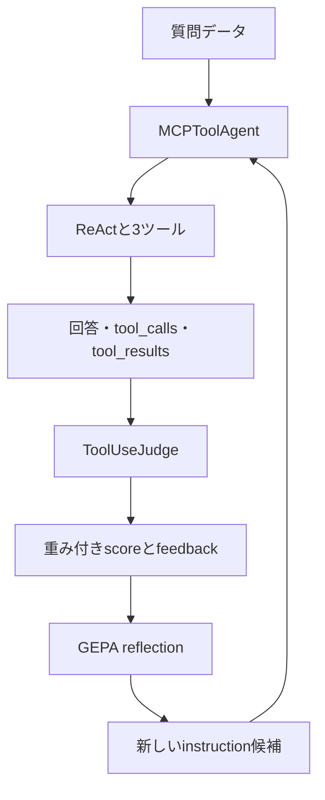
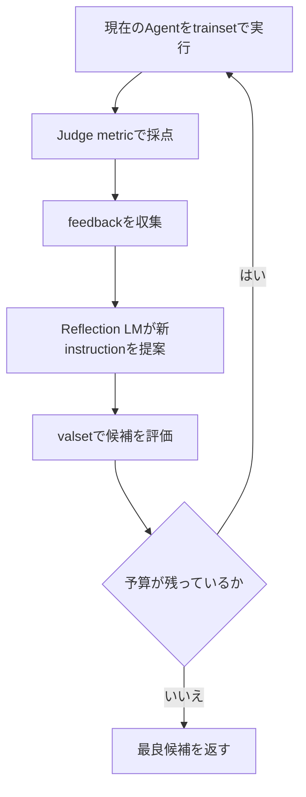

# DSPy GEPAによるツール利用最適化 実習ガイド

> 対象：東芝インターン「AIエージェントにおけるツール利用最適化」  
> 方針：LLM-as-a-Judgeでツール利用を採点し、具体的なフィードバックを使ってGEPAでReActエージェントを最適化する

## 0. 今回の正式な方針

今回の中心は、次の4要素です。

| 要素 | 使用するDSPy機能 | 役割 |
|---|---|---|
| ツール実行Agent | `dspy.ReAct` | 3つのMCPツールを選択・実行する |
| Agentのラッパー | `dspy.Module` | 回答、ツール呼び出し、ツール結果を評価関数へ渡す |
| LLM審査員 | `dspy.ChainOfThought(ToolUseJudge)` | ツール利用を4観点で採点し、改善案を返す |
| 最適化器 | `dspy.GEPA` | スコアと文章フィードバックからAgentの指示を改善する |

全体の流れです。



以前のガイドとの大きな違いは、主metricを次のように変更することです。

```text
以前：人手で期待ツールと正解値を用意し、完全一致で採点

今回：LLM審査員がツール選択・必要性・引数・最終回答を採点し、
      改善のための文章フィードバックも返す
```

さらにoptimizerは`BootstrapFewShot`ではなく、画像で指定された`GEPA`を使います。

---

## 1. GitHubへ載せる前の注意

公開GitHubには、次の情報を載せません。

- Azure OpenAIのAPIキー
- Azure OpenAIの社内endpoint
- MCPのAPIキー
- MCPサーバーのURLやIPアドレス
- 社内の質問ログ、tool result、最適化ログ
- 公開許可を得ていないメンター配布コード

このMarkdownでは、接続情報を変数名だけで表します。実習Notebookでは、メンター配布コードに定義済みの値を使ってください。

```python
# 値そのものはGitHubへ載せない
AZURE_OPENAI_API_KEY = ""
AZURE_OPENAI_ENDPOINT = ""
AZURE_OPENAI_API_VERSION = ""
AZURE_OPENAI_DEPLOYMENT = ""
```

---

## 2. 3種類のLMの役割

コード上では、LMに3つの役割があります。

| 役割 | 変数例 | 何をするか |
|---|---|---|
| Student LM | `lm` | ReAct Agentとして質問を解き、ツールを呼ぶ |
| Judge LM | `judge_lm` | Agentのツール利用を採点する |
| Reflection LM | `reflection_lm` | Judgeのfeedbackを読み、新しい指示を提案する |

同じAzure deploymentを使うこともできますが、役割は異なります。画像ではJudge／Reflection用モデルとしてメンター指定の小型モデルを使う方針が示されています。

注意：Azureでは、公開モデル名とAzure上のdeployment名が同じとは限りません。文字列を推測せず、メンターから指定されたdeployment名を使います。

---

## 3. 前提：メンター配布部分

以下はすでに定義済みであることを前提にします。

```python
import dspy

# Student LMがdspy.configure(lm=lm)で設定済み

# MCPへ接続する3つのPython関数が定義済み
# calculate_expression(...)
# analyze_numbers(...)
# convert_units(...)
```

メンター配布部分は変更せず、その後ろに本ガイドのセルを追加します。

### 3.1 Notebookへ貼る順番

このガイドのコードは、次の順にセルへ貼り付けます。前のセルで作った変数や関数を、後ろのセルで利用するため、順番を入れ替えないでください。

| 順番 | 貼り付けるもの | その時点で作られるもの |
|---:|---|---|
| 0 | メンター配布コード | `lm`と3つのMCPツール関数 |
| 1 | Step 1 | `ToolQA` |
| 2 | Step 2 | `extract_tool_history`、`MCPToolAgent`、`agent` |
| 3 | Step 3 | Agent単体の動作確認結果 |
| 4 | Step 4～5 | `AVAILABLE_TOOLS`、`trainset`、`valset`、`testset` |
| 5 | Step 6 | `ToolUseJudge` |
| 6 | Step 7～9 | `judge_lm`、`judge`、`run_judge`、`tool_use_metric` |
| 7 | Step 10～11 | Judgeの校正結果、Baselineスコア |
| 8 | Step 12～13 | `reflection_lm`、`optimizer`、`optimized_agent` |
| 9 | Step 14以降 | 最適化前後の比較結果 |

特に`judge_lm`は、`ToolUseJudge`の定義後、`run_judge()`の定義前に置きます。Student LM用の`dspy.configure(lm=lm)`をJudge用LMで上書きする必要はありません。

---

## 4. Step 1：Agentのタスクを定義する

### 4.1 `ToolQA` Signature

```python
class ToolQA(dspy.Signature):
    """
    ユーザーの質問へ正確に回答してください。
    必要な場合は、利用可能なツールから適切なものを選び、
    正しい引数を渡してください。
    不要または重複したツール呼び出しを避け、
    ツールの実行結果に基づいて最終回答を作成してください。
    """

    question: str = dspy.InputField(
        desc="ユーザーが入力した質問"
    )

    answer: str = dspy.OutputField(
        desc="ユーザー要求を満たす最終回答"
    )
```

`ToolQA`は計算処理ではなく、Agentが行う仕事の仕様です。

| 部分 | 意味 |
|---|---|
| docstring | Agent全体への初期instruction |
| `question` | 入力 |
| `answer` | 最終出力 |

GEPAが改善する主な対象は、ReAct内部のinstructionを含む文章部分です。

---

## 5. Step 2：ReActを`dspy.Module`で包む

### 5.1 なぜラッパーが必要か

通常のReAct結果には`answer`と`trajectory`があります。しかし今回のJudgeは、次を別々に受け取ります。

```text
tool_calls   ：呼び出したツール、引数、順序
tool_results ：各ツールの実行結果
final_answer ：最終回答
```

そこで`dspy.Module`を継承した`MCPToolAgent`を作り、ReActのtrajectoryをJudgeが読みやすい文字列へ変換します。

### 5.2 trajectoryを整理する補助関数

```python
import json


def extract_tool_history(trajectory):
    """
    ReActのtrajectoryから、実際のツール呼び出しと結果を取り出す。
    finishは終了合図なので、外部ツール呼び出しには数えない。
    """

    trajectory = trajectory or {}
    tool_calls = []
    tool_results = []

    for key, tool_name in trajectory.items():
        if not key.startswith("tool_name_"):
            continue

        step = key.removeprefix("tool_name_")
        tool_name = str(tool_name)

        if tool_name == "finish":
            continue

        tool_args = trajectory.get(f"tool_args_{step}", {})
        observation = trajectory.get(f"observation_{step}")

        tool_calls.append(
            {
                "step": step,
                "tool": tool_name,
                "arguments": tool_args,
            }
        )

        tool_results.append(
            {
                "step": step,
                "tool": tool_name,
                "result": observation,
            }
        )

    tool_calls_text = json.dumps(
        tool_calls,
        ensure_ascii=False,
        default=str,
    )

    tool_results_text = json.dumps(
        tool_results,
        ensure_ascii=False,
        default=str,
    )

    return tool_calls_text, tool_results_text
```

主な処理です。

| コード | 意味 |
|---|---|
| `tool_name_0` | 0番目に選んだツール |
| `tool_args_0` | 0番目のツールへ渡した引数 |
| `observation_0` | 0番目のツールの返却結果 |
| `finish`を除外 | 終了合図を外部ツール利用に数えない |
| `json.dumps` | Judgeが読める安定した文字列にする |
| `default=str` | JSON化できない返却値があっても文字列にする |

#### 5.2.1 なぜtrajectoryの整理が必要か

`dspy.ReAct`は、最終回答だけでなく途中の行動を`trajectory`へ記録します。典型的な中身は次のような辞書です。

```python
{
    "thought_0": "単位変換なのでconvert_unitsを使う",
    "tool_name_0": "convert_units",
    "tool_args_0": {
        "value": 10,
        "from_unit": "km",
        "to_unit": "m",
    },
    "observation_0": {"result": 10000},
    "thought_1": "必要な結果が得られた",
    "tool_name_1": "finish",
    "tool_args_1": {},
}
```

ここには思考、ツール名、引数、結果、終了合図が混在しています。そのままJudgeへ渡すこともできますが、Judgeが知りたい情報を次の2つに分ける方が、評価基準が明確になります。

```text
trajectory
  ├─ tool_calls   ：どのツールへ、どの引数を、何番目に渡したか
  └─ tool_results ：その呼び出しから何が返ったか
```

上の例を`extract_tool_history()`へ渡すと、概念的には次の文字列が返ります。

```json
[{"step":"0","tool":"convert_units","arguments":{"value":10,"from_unit":"km","to_unit":"m"}}]
```

```json
[{"step":"0","tool":"convert_units","result":{"result":10000}}]
```

`finish`は「回答を終了する」というReAct内部の合図であり、MCPサーバーへ送ったツール呼び出しではないため除外します。

#### 5.2.2 コードを上から読む

| コード | やっていること | 必要な理由 |
|---|---|---|
| `trajectory = trajectory or {}` | `None`を空の辞書へ変える | trajectoryが無い場合も例外にしない |
| `tool_calls = []` | 呼び出し履歴の入れ物を作る | 後でJudgeへまとめて渡す |
| `trajectory.items()` | キーと値を順番に調べる | `tool_name_0`などを探す |
| `startswith("tool_name_")` | ツール名の行だけを選ぶ | thoughtなどを除外する |
| `removeprefix(...)` | `0`、`1`などのstep番号を得る | 同じ番号の引数・結果を対応付ける |
| `trajectory.get(..., {})` | 同じstepの引数を取り出す | 引数が無い場合は空辞書にする |
| `trajectory.get(...)` | 同じstepの結果を取り出す | 結果が無い場合は`None`になる |
| `append(...)` | 1回分の情報をリストへ追加する | 複数回の呼び出しにも対応する |
| `ensure_ascii=False` | 日本語をそのままJSON化する | `\uXXXX`表記を避けて読みやすくする |
| `default=str` | 特殊な返却値を文字列へ変換する | JSON化できない型による停止を避ける |
| `return ...` | 2本のJSON文字列を返す | AgentがJudge用Predictionへ格納する |

step番号が重要です。例えば`tool_name_2`を見つけたら、同じ`2`を使って`tool_args_2`と`observation_2`を取り出します。これにより、複数ツールを使ったときも呼び出しと結果が混ざりません。

#### 5.2.3 補助関数だけを試す

Agent全体を動かす前に、次の小さなテストで整理結果を確認できます。

```python
sample_trajectory = {
    "thought_0": "単位を変換する",
    "tool_name_0": "convert_units",
    "tool_args_0": {
        "value": 10,
        "from_unit": "km",
        "to_unit": "m",
    },
    "observation_0": {"result": 10000},
    "tool_name_1": "finish",
}

sample_calls, sample_results = extract_tool_history(
    sample_trajectory
)

print(sample_calls)
print(sample_results)
```

期待する確認点は、`convert_units`が1回だけ記録され、`finish`が含まれていないことです。

### 5.3 `MCPToolAgent`

```python
class MCPToolAgent(dspy.Module):
    """3つのMCPツールを使うReActを、評価しやすい形で包むAgent。"""

    def __init__(self):
        """ReAct本体と、利用可能な3つのツールを初期化する。"""

        super().__init__()

        self.agent = dspy.ReAct(
            ToolQA,
            tools=[
                calculate_expression,
                analyze_numbers,
                convert_units,
            ],
            max_iters=5,
        )

    def forward(self, question: str):
        """
        質問をReActで処理し、回答と整理済みツール履歴を返す。

        Args:
            question: ユーザーが入力した質問。

        Returns:
            answer、tool_calls、tool_results、trajectoryを持つPrediction。
        """

        result = self.agent(question=question)

        tool_calls, tool_results = extract_tool_history(
            result.trajectory
        )

        return dspy.Prediction(
            answer=result.answer,
            tool_calls=tool_calls,
            tool_results=tool_results,
            trajectory=result.trajectory,
        )


agent = MCPToolAgent()
```

`dspy.Module`では、`forward()`がプログラム本体です。

```text
agent(question=質問)
       ↓
内部でforward(question=質問)が呼ばれる
       ↓
ReActを実行
       ↓
Judgeに必要なPredictionを返す
```

`self.agent`としてReActを持たせることで、GEPAはその内部predictorをDSPy Programの一部として認識できます。

コードの役割を分解すると次のとおりです。

| コード | 役割 |
|---|---|
| `class MCPToolAgent(dspy.Module)` | DSPyが追跡・最適化できるProgramとして定義する |
| `super().__init__()` | 親クラス`dspy.Module`の初期化を行う |
| `self.agent = dspy.ReAct(...)` | 実際に考えてツールを選ぶReActを内部に持つ |
| `tools=[...]` | ReActが呼び出してよい関数を限定する |
| `max_iters=5` | ReActの行動ループに上限を設ける |
| `result = self.agent(...)` | 質問をReActへ渡して実行する |
| `extract_tool_history(...)` | 生のtrajectoryをJudge用に整理する |
| `dspy.Prediction(...)` | 後段のJudgeと評価処理が扱いやすい出力へまとめる |

`max_iters=5`は「必ず5回ツールを使う」という意味ではありません。最大5回まで考え直せるという上限で、必要な結果が得られれば`finish`で早く終了します。

`answer`だけでなく生の`trajectory`も残すのは、評価スコアが不自然だったときに、人間が内部のツール選択と引数を確認できるようにするためです。

---

## 6. Step 3：Agent単体で動作確認する

```python
prediction = agent(
    question="10, 20, 30, 40, 50の平均と標準偏差を計算してください"
)

print("answer:")
print(prediction.answer)

print("\ntool_calls:")
print(prediction.tool_calls)

print("\ntool_results:")
print(prediction.tool_results)

print("\ntrajectory:")
for key, value in prediction.trajectory.items():
    print(f"{key}: {value}")
```

この段階では、次だけ確認します。

- `analyze_numbers`が呼ばれたか。
- 平均と標準偏差に対応する引数になっているか。
- `tool_calls`と`tool_results`が空でないか。
- 最終回答がツール結果と整合しているか。

これはsmoke testであり、まだ最適化ではありません。

---

## 7. Step 4：利用可能ツールの説明を作る

Judgeには「Agentが何を利用できたか」も渡します。関数のsignatureとdocstringから自動生成すると、実際のツール定義とのずれを減らせます。

```python
import inspect


TOOL_FUNCTIONS = [
    calculate_expression,
    analyze_numbers,
    convert_units,
]


def build_available_tools_text(tool_functions):
    """
    Python関数の名前、引数、docstringをJudge向けの説明文にまとめる。

    Args:
        tool_functions: Judgeへ説明するツール関数のリスト。

    Returns:
        各ツールの定義を空行で区切った文字列。
    """

    descriptions = []

    for tool in tool_functions:
        signature = inspect.signature(tool)
        docstring = inspect.getdoc(tool) or "説明なし"

        descriptions.append(
            f"{tool.__name__}{signature}\n{docstring}"
        )

    return "\n\n".join(descriptions)


AVAILABLE_TOOLS = build_available_tools_text(TOOL_FUNCTIONS)

print(AVAILABLE_TOOLS)
```

ここにAPIキーやMCP URLは含めません。ツール名、引数、用途だけをJudgeへ伝えます。

コード内では、次の情報をPython関数から自動で読み取っています。

| コード | 取得するもの | 例 |
|---|---|---|
| `tool.__name__` | 関数名 | `convert_units` |
| `inspect.signature(tool)` | 引数名、型、初期値 | `(value: float, from_unit: str, ...)` |
| `inspect.getdoc(tool)` | docstring | 「単位変換に使用する」など |
| `"\n\n".join(...)` | 3ツールの説明を連結 | Judgeへ渡す1本の文字列 |

ツール定義を変更した場合も、このセルを再実行すれば`AVAILABLE_TOOLS`へ反映されます。そのため、Judge用の説明を手作業で二重管理するより、実装との食い違いを減らせます。メンター配布ツールのdocstringが日本語なら、Judgeへ渡る説明も日本語になります。

---

## 8. Step 5：GEPA用データセットを作る

### 8.1 1件のExample

今回のLLM Judgeは、必ずしも人手の正解文を必要としません。質問、利用可能ツール、Agentの実行履歴から採点します。

```python
def make_example(question):
    """
    Agentへの質問と、Judgeが評価に使う補助情報を1件にまとめる。

    Args:
        question: Agentへ入力する質問文。

    Returns:
        Agent入力をquestionだけに指定したdspy.Example。
    """

    return dspy.Example(
        question=question,
        user_query=question,
        available_tools=AVAILABLE_TOOLS,
    ).with_inputs("question")
```

| フィールド | 役割 |
|---|---|
| `question` | Agentへ実際に入力する値 |
| `user_query` | Judgeがユーザー要求を確認するための値 |
| `available_tools` | Judgeが選択可能だったツールを知るための値 |
| `.with_inputs("question")` | Agentへの入力は`question`だけと宣言する |

`user_query`には`question`と同じ文章を入れていますが、役割は異なります。`question`はStudent Agentへ渡す入力、`user_query`はJudgeが「元の要求」を読むための情報です。`available_tools`もExampleに保持しますが、`.with_inputs("question")`によってStudent Agentへは渡されません。

つまり、1件のExampleには「Agentが解くための入力」と「後からJudgeが採点するための情報」が同居しています。

### 8.2 データ例

まずは小規模に動作確認します。実際にはメンター指定のtrainsetがあれば、そちらを優先します。

```python
trainset = [
    # 計算ツール
    make_example("25 * 16 を計算してください"),
    make_example("2の10乗を求めてください"),
    make_example("128に1.08を掛けてください"),

    # 統計ツール
    make_example("1, 2, 3, 4, 5の平均を求めてください"),
    make_example("2, 4, 6, 8, 10の中央値を求めてください"),
    make_example("10, 20, 30, 40, 50の平均と標準偏差を求めてください"),

    # 単位変換ツール
    make_example("10 kmは何mですか？"),
    make_example("5000 mは何kmですか？"),
    make_example("2 kgは何gですか？"),

    # ツールが不要な質問
    make_example("平均値とは何か、計算せずに説明してください"),
    make_example("このAgentが利用できる処理の種類を簡潔に説明してください"),
]


valset = [
    make_example("37 + 58を計算してください"),
    make_example("3, 7, 9, 11, 20の平均を求めてください"),
    make_example("250 cmは何mですか？"),
    make_example("中央値とは何か、数値計算をせずに説明してください"),
]


testset = [
    make_example("144の平方根を計算してください"),
    make_example("4, 8, 15, 16, 23, 42の中央値を求めてください"),
    make_example("3.5 kgは何gですか？"),
    make_example("単位変換が必要になる場面を1つ説明してください"),
]
```

ツール不要問題も入れる理由は、Judgeの`tool_necessity_score`で「外部ツールを使う必要があったか」を評価するためです。

| データ | GEPAでの役割 |
|---|---|
| `trainset` | reflectionの材料になる例 |
| `valset` | 候補instructionの選択に使う例 |
| `testset` | 最後の評価だけに使う未知例 |

画像の最小コードでは`trainset`だけで`compile()`しています。その場合、GEPAはtrainsetを候補選択にも再利用します。未知問題への一般化を比較するなら、可能な限り別の`valset`を渡します。

---

## 9. Step 6：LLM審査員`ToolUseJudge`を作る

```python
class ToolUseJudge(dspy.Signature):
    """
    AI Agentによるツール利用を厳格に評価してください。

    以下の観点を総合的に評価します。

    1. 選択したツールがユーザー要求に適しているか
    2. 外部ツールを使用する必要があったか
    3. ツールに渡した引数が適切か
    4. 最終回答がユーザー要求を満たしているか
    5. 不要または重複したツール呼び出しがないか

    代替ツールでも同じ目的を安全かつ正確に達成できる場合は、
    必ずしも減点しないでください。

    各スコアは0.0から1.0で返してください。
    feedbackには、問題点とAgentの指示を改善するための
    具体的な助言を書いてください。
    """

    user_query: str = dspy.InputField(
        desc="ユーザーが入力した質問"
    )

    available_tools: str = dspy.InputField(
        desc="Agentが利用可能だったツールの名前、引数、説明"
    )

    tool_calls: str = dspy.InputField(
        desc="実際に呼び出したツール、引数、実行順序"
    )

    tool_results: str = dspy.InputField(
        desc="各ツールの実行結果"
    )

    final_answer: str = dspy.InputField(
        desc="Agentが生成した最終回答"
    )

    tool_selection_score: float = dspy.OutputField(
        desc="ツール選択の妥当性。0.0から1.0"
    )

    tool_necessity_score: float = dspy.OutputField(
        desc="ツール利用または非利用の妥当性。不要・重複呼び出しも考慮。0.0から1.0"
    )

    argument_score: float = dspy.OutputField(
        desc="ツール引数の妥当性。0.0から1.0"
    )

    task_success_score: float = dspy.OutputField(
        desc="ユーザー要求の達成度。0.0から1.0"
    )

    feedback: str = dspy.OutputField(
        desc="問題点と、Agentの指示を改善するための具体的な助言"
    )
```

評価観点と出力の対応です。

| 観点 | 出力 |
|---|---|
| ツールの種類が適切か | `tool_selection_score` |
| ツールが必要だったか、不要・重複呼び出しがないか | `tool_necessity_score` |
| 引数が適切か | `argument_score` |
| 最終的に要求を満たしたか | `task_success_score` |
| 何を改善すべきか | `feedback` |

「別のツールでも正確に達成できるなら減点しない」という記述が重要です。期待ツールの完全一致だけでは、妥当な別解を誤って不正解にするためです。

---

## 10. Step 7：Judge LMを設定する

```python
# ToolUseJudgeを定義した直後、このセルを実行する。
# 右辺は公開モデル名ではなく、Azure上で作成済みのdeployment名にする。
JUDGE_AZURE_OPENAI_DEPLOYMENT = "gpt-5.4-mini"


judge_lm = dspy.LM(
    f"azure/{JUDGE_AZURE_OPENAI_DEPLOYMENT}",
    api_key=AZURE_OPENAI_API_KEY,
    api_base=AZURE_OPENAI_ENDPOINT,
    api_version=AZURE_OPENAI_API_VERSION,
    temperature=0.0,
)


judge = dspy.ChainOfThought(ToolUseJudge)
```

画像で指定されたJudge用モデルのAzure deployment名が`gpt-5.4-mini`と異なる場合は、`JUDGE_AZURE_OPENAI_DEPLOYMENT`の右辺だけをメンター指定値へ変更します。Azure Portalにその名前のdeploymentが存在しなければ動作しません。

このセルを置く位置は次のとおりです。

```text
ToolUseJudgeを定義
        ↓
judge_lmを作る       ← このStep 7
        ↓
judgeを作る
        ↓
run_judgeを定義      ← 次のStep 8
```

各行の意味です。

| コード | 意味 |
|---|---|
| `dspy.LM(...)` | Judge専用のLM接続設定を作る |
| `azure/...` | LiteLLM／DSPyへAzureのdeploymentを指定する |
| `api_key`など | メンター配布部分ですでに定義された接続情報を再利用する |
| `temperature=0.0` | 同じ実行に対する採点の揺れを抑える |
| `dspy.ChainOfThought(ToolUseJudge)` | 5つの入力から4スコアとfeedbackを生成するJudgeを作る |

`temperature=0.0`は採点の揺れを減らすためです。ただし、完全な決定性を保証するものではありません。

`judge`自体にはLMを直接渡していません。次の`run_judge()`内で`dspy.context(lm=judge_lm)`を使い、Judgeを実行する間だけLMを切り替えます。

---

## 11. Step 8：`run_judge()`を作る

```python
def run_judge(example, prediction):
    """
    1件のデータとAgentの実行結果をJudge LMで採点する。

    Args:
        example: user_queryとavailable_toolsを持つ評価データ。
        prediction: Agentが返した回答とツール履歴。

    Returns:
        4つの評価スコアとfeedbackを持つJudgeのPrediction。
    """

    with dspy.context(lm=judge_lm):
        return judge(
            user_query=example.user_query,
            available_tools=example.available_tools,
            tool_calls=prediction.tool_calls,
            tool_results=prediction.tool_results,
            final_answer=prediction.answer,
        )
```

引数の対応です。

| Judge入力 | 取得元 |
|---|---|
| `user_query` | データセットの`example.user_query` |
| `available_tools` | データセットの`example.available_tools` |
| `tool_calls` | Agentの`prediction.tool_calls` |
| `tool_results` | Agentの`prediction.tool_results` |
| `final_answer` | Agentの`prediction.answer` |

`with dspy.context(lm=judge_lm):`は、このブロック内だけ使用LMをJudge用へ一時的に切り替えます。ブロックを抜けると、全体設定はStudent LMへ戻ります。そのため、次のように`dspy.configure(lm=judge_lm)`で全体を上書きしてはいけません。

```python
# この書き方はしない
# dspy.configure(lm=judge_lm)
```

`example`と`prediction`の違いも重要です。

```text
example    ：実行前から分かっている質問と利用可能ツール
prediction ：Agentを実行して初めて得られる回答と利用履歴
```

Judgeはこの両方を比較し、「選択」「必要性」「引数」「達成度」を採点します。

---

## 12. Step 9：重み付き`tool_use_metric`を作る

### 12.1 metric本体

```python
def clip01(value):
    """数値をfloatへ変換し、0.0から1.0の範囲へ収める。"""

    return max(0.0, min(1.0, float(value)))


def tool_use_metric(
    example,
    prediction,
    trace=None,
    pred_name=None,
    pred_trace=None,
    program_trace=None,
):
    """
    Judgeの4スコアを重み付きで集約し、GEPA用feedbackと共に返す。

    Args:
        example: 評価対象の質問とJudge用情報。
        prediction: Agentの回答とツール履歴。
        trace: DSPy評価・最適化から渡される互換用引数。
        pred_name: 評価対象predictor名の互換用引数。
        pred_trace: predictor実行履歴の互換用引数。
        program_trace: Program実行履歴の互換用引数。

    Returns:
        scoreと具体的feedbackを持つdspy.Prediction。
    """

    judgment = run_judge(example, prediction)

    tool_selection = clip01(
        judgment.tool_selection_score
    )

    tool_necessity = clip01(
        judgment.tool_necessity_score
    )

    argument = clip01(
        judgment.argument_score
    )

    task_success = clip01(
        judgment.task_success_score
    )

    score = (
        0.40 * tool_selection
        + 0.20 * tool_necessity
        + 0.15 * argument
        + 0.25 * task_success
    )

    return dspy.Prediction(
        score=clip01(score),
        feedback=judgment.feedback,
    )
```

画像では`trace`、`pred_name`、`pred_trace`までですが、現行GEPAのmetric形式に合わせて`program_trace=None`も追加しています。今回の処理では、これらのtrace引数を直接使わなくても構いません。

### 12.2 重みの意味

```text
0.40：tool selection
0.20：tool necessity
0.15：arguments
0.25：task success
合計：1.00
```

| 項目 | 重み | 解釈 |
|---|---:|---|
| Tool Selection | 0.40 | 今回もっとも重視するツール選択 |
| Tool Necessity | 0.20 | 必要なときだけ使い、不要・重複呼び出しを避ける |
| Arguments | 0.15 | ツールへ正しい値を渡す |
| Task Success | 0.25 | 最終回答が要求を満たす |

例として、Judgeが次のスコアを返したとします。

```text
tool_selection = 1.0
tool_necessity = 0.8
argument       = 0.6
task_success   = 0.9
```

総合点は、

```text
0.40×1.0 + 0.20×0.8 + 0.15×0.6 + 0.25×0.9
= 0.875
```

です。

### 12.3 なぜ数値だけでなくfeedbackを返すのか

通常のoptimizerなら、スコアだけでも候補の優劣を比較できます。GEPAはさらに文章feedbackをReflection LMへ渡し、次のinstruction候補を考えます。

```text
悪いfeedback：スコアが低い

良いfeedback：統計問題でcalculate_expressionを選んでいる。
               数値配列に平均・中央値・標準偏差が要求された場合は
               analyze_numbersを優先する指示を追加すべきである。
```

具体的なfeedbackほど、GEPAが改善案を作りやすくなります。

処理の順番は次のとおりです。

1. `run_judge()`でAgentの1実行を採点する。
2. 4スコアを`clip01()`で0.0～1.0へ収める。
3. 4スコアへ固定の重みを掛けて足す。
4. 総合`score`とJudgeの文章`feedback`を返す。

戻り値を単なる`float`にせず`dspy.Prediction(score=..., feedback=...)`にしているのは、GEPAが「候補の良し悪し」と「次にどう直すか」の両方を必要とするためです。

---

## 13. Step 10：Judgeとmetricを最適化前に校正する

GEPAをすぐ実行せず、まず1～3問でJudgeの挙動を確認します。

```python
example = trainset[0]
prediction = agent(question=example.question)

judgment = run_judge(example, prediction)

print("tool_selection_score:", judgment.tool_selection_score)
print("tool_necessity_score:", judgment.tool_necessity_score)
print("argument_score:", judgment.argument_score)
print("task_success_score:", judgment.task_success_score)
print("feedback:", judgment.feedback)

metric_result = tool_use_metric(example, prediction)

print("weighted score:", metric_result.score)
print("metric feedback:", metric_result.feedback)
```

確認項目です。

- すべてのスコアが0.0～1.0か。
- 明らかに正しい実行へ高得点を付けるか。
- 不要なツール呼び出しへ`tool_necessity_score`を下げるか。
- 引数ミスへ`argument_score`を下げるか。
- feedbackが具体的か。
- 同じ入力を複数回採点したとき、極端に揺れないか。

Judgeが不安定または甘すぎる場合、GEPAは誤った方向へ最適化します。Agentより先に評価器を確認することが重要です。

---

## 14. Step 11：新方式のBaseline評価

Baselineは、GEPAで`compile()`する前の`agent`です。

```text
Baseline = MCPToolAgent + 初期ToolQA instruction + 3ツール
```

GEPA用metricは`Prediction(score, feedback)`を返します。通常評価では数値だけを使う関数を用意すると分かりやすいです。

```python
def score_only_metric(example, prediction, trace=None):
    """通常評価用に、GEPA metricの戻り値から数値scoreだけを返す。"""

    result = tool_use_metric(
        example,
        prediction,
        trace=trace,
    )
    return float(result.score)
```

```python
baseline_evaluator = dspy.Evaluate(
    devset=valset,
    metric=score_only_metric,
    num_threads=1,
    display_progress=True,
    display_table=True,
)


baseline_result = baseline_evaluator(agent)

print("Baseline score:", baseline_result.score)
```

`Baseline`とは、改善方法の効果を判断するための「改善前の基準」です。今回の目的はGEPA後の点数だけを見ることではなく、同じ条件でGEPA前より良くなったかを確かめることです。

例えば次の結果なら、GEPAによって8.4ポイント改善したと説明できます。

```text
Baseline : 72.1
GEPA後   : 80.5
差       : +8.4ポイント
```

ここでいうBaselineは「性能が低いAgent」という意味ではありません。最適化をまだ適用していない比較対象という意味です。

`dspy.Evaluate`の引数です。

| 引数 | やっていること |
|---|---|
| `devset=valset` | Baselineを評価する質問集合を指定する |
| `metric=score_only_metric` | 各実行を0.0～1.0で採点する |
| `num_threads=1` | まず直列実行し、エラーを追いやすくする |
| `display_progress=True` | 何件目まで終わったか表示する |
| `display_table=True` | 質問ごとの結果を表で表示する |
| `baseline_evaluator(agent)` | 最適化前Agentを全問で実行する |

現行DSPyの`EvaluationResult.score`は、各metric値を集計した**百分率**として返ります。metricの平均が`0.875`なら、表示される全体scoreは通常`87.5`です。`baseline_result.results`には、各問題の`(example, prediction, score)`も保存されます。

内部では、各問題について次を行っています。

```text
質問
 ↓
Baseline Agentを実行
 ↓
回答・ツール履歴
 ↓
Judge LMが4観点を採点
 ↓
重み付きscore
 ↓
valset全体で集計
```

Judge LMの呼び出しにも時間とtokenコストがかかります。最初は`num_threads=1`で確認し、安定後に増やします。

---

## 15. Step 12：Reflection LMとGEPAを設定する

### 15.1 Reflection LM

```python
# Judgeと同じdeploymentを使う例。
# 別の指定がある場合は、この右辺だけ専用deployment名へ変更する。
REFLECTION_AZURE_OPENAI_DEPLOYMENT = (
    JUDGE_AZURE_OPENAI_DEPLOYMENT
)


reflection_lm = dspy.LM(
    f"azure/{REFLECTION_AZURE_OPENAI_DEPLOYMENT}",
    api_key=AZURE_OPENAI_API_KEY,
    api_base=AZURE_OPENAI_ENDPOINT,
    api_version=AZURE_OPENAI_API_VERSION,
    temperature=0.0,
)
```

Reflection LMはAgentとして回答するのではなく、Judgeのfeedbackと実行例を読み、改善されたinstructionを提案します。

3種類のLMが呼ばれるタイミングを整理すると、次のようになります。

| LM | 呼ばれるタイミング | 出力 |
|---|---|---|
| Student LM | Agentが質問を解くとき | ツール選択、引数、回答 |
| Judge LM | metricがAgentの実行を採点するとき | 4スコア、feedback |
| Reflection LM | GEPAがinstruction候補を改善するとき | 新しいinstruction候補 |

Judge LMとReflection LMを同じdeploymentにしても、変数と役割は分けます。後からモデルを変更したり、コストを比較したりしやすくなるためです。

`temperature`については、メンター指定を優先してください。このガイドでは実習中の再現性を優先して`0.0`にしています。探索の多様性を増やす設定もありますが、実験途中で値を変えると比較条件が変わるため固定します。

### 15.2 GEPA

```python
optimizer = dspy.GEPA(
    metric=tool_use_metric,
    auto="light",
    reflection_lm=reflection_lm,
    num_threads=4,
)
```

| 引数 | 意味 |
|---|---|
| `metric=tool_use_metric` | 候補を採点し、文章feedbackを返す |
| `auto="light"` | 小さい探索予算で試す |
| `reflection_lm` | feedbackから新instructionを提案するLM |
| `num_threads=4` | 最大4件を並行処理する設定 |

`auto="light"`は、最適化の品質レベルではなく探索予算のプリセットです。まず接続・Judge・metric・データの問題を見つける段階では`light`が扱いやすく、本実験で予算を増やすかはメンターと相談します。

GEPAでは、`auto`、`max_full_evals`、`max_metric_calls`のうち、探索予算を表すものを1つ指定します。このガイドでは最小構成として`auto="light"`だけを使います。

画像では`num_threads=4`です。レート制限やMCPエラーが出る場合、動作確認だけ一時的に`1`へ下げ、メンターへ相談します。

---

## 16. Step 13：GEPAでcompileする

### 16.1 画像に近い最小形

```python
optimized_agent = optimizer.compile(
    student=agent,
    trainset=trainset,
)
```

### 16.2 valsetを分ける推奨形

```python
optimized_agent = optimizer.compile(
    student=agent,
    trainset=trainset,
    valset=valset,
)
```

GEPA内部では、おおむね次を繰り返します。



`compile()`はStudent LMのニューラルネットワーク重みを学習する処理ではありません。主にDSPy Program内のinstructionなどの文章要素を探索・改善します。

もう少し具体的には、次の処理です。

1. 初期`agent`を最初の候補として登録する。
2. `trainset`の一部で候補を実行し、trajectoryを集める。
3. `tool_use_metric`が各実行のscoreとfeedbackを返す。
4. Reflection LMが失敗例、実行履歴、feedbackを読み、新しいinstructionを提案する。
5. 新instructionを持つ候補Agentを作る。
6. 候補を`valset`で評価する。
7. 複数問題で強みを持つ候補を残しながら探索する。
8. `auto="light"`の予算を使い切るまで繰り返す。
9. valsetの集計性能が最も良い候補を`optimized_agent`として返す。

GEPAの名前に含まれる`Pareto`は、単純に全体平均が一番高い1候補だけを毎回残すのではなく、特定の評価例で強い候補も探索対象として保持する考え方です。これにより、計算問題には強い候補と単位変換に強い候補など、異なる改善方向を早い段階で捨てにくくします。

```text
agent           ：最適化前
optimized_agent ：GEPA最適化後
```

元の`agent`を残すことで、同じ評価条件で比較できます。

---

## 17. Step 14：最適化後を評価する

Baselineと同じvalset、Judge、metricを使います。

```python
optimized_result = baseline_evaluator(optimized_agent)

print("Baseline score:", baseline_result.score)
print("Optimized score:", optimized_result.score)
```

最終的には、未使用のtestsetでも両方を比較します。

```python
test_evaluator = dspy.Evaluate(
    devset=testset,
    metric=score_only_metric,
    num_threads=1,
    display_progress=True,
    display_table=True,
)


baseline_test_result = test_evaluator(agent)
optimized_test_result = test_evaluator(optimized_agent)

print("Baseline test score:", baseline_test_result.score)
print("Optimized test score:", optimized_test_result.score)
```

比較時に固定するものです。

| 固定条件 | 理由 |
|---|---|
| Student LM | モデル変更の効果と混ぜない |
| Judge LM | 採点基準をそろえる |
| ツール実装 | ツール変更の効果と混ぜない |
| valset／testset | 同じ質問で比較する |
| metricと重み | 同じ尺度で比較する |
| `max_iters` | 最大ツール回数をそろえる |

---

## 18. 4つの内訳も記録する

総合scoreだけでは、何が改善したか分かりません。発表では4観点を別々に集計します。

```python
import time
import pandas as pd


def evaluate_with_judge(program, dataset):
    """
    Agentをデータセット全件で実行し、Judgeの内訳と実行情報を表にする。

    Args:
        program: 評価するagentまたはoptimized_agent。
        dataset: testsetなどのdspy.Exampleのリスト。

    Returns:
        質問ごとの回答、4スコア、総合点、呼び出し回数、時間、
        feedback、errorを持つpandas.DataFrame。
    """

    rows = []

    for index, example in enumerate(dataset):
        start = time.perf_counter()

        try:
            prediction = program(question=example.question)
            judgment = run_judge(example, prediction)

            tool_selection = clip01(
                judgment.tool_selection_score
            )
            tool_necessity = clip01(
                judgment.tool_necessity_score
            )
            argument = clip01(
                judgment.argument_score
            )
            task_success = clip01(
                judgment.task_success_score
            )

            weighted_score = (
                0.40 * tool_selection
                + 0.20 * tool_necessity
                + 0.15 * argument
                + 0.25 * task_success
            )

            elapsed = time.perf_counter() - start
            calls = json.loads(prediction.tool_calls)

            rows.append(
                {
                    "index": index,
                    "question": example.question,
                    "answer": prediction.answer,
                    "tool_calls": prediction.tool_calls,
                    "tool_selection": tool_selection,
                    "tool_necessity": tool_necessity,
                    "argument": argument,
                    "task_success": task_success,
                    "weighted_score": clip01(weighted_score),
                    "num_tool_calls": len(calls),
                    "latency_sec": elapsed,
                    "feedback": judgment.feedback,
                    "error": None,
                }
            )

        except Exception as error:
            elapsed = time.perf_counter() - start

            rows.append(
                {
                    "index": index,
                    "question": example.question,
                    "answer": None,
                    "tool_calls": None,
                    "tool_selection": 0.0,
                    "tool_necessity": 0.0,
                    "argument": 0.0,
                    "task_success": 0.0,
                    "weighted_score": 0.0,
                    "num_tool_calls": 0,
                    "latency_sec": elapsed,
                    "feedback": None,
                    "error": repr(error),
                }
            )

    return pd.DataFrame(rows)
```

```python
baseline_df = evaluate_with_judge(agent, testset)
optimized_df = evaluate_with_judge(optimized_agent, testset)


def summarize(df):
    """質問ごとの評価表から、比較に使う平均値とエラー率を計算する。"""

    return {
        "tool_selection": df["tool_selection"].mean(),
        "tool_necessity": df["tool_necessity"].mean(),
        "argument": df["argument"].mean(),
        "task_success": df["task_success"].mean(),
        "weighted_score": df["weighted_score"].mean(),
        "avg_tool_calls": df["num_tool_calls"].mean(),
        "avg_latency_sec": df["latency_sec"].mean(),
        "error_rate": df["error"].notna().mean(),
    }


comparison_df = pd.DataFrame(
    [
        summarize(baseline_df),
        summarize(optimized_df),
    ],
    index=["Baseline", "GEPA"],
)

display(comparison_df)
```

注意：この`latency_sec`には、Agent実行だけでなくJudge実行時間も含まれます。利用者が感じるAgent応答時間を測りたい場合は、Judgeの前で別に計測します。

`try`と`except`で1件ずつ囲んでいるのは、1問のAPIエラーだけで全評価が止まらないようにするためです。失敗した問題は0点として行を残し、`error`列で原因を後から確認します。エラーを黙って除外すると、成功した問題だけの平均になり、性能を過大評価してしまいます。

---

## 19. Agent応答時間を分けて測る

```python
def measure_agent_latency(program, dataset):
    """
    Judgeを呼ばず、利用者が待つAgent処理時間だけを問題ごとに測る。

    Args:
        program: 評価するagentまたはoptimized_agent。
        dataset: 時間を測る質問データ。

    Returns:
        Agent応答時間とツール呼び出し回数を持つDataFrame。
    """

    rows = []

    for example in dataset:
        start = time.perf_counter()
        prediction = program(question=example.question)
        agent_latency = time.perf_counter() - start

        rows.append(
            {
                "question": example.question,
                "agent_latency_sec": agent_latency,
                "tool_calls": len(
                    json.loads(prediction.tool_calls)
                ),
            }
        )

    return pd.DataFrame(rows)
```

```text
Agent latency：実際の質問応答にかかる時間
Judge latency：評価時だけ追加でかかる時間
GEPA compile cost：最適化時だけかかるコスト
```

この3つを混同しないようにします。

---

## 20. LLM-as-a-Judge方式の注意点

### 長所

- 正解ツール経路を全問で人手作成しなくてよい。
- 複数の妥当なツール経路を柔軟に評価できる。
- 最終回答だけでなく、必要性や引数も評価できる。
- GEPAへ具体的な文章feedbackを渡せる。

### 限界

- Judge自体が誤る可能性がある。
- 同じ実行でもスコアが多少揺れる可能性がある。
- Judge LMのtokenコストと待ち時間が増える。
- JudgeとAgentが似た誤りを共有する可能性がある。
- feedbackが抽象的だとGEPAが改善しにくい。

### 対策

- 明らかな成功例・失敗例でJudgeを事前校正する。
- 代表例は人間もtrajectoryを確認する。
- testsetの一部は人手評価とJudge評価を照合する。
- temperature、Judgeモデル、rubric、重みを固定する。
- 実験条件とDSPyバージョンを記録する。

---

## 21. よくあるエラー

### `prediction.tool_calls`がない

原因：生の`dspy.ReAct`を直接`student`に渡している可能性があります。

対処：

```python
agent = MCPToolAgent()
```

として、ラッパーが`tool_calls`と`tool_results`を返すようにします。

### `example.user_query`がない

原因：古い`dspy.Example(question=..., answer=...)`を使っている可能性があります。

対処：

```python
make_example(question)
```

で`user_query`と`available_tools`を持たせます。

### JudgeがStudent LMで動いてしまう

`run_judge()`内の次を確認します。

```python
with dspy.context(lm=judge_lm):
    # この中でJudgeを実行する
    ...
```

### `tool_calls`が常に空

`prediction.trajectory`を表示し、キー名を確認します。

```python
print(prediction.trajectory)
```

現在のReActでは通常、`tool_name_0`、`tool_args_0`、`observation_0`の形です。DSPyバージョンが異なる場合は`extract_tool_history()`を実際のキーへ合わせます。

### GEPAが遅い

- まず`auto="light"`を使う。
- trainset／valsetを小さくして疎通確認する。
- Judge呼び出しが正常か単体テストする。
- `num_threads`を環境に合わせる。
- API利用上限をメンターへ確認する。

### スコアは高いが挙動が悪い

Judge rubricまたは重みが目的と合っていない可能性があります。代表的trajectoryとfeedbackを人手で読み、評価関数を先に直します。

---

## 22. 実習での実行順序

### Phase 1：Agentの準備

- [ ] メンター配布のMCPツールが単体で動く。
- [ ] `ToolQA`を定義する。
- [ ] `extract_tool_history()`を作る。
- [ ] `MCPToolAgent`を作る。
- [ ] 1問実行し、answer／tool_calls／tool_resultsを確認する。

### Phase 2：評価器の準備

- [ ] `AVAILABLE_TOOLS`を作る。
- [ ] `make_example()`でデータを作る。
- [ ] `ToolUseJudge`を定義する。
- [ ] `judge_lm`と`run_judge()`を作る。
- [ ] `tool_use_metric()`を作る。
- [ ] 明らかな成功例と失敗例でJudgeを校正する。

### Phase 3：Baseline

- [ ] GEPA前のAgentをvalsetで評価する。
- [ ] 4スコア、総合点、ツール回数、応答時間を記録する。
- [ ] 低得点例のfeedbackとtrajectoryを読む。

### Phase 4：GEPA

- [ ] `reflection_lm`を設定する。
- [ ] `dspy.GEPA(auto="light")`を作る。
- [ ] `compile(student=agent, trainset=..., valset=...)`を実行する。
- [ ] `optimized_agent`を保存する。

### Phase 5：比較

- [ ] 同じvalsetでBaselineとGEPAを比較する。
- [ ] 最後に未使用testsetで比較する。
- [ ] 総合点だけでなく4観点の改善を示す。
- [ ] 代表的な改善trajectoryを示す。
- [ ] Agent latencyと評価・最適化コストを分けて説明する。

---

## 23. 最適化済みAgentを保存する

```python
optimized_agent.save(
    "optimized_mcp_tool_agent_gepa.json"
)
```

保存ファイルには、最適化されたinstructionや実習データ由来の内容が含まれる可能性があります。公開GitHubへ載せる前に、メンターへ確認してください。

---

## 24. 最終発表の構成案

### 1. 課題

質問傾向やモデル更新により、AI Agentのツール選択、回答品質、コスト、応答時間が変化する。手動プロンプト調整では継続改善の負担が大きい。

### 2. 提案方法

```text
ReAct Agent
  ↓ 実行履歴
LLM-as-a-Judge
  ↓ score + feedback
GEPA
  ↓ instruction改善
最適化済みAgent
```

### 3. 評価観点

- Tool Selection：40%
- Tool Necessity：20%
- Argument：15%
- Task Success：25%

### 4. 実験

- Baseline：最適化前の`MCPToolAgent`
- Proposed：GEPA最適化後
- 同じStudent LM、Judge LM、ツール、testsetで比較

### 5. 結果

| Method | Selection | Necessity | Argument | Success | Total | Calls | Agent Latency |
|---|---:|---:|---:|---:|---:|---:|---:|
| Baseline | 実測 | 実測 | 実測 | 実測 | 実測 | 実測 | 実測 |
| GEPA | 実測 | 実測 | 実測 | 実測 | 実測 | 実測 | 実測 |

### 6. 考察

- どの評価観点が改善したか。
- feedbackがinstructionにどう反映されたか。
- 不要・重複呼び出しは減ったか。
- 回答品質と呼び出し回数・時間のtrade-offはどうか。
- Judge評価と人手確認は一致したか。

### 7. 限界

- データ件数が少ない。
- Judgeの採点誤差がある。
- GEPA探索には追加コストがかかる。
- 実際のユーザーログ分布を十分に再現していない。

---

## 25. まず実行する最小コード

迷った場合は、次の順に1セルずつ確認します。

```python
# 1. ラッパーAgent
agent = MCPToolAgent()

# 2. 1問実行
example = make_example(
    "10, 20, 30, 40, 50の平均と標準偏差を計算してください"
)
prediction = agent(question=example.question)

# 3. 履歴確認
print(prediction.answer)
print(prediction.tool_calls)
print(prediction.tool_results)

# 4. Judge確認
judgment = run_judge(example, prediction)
print(judgment)

# 5. metric確認
metric_result = tool_use_metric(example, prediction)
print(metric_result.score)
print(metric_result.feedback)
```

ここまで正常に動いてから、Baseline評価とGEPAの`compile()`へ進みます。

---

## 26. 公式資料

- [DSPy ReAct](https://dspy.ai/api/modules/ReAct/)
- [DSPy Module](https://dspy.ai/api/modules/Module/)
- [GEPA Overview](https://dspy.ai/api/optimizers/GEPA/overview/)
- [GEPA Optimization Tutorial](https://dspy.ai/getting-started/gepa-optimization/)
- [DSPy Metrics and Evaluation](https://dspy.ai/diving-deeper/metrics-and-evaluation/)
- [DSPy Evaluate](https://dspy.ai/api/evaluation/Evaluate/)
- [DSPy Saving and Loading](https://dspy.ai/tutorials/saving/)

---

## 27. 要点

今回の方針を一行で表すと、次のとおりです。

```text
ReActの実行履歴をLLM Judgeが採点し、
scoreと具体的feedbackをGEPAへ渡して、
Agentのinstructionを自動改善する。
```

実装上の重要点は3つです。

1. `dspy.Module`でReActを包み、`tool_calls`と`tool_results`を返す。
2. `tool_use_metric`は数値scoreだけでなく、具体的な`feedback`も返す。
3. GEPA前のBaselineとGEPA後を、同じJudge・データ・条件で比較する。

これで、画像に示された`ToolUseJudge`、重み付き評価関数、Reflection LM、`dspy.GEPA`、`MCPToolAgent(dspy.Module)`を使う一連の実習手順になります。
