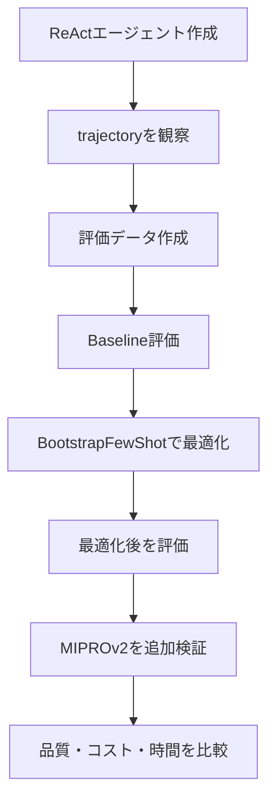
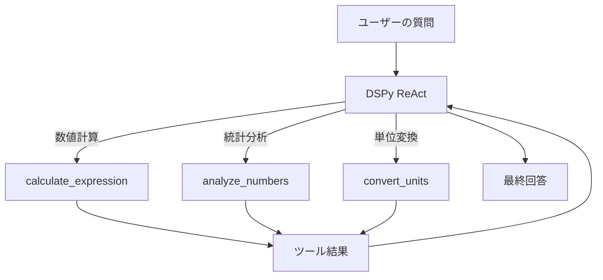
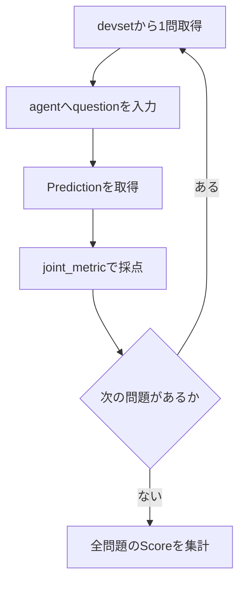

# DSPyによるツール利用最適化 実習ガイド

> 対象：インターン「AIエージェントにおけるツール利用最適化」  
> 目的：3つのMCPツールを使うDSPy ReActエージェントを作り、最適化前後で品質・ツール選択・コスト・応答時間を比較する

## 0. このガイドでできること

今回扱うツールは次の3つです。

| ツール | 用途 | 質問例 |
|---|---|---|
| `calculate_expression` | 四則演算、べき乗など | `25 * 16` |
| `analyze_numbers` | 配列の平均、中央値、分散など | `1, 2, 3の平均` |
| `convert_units` | 長さ、質量、温度などの単位変換 | `10 kmは何m` |

このガイドでは、次の順に進めます。



重要な点は、`trainset`と`metric`を定義しただけでは最適化されないことです。

```text
現在のコード：エージェント＋教師データ＋評価基準
最適化の実行：optimizer.compile(...)
```

---

## 1. GitHub公開前の注意

次の情報は、GitHubに絶対に載せません。

- Azure OpenAIのAPIキー
- MCPのAPIキー
- 社内MCPサーバーのURLやIPアドレス
- 社内ログ、質問データ、ツールの返却内容
- メンター配布コードそのもの（公開許可がない場合）

このMarkdownには、メンター配布部分の秘密情報を含めていません。Notebookでは、メンターから渡されたコードをローカルで実行し、その後ろに本ガイドのコードを追加してください。

```python
# ここまで：メンター配布のAzure OpenAI設定、MCP接続、3ツールの定義
# ここから：本ガイドのコード
```

実習中に実行結果をGitHubへ載せる場合も、`trajectory`の`observation`に社内情報が含まれていないか確認してください。

---

## 2. 全体像

質問が入力されると、ReActエージェントがツールを選び、引数を作り、ツールの結果を見て最終回答を生成します。



今回最適化したいのは、主に次の判断です。

1. どのツールを選ぶか。
2. どの引数を渡すか。
3. ツールを何回、どの順番で呼ぶか。
4. 必要な結果を得た後、いつ終了するか。

### 2.1 コードに登場する主要な部品

最初に、コード全体の役割を対応付けておきます。

| 名前 | 種類 | 役割 |
|---|---|---|
| `lm` | 言語モデル | ReActのツール選択や回答生成を行う |
| `calculate_expression`など | Python関数／ツール | MCPサーバー上の処理を呼び出す |
| `ToolQA` | Signature | 入力が`question`、出力が`answer`というタスクを定義する |
| `agent` | DSPy Program | 最適化前のReActエージェント |
| `dspy.Example` | データ1件 | 質問、正解、期待するツール経路を保持する |
| `trainset` | 学習用データ | optimizerがdemonstrationなどを作るために使う |
| `devset` | 開発・比較用データ | Baselineと最適化後の性能を同じ条件で比較する |
| `testset` | 最終評価用データ | 方法を決めた後、最後に一度だけ性能を測る |
| `joint_metric` | 評価関数 | 回答とツール利用が正しいかを判定する |
| `evaluator` | 評価器 | データ全体にエージェントとmetricを適用して集計する |
| `optimizer` | 最適化器 | metricが高くなるようにDSPy Programを改善する |
| `optimized_agent` | 最適化済みProgram | `compile()`によって作られた比較対象 |

この関係を短く書くと、次のようになります。

```text
agent + devset + metric
        ↓
最適化前のBaseline Score

agent + trainset + metric + optimizer
        ↓ compile
optimized_agent

optimized_agent + 同じdevset + 同じmetric
        ↓
最適化後のScore
```

`trainset`は最適化材料、`devset`は比較用です。この2つを混同しないことが、実験として重要です。

---

## 3. Step 1：SignatureとReActエージェントを作る

### 3.1 Signatureを定義する

以下を、メンター配布コードの後ろに追加します。

```python
class ToolQA(dspy.Signature):
    """
    Answer the question using the available tools when appropriate.
    Use calculation tools for arithmetic,
    statistics tools for numerical arrays,
    and unit conversion tools for unit conversions.
    """

    question: str = dspy.InputField()
    answer: str = dspy.OutputField()
```

`ToolQA`は通常の計算処理ではなく、LLMが行うタスクの仕様書です。

| 記述 | 意味 |
|---|---|
| `dspy.Signature` | タスクの入力と出力を宣言する |
| `InputField()` | エージェントに渡す入力 |
| `OutputField()` | エージェントが生成する出力 |
| docstring | LLMへ与えられるタスク指示の一部 |

### 3.2 ReActエージェントを作る

```python
agent = dspy.ReAct(
    ToolQA,
    tools=[
        calculate_expression,
        analyze_numbers,
        convert_units,
    ],
    max_iters=8,
)
```

`dspy.Predict(ToolQA)`だけなら、質問から直接回答を作ります。`dspy.ReAct`では、LLMが「考える→ツールを呼ぶ→結果を見る」を繰り返せます。

`max_iters=8`は、無限に近いツール呼び出しを避けるための上限です。単純な問題なら1回、複合問題でも2～3回程度で十分です。

ツールの関数名、引数の型ヒント、docstringは、LLMのツール選択に影響します。したがって、ツール説明も実験対象になり得ます。ただし、メンター配布部分を変更してよいかは先に確認してください。

---

## 4. Step 2：まず3問で動作確認する

最初は評価や最適化をせず、3種類のツールが呼べるかを確認します。

```python
smoke_questions = [
    "128 * 1.08 を計算してください",
    "1, 2, 3, 4, 5 の平均値と中央値を求めてください",
    "10 km は何 m ですか？",
]

for question in smoke_questions:
    result = agent(question=question)

    print("=" * 60)
    print("question:", question)
    print("answer:", result.answer)
    print("trajectory:")

    for key, value in result.trajectory.items():
        print(f"  {key}: {value}")
```

理想的なツール選択は次のとおりです。

| 質問 | 期待するツール |
|---|---|
| `128 * 1.08` | `calculate_expression` |
| 平均値と中央値 | `analyze_numbers` |
| `10 km → m` | `convert_units` |

### trajectoryの読み方

おおむね、次のような情報が入ります。

```text
thought_0: 数値計算なので計算ツールを使う
tool_name_0: calculate_expression
tool_args_0: {'expression': '128 * 1.08'}
observation_0: {'result': 138.24}
thought_1: 必要な結果が得られた
tool_name_1: finish
```

確認するポイントは4つです。

1. 正しいツールを選んだか。
2. 引数は正しいか。
3. ツールの返却値を正しく回答に使ったか。
4. 不要なツールを追加で呼んでいないか。

最終回答だけが正しくても、誤ったツールを呼んでいたら「ツール利用は正しい」とは言えません。

---

## 5. Step 3：使用ツールをtrajectoryから取り出す

後の評価で使う補助関数です。

```python
def get_used_tools(pred):
    """ReActのtrajectoryから、実際に呼んだツール名を順番に取り出す。"""

    trajectory = getattr(pred, "trajectory", {}) or {}
    used_tools = []

    for key, value in trajectory.items():
        if key.startswith("tool_name_"):
            tool_name = str(value)

            if tool_name != "finish":
                used_tools.append(tool_name)

    return used_tools
```

確認します。

```python
result = agent(question="10 km は何 m ですか？")

print("answer:", result.answer)
print("used tools:", get_used_tools(result))
```

期待される表示例です。

```text
answer: 10000 m
used tools: ['convert_units']
```

もし空のリストになった場合は、まず`result.trajectory`をそのまま表示し、現在のDSPyバージョンでキー名がどうなっているかを確認します。

---

## 6. Step 4：評価データを作る

### 6.1 1件のデータが持つ情報

今回は、正解文だけでなく、正解数値と期待ツールもラベルにします。

```python
def make_example(question, answer, expected_values, expected_tools):
    return dspy.Example(
        question=question,
        answer=answer,
        expected_values=expected_values,
        expected_tools=expected_tools,
    ).with_inputs("question")
```

各フィールドの意味は次のとおりです。

| フィールド | 役割 |
|---|---|
| `question` | エージェントに渡す入力 |
| `answer` | 教師となる回答 |
| `expected_values` | 数値比較に使う正解値のリスト |
| `expected_tools` | 期待するツール呼び出し順 |

`.with_inputs("question")`により、`question`だけが入力になり、残りはラベルとして扱われます。

### 6.2 最初のtrainset

まずは、現在作成済みの9問を使います。

```python
trainset = [
    # 数値計算
    make_example(
        "25 * 16 を計算してください",
        "400",
        [400.0],
        ["calculate_expression"],
    ),
    make_example(
        "100 / 4 を計算してください",
        "25",
        [25.0],
        ["calculate_expression"],
    ),
    make_example(
        "2 ** 10 を計算してください",
        "1024",
        [1024.0],
        ["calculate_expression"],
    ),

    # 統計
    make_example(
        "1, 2, 3, 4, 5 の平均を求めてください",
        "3",
        [3.0],
        ["analyze_numbers"],
    ),
    make_example(
        "2, 4, 6, 8, 10 の中央値を求めてください",
        "6",
        [6.0],
        ["analyze_numbers"],
    ),
    make_example(
        "1, 1, 2, 2, 100 の平均を求めてください",
        "21.2",
        [21.2],
        ["analyze_numbers"],
    ),

    # 単位変換
    make_example(
        "1 km は何 m ですか？",
        "1000 m",
        [1000.0],
        ["convert_units"],
    ),
    make_example(
        "5000 m は何 km ですか？",
        "5 km",
        [5.0],
        ["convert_units"],
    ),
    make_example(
        "2 kg は何 g ですか？",
        "2000 g",
        [2000.0],
        ["convert_units"],
    ),
]
```

### 6.3 devsetとtestsetも分ける

同じデータで最適化と最終評価を行うと、未知の問題にも有効なのか判断できません。

| データ | 用途 |
|---|---|
| `trainset` | optimizerがプロンプトやdemonstrationを作るために使う |
| `devset` | 手法や設定を選ぶために使う |
| `testset` | 最後の比較だけに使う |

まずは動作確認用として、次の小さなdevsetを作れます。

```python
devset = [
    make_example(
        "37 + 58 を計算してください",
        "95",
        [95.0],
        ["calculate_expression"],
    ),
    make_example(
        "3, 7, 9, 11, 20 の平均を求めてください",
        "10",
        [10.0],
        ["analyze_numbers"],
    ),
    make_example(
        "250 cm は何 m ですか？",
        "2.5 m",
        [2.5],
        ["convert_units"],
    ),
    make_example(
        "4, 8, 15, 16, 23, 42 の中央値を求めてください",
        "15.5",
        [15.5],
        ["analyze_numbers"],
    ),
    make_example(
        "3.5 kg は何 g ですか？",
        "3500 g",
        [3500.0],
        ["convert_units"],
    ),
    make_example(
        "144 ** 0.5 を計算してください",
        "12",
        [12.0],
        ["calculate_expression"],
    ),
]
```

最終実験では、各ツールの件数をほぼ同数にして、少なくとも次を目安に増やします。

```text
train：30～45問
dev  ：15問程度
test ：15～30問程度
```

問題数を増やす前に、メンターへ「ツールの正解経路を人手でラベル付けしてよいか」「複数の正解経路を認めるか」を確認します。

---

## 7. Step 5：現在のmetricの問題点を理解する

最初に作ったmetricは次の形でした。

```python
def metric(example, pred, trace=None):
    expected = str(example.answer).lower().strip()
    actual = str(pred.answer).lower().strip()

    return expected in actual
```

動作確認には使えますが、最終評価には問題があります。

### 問題1：部分文字列なので誤判定する

```text
正解：3
予測：13
```

この場合も、文字列`"3"`は`"13"`に含まれるため、誤って正解になります。

### 問題2：ツール利用を評価していない

GPT-4oがツールを使わずに暗算して正解した場合も、metricは`True`になります。しかし今回の実習では、正しいツールを選べたかも重要です。

### 問題3：不要な呼び出しを評価していない

正解ツールの前に2つの不要なツールを呼んでも、最終回答だけが合っていれば正解になります。これではコストや応答時間を評価できません。

---

## 8. Step 6：数値とツールを評価するmetricを作る

### 8.1 回答から数値を抽出する

```python
import math
import re


NUMBER_PATTERN = re.compile(
    r"[-+]?(?:\d{1,3}(?:,\d{3})+|\d+)(?:\.\d+)?(?:[eE][-+]?\d+)?"
)


def extract_numbers(text):
    """回答文に含まれる数値をfloatのリストとして取り出す。"""

    matches = NUMBER_PATTERN.findall(str(text))
    return [float(value.replace(",", "")) for value in matches]
```

### 8.2 回答の正誤を判定する

```python
def is_answer_correct(example, pred, rel_tol=1e-6, abs_tol=1e-6):
    actual_values = extract_numbers(getattr(pred, "answer", ""))

    if not actual_values:
        return False

    return all(
        any(
            math.isclose(
                float(expected),
                float(actual),
                rel_tol=rel_tol,
                abs_tol=abs_tol,
            )
            for actual in actual_values
        )
        for expected in example.expected_values
    )
```

これなら、正解が`3`のときに回答が`13`でも不正解になります。また、`1000`と`1000.0`は同じ値として比較できます。

温度変換や近似値など、誤差を許したい問題では`rel_tol`と`abs_tol`を調整します。

### 8.3 ツール選択を判定する

```python
def is_tool_use_correct(example, pred):
    actual_tools = get_used_tools(pred)
    expected_tools = list(example.expected_tools)

    return actual_tools == expected_tools
```

単純問題では、正しいツールを1回だけ呼んだ場合に`True`になります。

### 8.4 最適化用のJoint metric

```python
def joint_metric(example, pred, trace=None):
    answer_ok = is_answer_correct(example, pred)
    tool_ok = is_tool_use_correct(example, pred)

    return answer_ok and tool_ok
```

このmetricは、次の両方を満たした場合だけ`True`です。

- 最終回答の数値が正しい。
- 期待どおりのツールを、期待どおりの順序で呼んだ。

最初は厳密なBoolean metricが分かりやすいです。後から、回答とツール選択を重み付けした連続値metricも検討できます。

関数の引数は次の意味です。

| 引数 | DSPyから渡される内容 |
|---|---|
| `example` | 正解ラベルを持つ`dspy.Example` |
| `pred` | エージェントが生成した`answer`と`trajectory` |
| `trace` | optimizerが実行過程を扱う際に使う情報。今回のmetricでは直接使用しない |

`return answer_ok and tool_ok`なので、片方だけ正しくても不正解です。これは「正答したうえで、適切にツールを使う」エージェントを最適化したいためです。

### 8.5 metric自体を単体テストする

metricにバグがあると、optimizerが間違った目標を最適化します。最低限、次のテストを行います。

```python
fake_example = make_example(
    "テスト問題",
    "3",
    [3.0],
    ["analyze_numbers"],
)

pred_ok = dspy.Prediction(
    answer="答えは3です。",
    trajectory={
        "tool_name_0": "analyze_numbers",
        "tool_name_1": "finish",
    },
)

pred_wrong_number = dspy.Prediction(
    answer="答えは13です。",
    trajectory={
        "tool_name_0": "analyze_numbers",
        "tool_name_1": "finish",
    },
)

pred_wrong_tool = dspy.Prediction(
    answer="答えは3です。",
    trajectory={
        "tool_name_0": "calculate_expression",
        "tool_name_1": "finish",
    },
)

assert joint_metric(fake_example, pred_ok) is True
assert joint_metric(fake_example, pred_wrong_number) is False
assert joint_metric(fake_example, pred_wrong_tool) is False

print("metric tests passed")
```

ここで失敗した場合は、最適化に進まず、metricを先に直します。

---

## 9. Step 7：Baselineを評価する

### 9.1 Baseline評価とは何か

Baseline（ベースライン）評価とは、**改善や最適化を行う前のシステムが、現在どの程度の性能を持っているか測ること**です。日本語では「基準性能の測定」や「比較基準」と考えると分かりやすいです。

今回のBaselineは、次のエージェントです。

```python
agent = dspy.ReAct(
    ToolQA,
    tools=[
        calculate_expression,
        analyze_numbers,
        convert_units,
    ],
    max_iters=8,
)
```

この`agent`は3つのツールを使えますが、まだ次の処理を受けていません。

```python
optimizer.compile(...)
```

つまり今回のBaselineは、**GPT-4o、ToolQAの初期instruction、3つのツールだけで動く、DSPyによる最適化前のReActエージェント**です。

Baselineは「何もできない適当なモデル」ではありません。実際に使おうとしている初期システムを、そのまま測ったものです。

### 9.2 なぜBaselineが必要なのか

最適化後のスコアだけを見ても、DSPyにより改善したかどうかは分かりません。

例えば、最適化後のJoint Accuracyが`83.3%`だったとします。

| Baseline | 最適化後 | 解釈 |
|---:|---:|---|
| 50.0% | 83.3% | 大きく改善した |
| 80.0% | 83.3% | 少し改善した |
| 90.0% | 83.3% | むしろ悪化した |

最適化後の`83.3%`という数値だけでは、この3つを区別できません。そこで、最適化前のBaselineを先に測ります。

今回の実験では、次の差を見ます。

```text
改善量 = 最適化後の性能 - Baseline性能
```

例えば、

```text
Baseline Joint Accuracy      = 66.7%
BootstrapFewShot Joint Accuracy = 83.3%

改善量 = 83.3 - 66.7 = 16.6ポイント
```

と説明できます。割合の差は「16.6%増加」ではなく、まずは「16.6ポイント改善」と表現するのが明確です。

### 9.3 Baselineと最適化後で固定するもの

公平に比較するため、最適化したい部分以外は同じ条件にします。

| 固定するもの | 理由 |
|---|---|
| Azure OpenAIのdeployment／モデル | モデル差をDSPyの効果と誤認しないため |
| temperatureなどの生成設定 | 出力の揺れ方をそろえるため |
| 3つのツールとツール実装 | ツール変更の効果と混ざらないようにするため |
| `max_iters` | 最大呼び出し回数の条件をそろえるため |
| devset | 同じ質問で比較するため |
| metric | 同じ採点基準で比較するため |
| 評価回数 | ランダム性の影響をそろえるため |

今回、BaselineとBootstrapFewShotの間で変える主なものは、`compile()`によって追加・調整されたdemonstrationなどです。

途中でモデルをGPT-4oから別モデルへ変えた場合、それは「DSPy最適化の比較」ではなく、「モデルと最適化を同時に変えた比較」になります。

### 9.4 DSPyのEvaluateを使う

```python
evaluator = dspy.Evaluate(
    devset=devset,
    metric=joint_metric,
    num_threads=1,
    display_progress=True,
    display_table=True,
)

baseline_result = evaluator(agent)

print("Baseline Joint Score:", baseline_result.score)
```

このコードは、内部でおおむね次の処理を行います。



1問ごとに書くと、次の関係です。

```text
example.question
       ↓
agent(question=...)
       ↓
pred.answer と pred.trajectory
       ↓
joint_metric(example, pred)
       ↓
True または False
```

全問についてこの処理を行い、正解した割合をまとめたものが`baseline_result.score`です。Boolean metricの場合、表示されるScoreは正解率として解釈できます。

### 9.5 `dspy.Evaluate`の各引数

```python
evaluator = dspy.Evaluate(
    devset=devset,
    metric=joint_metric,
    num_threads=1,
    display_progress=True,
    display_table=True,
)
```

| 引数 | 意味 |
|---|---|
| `devset=devset` | 評価に使う質問データを指定する |
| `metric=joint_metric` | 1問をどう採点するか指定する |
| `num_threads=1` | 同時に何問処理するか指定する |
| `display_progress=True` | 進捗バーを表示する |
| `display_table=True` | 問題ごとの結果表を表示する |

最初は`num_threads=1`にします。並列化すると速くなる場合がありますが、次の問題が起こりやすくなります。

- Azure OpenAIやMCPのレート制限にかかる。
- 複数のログが混ざり、trajectoryを追いにくい。
- エラーが起きた問題を切り分けにくい。

動作が安定してから、メンターに確認したうえで`2`や`4`へ増やします。

### 9.6 `evaluator(agent)`は何を意味するか

```python
baseline_result = evaluator(agent)
```

ここで`agent`を渡すと、`evaluator`がdevsetの各質問に対して`agent`を呼び出します。

この1行は、概念的には次のループに近いです。

```python
scores = []

for example in devset:
    pred = agent(question=example.question)
    score = joint_metric(example, pred)
    scores.append(score)

baseline_accuracy = sum(scores) / len(scores)
```

実際の`dspy.Evaluate`は、これに進捗表示、並列処理、エラー処理、結果表の作成などを加えた評価用の仕組みです。

### 9.7 評価結果の読み方

```python
print("Baseline Joint Score:", baseline_result.score)
```

`baseline_result.score`は、全問題に対する集約スコアです。今回の`joint_metric`はBooleanなので、回答とツール利用が両方正しかった問題の割合を表します。

例えばdevsetが6問あり、4問だけ`joint_metric=True`なら、Joint Accuracyは次のとおりです。

```text
4 / 6 = 0.666... = 約66.7%
```

問題ごとの結果も確認できます。

```python
for example, pred, score in baseline_result.results:
    print("=" * 60)
    print("question:", example.question)
    print("answer:", pred.answer)
    print("used tools:", get_used_tools(pred))
    print("joint score:", score)
```

DSPyのバージョンによって結果オブジェクトの表示形式が異なる場合があります。その場合は、まず次を実行します。

```python
print(type(baseline_result))
print(baseline_result)
```

### 9.8 Baseline評価とsmoke testの違い

| 項目 | smoke test | Baseline評価 |
|---|---|---|
| 目的 | 最低限動くか確認する | 改善前の性能を数値化する |
| 問題数 | 代表的な数問 | devset全体 |
| 確認方法 | trajectoryを人が読む | metricで統一的に採点する |
| 出力 | 動いた／動かない、個別ログ | Accuracy、Calls、Latencyなど |
| 比較に使えるか | 原則として不十分 | 最適化後との比較基準になる |

3問のsmoke testで全部成功しても、Baseline Accuracyが100%とは限りません。表現や数値が異なるdevset全体で評価する必要があります。

### 9.9 Baselineはdevsetとtestsetのどちらで測るか

実習中の開発では、まずBaselineと最適化後を**同じdevset**で比較します。その結果を見てmetricやoptimizer設定を調整します。

最終的な方法を決めた後、Baselineと採用した最適化手法を**同じtestset**で一度だけ比較します。

```text
開発中：devsetで比較し、方法を決める
最終時：未使用のtestsetで最終性能を確認する
```

testsetの結果を見ながらinstruction、データ、metricを何度も調整すると、testsetにも過適合します。そうなると、未知の質問に対する性能を正しく推定できません。

### 9.10 今回記録するBaseline

最低限、次の6項目を保存します。

```text
Baseline Answer Accuracy
Baseline Tool Accuracy
Baseline Joint Accuracy
Baseline Average Tool Calls
Baseline Average Latency
Baseline Error Rate
```

`dspy.Evaluate`のJoint Scoreだけでなく、次の節の`evaluate_detailed()`も使って内訳を記録します。最終回答は正しいがツールが間違っている場合を区別するためです。

### 9.11 評価時の注意

- 同じ質問でもLLMの出力が揺れる場合がある。
- APIエラーやMCPエラーは、モデルの誤答と分けて記録する。
- 1回だけでなく、可能なら同じ条件で3回実行し、平均と標準偏差を出す。
- 比較時は、モデル、temperature、データ、ツール定義を固定する。
- Baselineを測った後でdevsetを変更した場合は、最適化前と最適化後を新しいdevsetで測り直す。
- どの条件を固定し、何を変更したか実験メモへ残す。

---

## 10. Step 8：品質・呼び出し回数・応答時間を詳しく測る

`dspy.Evaluate`のJoint Scoreに加えて、実習テーマに合う指標を個別に記録します。

```python
import time
import pandas as pd


def evaluate_detailed(program, dataset):
    rows = []

    for index, example in enumerate(dataset):
        start = time.perf_counter()

        try:
            pred = program(question=example.question)
            elapsed = time.perf_counter() - start

            used_tools = get_used_tools(pred)
            answer_ok = is_answer_correct(example, pred)
            tool_ok = is_tool_use_correct(example, pred)

            rows.append(
                {
                    "index": index,
                    "question": example.question,
                    "expected_answer": example.answer,
                    "predicted_answer": pred.answer,
                    "expected_tools": list(example.expected_tools),
                    "used_tools": used_tools,
                    "answer_ok": answer_ok,
                    "tool_ok": tool_ok,
                    "joint_ok": answer_ok and tool_ok,
                    "tool_calls": len(used_tools),
                    "latency_sec": elapsed,
                    "error": None,
                }
            )

        except Exception as error:
            elapsed = time.perf_counter() - start

            rows.append(
                {
                    "index": index,
                    "question": example.question,
                    "expected_answer": example.answer,
                    "predicted_answer": None,
                    "expected_tools": list(example.expected_tools),
                    "used_tools": [],
                    "answer_ok": False,
                    "tool_ok": False,
                    "joint_ok": False,
                    "tool_calls": 0,
                    "latency_sec": elapsed,
                    "error": repr(error),
                }
            )

    return pd.DataFrame(rows)
```

この関数の処理を分解すると、次のようになります。

| コード | 役割 |
|---|---|
| `for ... in enumerate(dataset)` | 評価データを1問ずつ処理する |
| `time.perf_counter()` | 高精度な経過時間の測定を始める |
| `program(question=...)` | Baselineまたは最適化後エージェントを実行する |
| `get_used_tools(pred)` | trajectoryからツール名を取り出す |
| `is_answer_correct(...)` | 回答中の数値を正解と比較する |
| `is_tool_use_correct(...)` | ツール名と順番を正解経路と比較する |
| `rows.append(...)` | 1問分の結果を辞書として保存する |
| `except Exception` | APIやMCPの例外を記録し、残りの評価を続ける |
| `pd.DataFrame(rows)` | 全問の結果を表に変換する |

引数の`program`には、どちらも渡せます。

```python
evaluate_detailed(agent, devset)           # Baseline
evaluate_detailed(optimized_agent, devset) # 最適化後
```

同じ関数と同じdevsetを使うため、評価条件をそろえられます。

`try`と`except`を使っているのは、1問でMCPタイムアウトが起きても評価全体を中断せず、エラー率として記録するためです。ただし、すべての問題でエラーになる場合は評価を続けず、接続設定を先に直します。

集計関数です。

```python
def summarize_results(result_df):
    return {
        "n": len(result_df),
        "answer_accuracy": result_df["answer_ok"].mean(),
        "tool_accuracy": result_df["tool_ok"].mean(),
        "joint_accuracy": result_df["joint_ok"].mean(),
        "avg_tool_calls": result_df["tool_calls"].mean(),
        "avg_latency_sec": result_df["latency_sec"].mean(),
        "error_rate": result_df["error"].notna().mean(),
    }
```

Baselineを測ります。

```python
baseline_df = evaluate_detailed(agent, devset)
baseline_summary = summarize_results(baseline_df)

display(baseline_df)
print(baseline_summary)
```

主な指標の意味です。

| 指標 | 意味 |
|---|---|
| Answer Accuracy | 最終回答が正しい割合 |
| Tool Accuracy | 期待するツール経路と一致した割合 |
| Joint Accuracy | 回答とツール経路が両方正しい割合 |
| Avg Tool Calls | 1問あたりの平均ツール呼び出し回数 |
| Avg Latency | 1問あたりの平均応答時間 |
| Error Rate | APIやMCPを含む例外発生率 |

注意：`Avg Tool Calls`は、ツール呼び出し回数の代理指標です。正確な金額コストを出すには、LLMの入出力token数と利用料金も取得する必要があります。

---

## 11. Step 9：BootstrapFewShotで最適化する

### 11.1 最初に試すoptimizer

```python
optimizer = dspy.BootstrapFewShot(
    metric=joint_metric,
    max_bootstrapped_demos=4,
    max_labeled_demos=4,
    max_rounds=1,
)

optimized_agent = optimizer.compile(
    agent,
    trainset=trainset,
)
```

各設定の意味です。

| 引数 | 意味 |
|---|---|
| `metric=joint_metric` | どの実行例を「良い」と判定するか決める |
| `max_bootstrapped_demos=4` | エージェントの成功実行から最大4件のdemonstrationを作る |
| `max_labeled_demos=4` | 人手でラベル付けした例を最大4件demonstrationに使う |
| `max_rounds=1` | bootstrappingの試行ラウンド数を1回にする |
| `agent` | 改善したい元のDSPy Program |
| `trainset=trainset` | demonstration作成に使う学習用データ |

ここでいうdemonstrationは、LLMに提示する「入力と望ましい処理・出力の例」です。BootstrapFewShotは、metricを通過した実行を選んで、後続の質問で参考にできる例として組み込みます。

最初に小さい設定を使う理由は、API呼び出し回数と実行時間を抑えながら、一連の流れが正しく動くか確認するためです。動作確認後にデータ数や設定を増やします。

`compile()`が返す`optimized_agent`は、元の`agent`とは別のプログラムです。

```text
agent           ：最適化前
optimized_agent ：最適化後
```

BootstrapFewShotは、trainsetの問題に対してエージェントを実行し、metricを通過した成功例をfew-shot demonstrationとして組み込みます。GPT-4o自体の重みを更新するわけではありません。

### 11.2 最適化後を同じdevsetで測る

```python
optimized_result = evaluator(optimized_agent)

print("Optimized Joint Score:", optimized_result.score)
```

詳細指標も測ります。

```python
optimized_df = evaluate_detailed(optimized_agent, devset)
optimized_summary = summarize_results(optimized_df)

display(optimized_df)
print(optimized_summary)
```

### 11.3 比較表を作る

```python
comparison_df = pd.DataFrame(
    [baseline_summary, optimized_summary],
    index=["Baseline", "BootstrapFewShot"],
)

display(comparison_df)
```

最終発表では、次のような表にします。

| Method | Answer Accuracy | Tool Accuracy | Joint Accuracy | Avg Calls | Avg Latency |
|---|---:|---:|---:|---:|---:|
| Baseline | 実測値 | 実測値 | 実測値 | 実測値 | 実測値 |
| BootstrapFewShot | 実測値 | 実測値 | 実測値 | 実測値 | 実測値 |

架空の数値は入れず、必ず実測値を記載します。

---

## 12. Step 10：MIPROv2を追加で試す

BootstrapFewShotが動いた後で、時間とAPI予算に余裕がある場合だけ試します。

```python
mipro_optimizer = dspy.MIPROv2(
    metric=joint_metric,
    auto="light",
)

mipro_agent = mipro_optimizer.compile(
    agent,
    trainset=trainset,
)
```

評価します。

```python
mipro_df = evaluate_detailed(mipro_agent, devset)
mipro_summary = summarize_results(mipro_df)

comparison_df = pd.DataFrame(
    [
        baseline_summary,
        optimized_summary,
        mipro_summary,
    ],
    index=[
        "Baseline",
        "BootstrapFewShot",
        "MIPROv2-light",
    ],
)

display(comparison_df)
```

MIPROv2はinstructionとfew-shot exampleの組み合わせを探索します。その分、BootstrapFewShotよりLM呼び出しが多くなりやすいです。社内APIの利用上限と実行時間をメンターへ確認してから実行してください。

`auto="light"`でも実行回数は増えます。実習時間が限られる場合は、BootstrapFewShotまでを確実に完了し、MIPROv2は追加実験にします。

---

## 13. 複数ツール問題へ拡張する

単純な問題はGPT-4oが最適化前からほぼ正解し、改善幅が見えない可能性があります。その場合は、複数ツールが必要な問題を追加します。

### 例1：単位変換→統計分析

```python
multi_step_example_1 = make_example(
    "1.2 km、800 m、1500 m の平均距離をmで求めてください",
    "約1166.67 m",
    [1166.6666667],
    ["convert_units", "analyze_numbers"],
)
```

想定経路です。

```text
1. convert_unitsで1.2 kmを1200 mへ変換
2. analyze_numbersで[1200, 800, 1500]の平均を計算
```

### 例2：単位変換→数値計算

```python
multi_step_example_2 = make_example(
    "5 kgをgに変換し、その値を4で割ってください",
    "1250 g",
    [1250.0],
    ["convert_units", "calculate_expression"],
)
```

### 複数経路が正解になり得る問題

問題によっては、複数の妥当なツール経路があります。

例えば、`1 km + 500 m`は次の両方で解けます。

```text
経路A：convert_units → calculate_expression
経路B：calculate_expression → convert_units
```

この場合、正解経路を1つに固定すると、妥当な別解を誤って不正解にする可能性があります。以下のいずれかを選びます。

1. 問題文で手順を明示し、正解経路を一意にする。
2. 複数の許容経路をラベルとして持たせる。
3. ツール順序ではなく「必要ツールを過不足なく使ったか」を評価する。

5日間の実習では、まず1の「問題文で経路を一意にする」が最も実装しやすいです。

---

## 14. 失敗例を分類する

スコアだけでなく、Baselineがどこで失敗したかを分類すると、改善方針を説明しやすくなります。

| 失敗分類 | 例 | 改善候補 |
|---|---|---|
| Tool routing error | 単位変換なのに計算ツールを選ぶ | instruction、docstring、demonstration |
| Argument error | `from_unit`と`to_unit`を逆にする | 引数例を追加 |
| Tool omission | 暗算してツールを呼ばない | ツール使用をmetricへ追加 |
| Redundant calls | 不要なツールを複数回呼ぶ | 呼び出し回数へのペナルティ |
| Result interpretation error | ツール結果を誤って文章化 | 出力形式の指示 |
| Runtime error | MCP/APIのタイムアウト | リトライ、タイムアウト、エラー率の分離 |

失敗した行だけ表示できます。

```python
baseline_failures = baseline_df.loc[
    ~baseline_df["joint_ok"],
    [
        "question",
        "expected_tools",
        "used_tools",
        "expected_answer",
        "predicted_answer",
        "error",
    ],
]

display(baseline_failures)
```

---

## 15. 最適化の効果が見えないとき

### ケース1：Baselineが最初から100%

原因は、問題が簡単すぎる可能性があります。

対処方法です。

- 数字や単位だけを変えた問題ではなく、表現の揺れを増やす。
- 複数の統計量を一度に求める。
- 複数ツール問題を追加する。
- 不要なツールを呼ばないことも評価する。
- 引数を間違えやすい温度変換などを追加する。

難しくする目的は、LLMを意地悪に失敗させることではありません。実運用で起こりそうな入力の多様性を再現することが目的です。

### ケース2：最適化後に悪化した

確認する順番です。

1. metricが本当に意図どおりか。
2. trainsetの正解ラベルが誤っていないか。
3. trainsetにカテゴリの偏りがないか。
4. demonstrationが特定表現に過適合していないか。
5. 評価時のモデル設定が同じか。
6. LLM出力のランダム性ではないか。

### ケース3：ツールが一度も呼ばれない

- `agent`が`dspy.ReAct`になっているか。
- `tools=[...]`に3関数が渡されているか。
- ツール関数がNotebookの現在のスコープに存在するか。
- 関数のdocstringと型ヒントが見えるか。
- `result.trajectory`で実際の判断を確認したか。

### ケース4：`expected_tools`と実際の経路がずれる

実際の経路も妥当なら、metric側が厳しすぎます。問題文を一意にするか、複数の許容経路を導入します。

---

## 16. 再現性を確保する実験メモ

各実験で次を記録します。

```text
実験日時：
DSPyバージョン：
使用モデル／deployment：
temperature：
optimizer：
optimizer設定：
train/dev/test件数：
各ツールの件数：
Answer Accuracy：
Tool Accuracy：
Joint Accuracy：
Avg Tool Calls：
Avg Latency：
Error Rate：
主な失敗例：
```

バージョン確認コードです。

```python
import importlib.metadata

print("dspy:", importlib.metadata.version("dspy"))
```

結果表をCSVに保存する場合です。

```python
baseline_df.to_csv("baseline_results.csv", index=False)
optimized_df.to_csv("bootstrap_results.csv", index=False)
comparison_df.to_csv("method_comparison.csv")
```

社内の質問やログを含むCSVは、公開GitHubへpushしないでください。

---

## 17. 最適化済みプログラムを保存する

DSPyのバージョンによって保存形式の詳細が異なる可能性がありますが、基本形は次です。

```python
optimized_agent.save("optimized_tool_agent.json")
```

保存したファイルには、最適化されたinstructionやdemonstrationなどが含まれる可能性があります。社内データ由来の内容が含まれていないか確認し、公開範囲はメンターへ確認してください。

---

## 18. Day2からDay5の進め方

### Day2：実装と観察

- [ ] `ToolQA`を定義する。
- [ ] `dspy.ReAct`へ3ツールを渡す。
- [ ] 3つのsmoke testを実行する。
- [ ] `result.trajectory`を読む。
- [ ] `get_used_tools()`を作る。
- [ ] 現在のmetricの弱点を整理する。

### Day3：評価設計とBaseline

- [ ] train/dev/testを分ける。
- [ ] 数値比較metricを作る。
- [ ] ツール経路metricを作る。
- [ ] metricの単体テストをする。
- [ ] Baselineを測る。
- [ ] 失敗を分類する。

### Day4：最適化と比較

- [ ] BootstrapFewShotで`compile()`する。
- [ ] 同じdevsetで再評価する。
- [ ] Answer、Tool、Jointを比較する。
- [ ] 呼び出し回数と応答時間を比較する。
- [ ] 余裕があればMIPROv2を試す。

### Day5：成果発表

- [ ] 背景と課題を1枚で説明する。
- [ ] ReActと3ツールの構成を図示する。
- [ ] 評価データとmetricを説明する。
- [ ] 最適化前後の比較表を示す。
- [ ] 代表的な成功例と失敗例を示す。
- [ ] 限界と今後の改善を説明する。

---

## 19. 最終発表の構成案

### 1. 背景

生成AIアプリでは、利用者の質問傾向やモデル更新により、回答品質、コスト、応答時間が変化する。人手によるプロンプト改善だけでは、継続的な評価と改善の負担が大きい。

### 2. 目的

DSPyを用いて、3種類のツールを利用するReActエージェントを構築し、適切なツール選択を自動的に改善できるか検証する。

### 3. 方法

```text
Baseline：最適化前のDSPy ReAct
手法1   ：BootstrapFewShot
手法2   ：MIPROv2（時間と予算に余裕があれば）
```

### 4. 評価指標

```text
Answer Accuracy
Tool Selection Accuracy
Joint Accuracy
Average Tool Calls
Average Latency
Error Rate
```

### 5. 結果

最適化前後の比較表と、代表的なtrajectoryを掲載する。

### 6. 考察

- どの種類の問題で改善したか。
- 最終回答とツール選択のどちらが改善したか。
- 呼び出し回数や応答時間はどう変わったか。
- どの失敗が残ったか。

### 7. 限界と今後

- データ件数が少ない。
- LLM出力にランダム性がある。
- 複数の妥当なツール経路の評価が難しい。
- token数を含む正確なコスト計測が未実装。
- 実際のユーザーログ分布を十分に再現できていない。

---

## 20. 実習開始時に最初に実行するコード

迷った場合は、まず次だけを実行します。

```python
# 1. エージェント作成
agent = dspy.ReAct(
    ToolQA,
    tools=[
        calculate_expression,
        analyze_numbers,
        convert_units,
    ],
    max_iters=8,
)


# 2. 1問実行
result = agent(question="10 km は何 m ですか？")


# 3. 最終回答を確認
print("answer:", result.answer)


# 4. ツール利用過程を確認
for key, value in result.trajectory.items():
    print(f"{key}: {value}")
```

次にやることは、optimizerの実行ではなく、まずtrajectoryを読んで「現在のエージェントが何を間違えているか」を確認することです。Baselineの失敗が分からなければ、最適化で何を改善したのかも説明できません。

---

## 21. 公式資料

- [DSPy公式サイト](https://dspy.ai/)
- [DSPy Tools with ReAct](https://dspy.ai/getting-started/react-and-tools/)
- [dspy.ReAct API](https://dspy.ai/api/modules/ReAct/)
- [Metrics and Evaluation](https://dspy.ai/diving-deeper/metrics-and-evaluation/)
- [dspy.Evaluate API](https://dspy.ai/api/evaluation/Evaluate/)
- [BootstrapFewShot API](https://dspy.ai/api/optimizers/BootstrapFewShot/)
- [MIPROv2 API](https://dspy.ai/api/optimizers/MIPROv2/)
- [Optimizerの選び方](https://dspy.ai/diving-deeper/choosing-an-optimizer/)
- [DSPyプログラムの保存と読込](https://dspy.ai/tutorials/saving/)

---

## 22. 要点のまとめ

今回の実装は、次の構成として妥当です。

```text
MCP tools
   ↓
ToolQA Signature
   ↓
DSPy ReAct Agent
   ↓
train/dev/test
   ↓
回答＋ツール利用metric
   ↓
Baseline評価
   ↓
BootstrapFewShot.compile()
   ↓
最適化後の評価
```

ただし、`trainset`と`metric`を定義しただけでは最適化は行われません。`optimizer.compile()`を実行し、最適化前と最適化後を同じ評価データと同じ指標で比較して、初めて「DSPyによるツール利用最適化を検証した」と言えます。

最も重要なのは、最終回答だけでなく、trajectoryから次を評価することです。

```text
正しいツールを選んだか
正しい引数を渡したか
不要な呼び出しをしていないか
適切な順序で複数ツールを使ったか
```

これに回答精度、呼び出し回数、応答時間を組み合わせると、実習テーマである「品質・コスト・応答時間の継続的な改善」に直結する実験になります。
