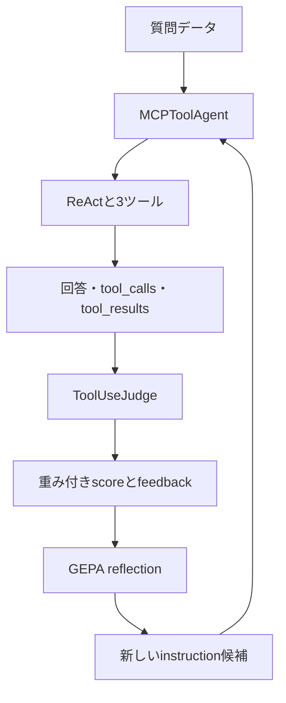
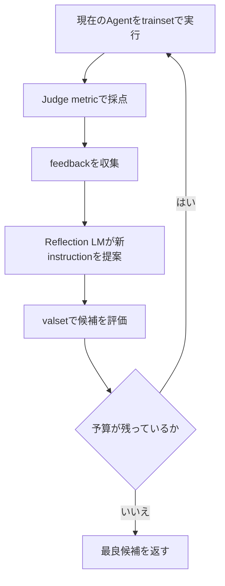

# DSPy GEPAによるツール利用最適化 実習ガイド

> 対象：東芝インターン「AIエージェントにおけるツール利用最適化」  
> 方針：LLM-as-a-Judgeでツール利用を採点し、具体的なフィードバックを使ってGEPAでReActエージェントを最適化する

## 0. 今回の正式な方針

今回の中心は、次の4要素です。

| 要素 | 使用するDSPy機能 | 役割 |
|---|---|---|
| ツール実行Agent | `dspy.ReAct` | 3つのMCPツールを選択・実行する |
| Agentのラッパー | `dspy.Module` | 回答、ツール呼び出し、ツール結果を評価関数へ渡す |
| LLM審査員 | `dspy.ChainOfThought(ToolUseJudge)` | ツール利用を4観点で採点し、改善案を返す |
| 最適化器 | `dspy.GEPA` | スコアと文章フィードバックからAgentの指示を改善する |

全体の流れです。



以前のガイドとの大きな違いは、主metricを次のように変更することです。

```text
以前：人手で期待ツールと正解値を用意し、完全一致で採点

今回：LLM審査員がツール選択・必要性・引数・最終回答を採点し、
      改善のための文章フィードバックも返す
```

さらにoptimizerは`BootstrapFewShot`ではなく、画像で指定された`GEPA`を使います。

---

## 1. GitHubへ載せる前の注意

公開GitHubには、次の情報を載せません。

- Azure OpenAIのAPIキー
- Azure OpenAIの社内endpoint
- MCPのAPIキー
- MCPサーバーのURLやIPアドレス
- 社内の質問ログ、tool result、最適化ログ
- 公開許可を得ていないメンター配布コード

このMarkdownでは、接続情報を変数名だけで表します。実習Notebookでは、メンター配布コードに定義済みの値を使ってください。

```python
# 値そのものはGitHubへ載せない
AZURE_OPENAI_API_KEY = ""
AZURE_OPENAI_ENDPOINT = ""
AZURE_OPENAI_API_VERSION = ""
AZURE_OPENAI_DEPLOYMENT = ""
```

---

## 2. 3種類のLMの役割

コード上では、LMに3つの役割があります。

| 役割 | 変数例 | 何をするか |
|---|---|---|
| Student LM | `lm` | ReAct Agentとして質問を解き、ツールを呼ぶ |
| Judge LM | `judge_lm` | Agentのツール利用を採点する |
| Reflection LM | `reflection_lm` | Judgeのfeedbackを読み、新しい指示を提案する |

同じAzure deploymentを使うこともできますが、役割は異なります。画像ではJudge／Reflection用モデルとしてメンター指定の小型モデルを使う方針が示されています。

注意：Azureでは、公開モデル名とAzure上のdeployment名が同じとは限りません。文字列を推測せず、メンターから指定されたdeployment名を使います。

---

## 3. 前提：メンター配布部分

以下はすでに定義済みであることを前提にします。

```python
import dspy

# Student LMがdspy.configure(lm=lm)で設定済み

# MCPへ接続する3つのPython関数が定義済み
# calculate_expression(...)
# analyze_numbers(...)
# convert_units(...)
```

メンター配布部分は変更せず、その後ろに本ガイドのセルを追加します。

---

## 4. Step 1：Agentのタスクを定義する

### 4.1 `ToolQA` Signature

```python
class ToolQA(dspy.Signature):
    """
    Answer the user's question accurately.
    Use the available tools when they are needed.
    Select an appropriate tool, pass valid arguments,
    avoid unnecessary or duplicate calls, and use the tool results
    to produce the final answer.
    """

    question: str = dspy.InputField(
        desc="ユーザーが入力した質問"
    )

    answer: str = dspy.OutputField(
        desc="ユーザー要求を満たす最終回答"
    )
```

`ToolQA`は計算処理ではなく、Agentが行う仕事の仕様です。

| 部分 | 意味 |
|---|---|
| docstring | Agent全体への初期instruction |
| `question` | 入力 |
| `answer` | 最終出力 |

GEPAが改善する主な対象は、ReAct内部のinstructionを含む文章部分です。

---

## 5. Step 2：ReActを`dspy.Module`で包む

### 5.1 なぜラッパーが必要か

通常のReAct結果には`answer`と`trajectory`があります。しかし今回のJudgeは、次を別々に受け取ります。

```text
tool_calls   ：呼び出したツール、引数、順序
tool_results ：各ツールの実行結果
final_answer ：最終回答
```

そこで`dspy.Module`を継承した`MCPToolAgent`を作り、ReActのtrajectoryをJudgeが読みやすい文字列へ変換します。

### 5.2 trajectoryを整理する補助関数

```python
import json


def extract_tool_history(trajectory):
    """
    ReActのtrajectoryから、実際のツール呼び出しと結果を取り出す。
    finishは終了合図なので、外部ツール呼び出しには数えない。
    """

    trajectory = trajectory or {}
    tool_calls = []
    tool_results = []

    for key, tool_name in trajectory.items():
        if not key.startswith("tool_name_"):
            continue

        step = key.removeprefix("tool_name_")
        tool_name = str(tool_name)

        if tool_name == "finish":
            continue

        tool_args = trajectory.get(f"tool_args_{step}", {})
        observation = trajectory.get(f"observation_{step}")

        tool_calls.append(
            {
                "step": step,
                "tool": tool_name,
                "arguments": tool_args,
            }
        )

        tool_results.append(
            {
                "step": step,
                "tool": tool_name,
                "result": observation,
            }
        )

    tool_calls_text = json.dumps(
        tool_calls,
        ensure_ascii=False,
        default=str,
    )

    tool_results_text = json.dumps(
        tool_results,
        ensure_ascii=False,
        default=str,
    )

    return tool_calls_text, tool_results_text
```

主な処理です。

| コード | 意味 |
|---|---|
| `tool_name_0` | 0番目に選んだツール |
| `tool_args_0` | 0番目のツールへ渡した引数 |
| `observation_0` | 0番目のツールの返却結果 |
| `finish`を除外 | 終了合図を外部ツール利用に数えない |
| `json.dumps` | Judgeが読める安定した文字列にする |
| `default=str` | JSON化できない返却値があっても文字列にする |

### 5.3 `MCPToolAgent`

```python
class MCPToolAgent(dspy.Module):
    def __init__(self):
        super().__init__()

        self.agent = dspy.ReAct(
            ToolQA,
            tools=[
                calculate_expression,
                analyze_numbers,
                convert_units,
            ],
            max_iters=5,
        )

    def forward(self, question: str):
        result = self.agent(question=question)

        tool_calls, tool_results = extract_tool_history(
            result.trajectory
        )

        return dspy.Prediction(
            answer=result.answer,
            tool_calls=tool_calls,
            tool_results=tool_results,
            trajectory=result.trajectory,
        )


agent = MCPToolAgent()
```

`dspy.Module`では、`forward()`がプログラム本体です。

```text
agent(question=質問)
       ↓
内部でforward(question=質問)が呼ばれる
       ↓
ReActを実行
       ↓
Judgeに必要なPredictionを返す
```

`self.agent`としてReActを持たせることで、GEPAはその内部predictorをDSPy Programの一部として認識できます。

---

## 6. Step 3：Agent単体で動作確認する

```python
prediction = agent(
    question="10, 20, 30, 40, 50の平均と標準偏差を計算してください"
)

print("answer:")
print(prediction.answer)

print("\ntool_calls:")
print(prediction.tool_calls)

print("\ntool_results:")
print(prediction.tool_results)

print("\ntrajectory:")
for key, value in prediction.trajectory.items():
    print(f"{key}: {value}")
```

この段階では、次だけ確認します。

- `analyze_numbers`が呼ばれたか。
- 平均と標準偏差に対応する引数になっているか。
- `tool_calls`と`tool_results`が空でないか。
- 最終回答がツール結果と整合しているか。

これはsmoke testであり、まだ最適化ではありません。

---

## 7. Step 4：利用可能ツールの説明を作る

Judgeには「Agentが何を利用できたか」も渡します。関数のsignatureとdocstringから自動生成すると、実際のツール定義とのずれを減らせます。

```python
import inspect


TOOL_FUNCTIONS = [
    calculate_expression,
    analyze_numbers,
    convert_units,
]


def build_available_tools_text(tool_functions):
    descriptions = []

    for tool in tool_functions:
        signature = inspect.signature(tool)
        docstring = inspect.getdoc(tool) or "説明なし"

        descriptions.append(
            f"{tool.__name__}{signature}\n{docstring}"
        )

    return "\n\n".join(descriptions)


AVAILABLE_TOOLS = build_available_tools_text(TOOL_FUNCTIONS)

print(AVAILABLE_TOOLS)
```

ここにAPIキーやMCP URLは含めません。ツール名、引数、用途だけをJudgeへ伝えます。

---

## 8. Step 5：GEPA用データセットを作る

### 8.1 1件のExample

今回のLLM Judgeは、必ずしも人手の正解文を必要としません。質問、利用可能ツール、Agentの実行履歴から採点します。

```python
def make_example(question):
    return dspy.Example(
        question=question,
        user_query=question,
        available_tools=AVAILABLE_TOOLS,
    ).with_inputs("question")
```

| フィールド | 役割 |
|---|---|
| `question` | Agentへ実際に入力する値 |
| `user_query` | Judgeがユーザー要求を確認するための値 |
| `available_tools` | Judgeが選択可能だったツールを知るための値 |
| `.with_inputs("question")` | Agentへの入力は`question`だけと宣言する |

### 8.2 データ例

まずは小規模に動作確認します。実際にはメンター指定のtrainsetがあれば、そちらを優先します。

```python
trainset = [
    # 計算ツール
    make_example("25 * 16 を計算してください"),
    make_example("2の10乗を求めてください"),
    make_example("128に1.08を掛けてください"),

    # 統計ツール
    make_example("1, 2, 3, 4, 5の平均を求めてください"),
    make_example("2, 4, 6, 8, 10の中央値を求めてください"),
    make_example("10, 20, 30, 40, 50の平均と標準偏差を求めてください"),

    # 単位変換ツール
    make_example("10 kmは何mですか？"),
    make_example("5000 mは何kmですか？"),
    make_example("2 kgは何gですか？"),

    # ツールが不要な質問
    make_example("平均値とは何か、計算せずに説明してください"),
    make_example("このAgentが利用できる処理の種類を簡潔に説明してください"),
]


valset = [
    make_example("37 + 58を計算してください"),
    make_example("3, 7, 9, 11, 20の平均を求めてください"),
    make_example("250 cmは何mですか？"),
    make_example("中央値とは何か、数値計算をせずに説明してください"),
]


testset = [
    make_example("144の平方根を計算してください"),
    make_example("4, 8, 15, 16, 23, 42の中央値を求めてください"),
    make_example("3.5 kgは何gですか？"),
    make_example("単位変換が必要になる場面を1つ説明してください"),
]
```

ツール不要問題も入れる理由は、Judgeの`tool_necessity_score`で「外部ツールを使う必要があったか」を評価するためです。

| データ | GEPAでの役割 |
|---|---|
| `trainset` | reflectionの材料になる例 |
| `valset` | 候補instructionの選択に使う例 |
| `testset` | 最後の評価だけに使う未知例 |

画像の最小コードでは`trainset`だけで`compile()`しています。その場合、GEPAはtrainsetを候補選択にも再利用します。未知問題への一般化を比較するなら、可能な限り別の`valset`を渡します。

---

## 9. Step 6：LLM審査員`ToolUseJudge`を作る

```python
class ToolUseJudge(dspy.Signature):
    """
    AI Agentによるツール利用を厳格に評価してください。

    以下の観点を総合的に評価します。

    1. 選択したツールがユーザー要求に適しているか
    2. 外部ツールを使用する必要があったか
    3. ツールに渡した引数が適切か
    4. 最終回答がユーザー要求を満たしているか
    5. 不要または重複したツール呼び出しがないか

    代替ツールでも同じ目的を安全かつ正確に達成できる場合は、
    必ずしも減点しないでください。

    各スコアは0.0から1.0で返してください。
    feedbackには、問題点とAgentの指示を改善するための
    具体的な助言を書いてください。
    """

    user_query: str = dspy.InputField(
        desc="ユーザーが入力した質問"
    )

    available_tools: str = dspy.InputField(
        desc="Agentが利用可能だったツールの名前、引数、説明"
    )

    tool_calls: str = dspy.InputField(
        desc="実際に呼び出したツール、引数、実行順序"
    )

    tool_results: str = dspy.InputField(
        desc="各ツールの実行結果"
    )

    final_answer: str = dspy.InputField(
        desc="Agentが生成した最終回答"
    )

    tool_selection_score: float = dspy.OutputField(
        desc="ツール選択の妥当性。0.0から1.0"
    )

    tool_necessity_score: float = dspy.OutputField(
        desc="ツール利用または非利用の妥当性。不要・重複呼び出しも考慮。0.0から1.0"
    )

    argument_score: float = dspy.OutputField(
        desc="ツール引数の妥当性。0.0から1.0"
    )

    task_success_score: float = dspy.OutputField(
        desc="ユーザー要求の達成度。0.0から1.0"
    )

    feedback: str = dspy.OutputField(
        desc="問題点と、Agentの指示を改善するための具体的な助言"
    )
```

評価観点と出力の対応です。

| 観点 | 出力 |
|---|---|
| ツールの種類が適切か | `tool_selection_score` |
| ツールが必要だったか、不要・重複呼び出しがないか | `tool_necessity_score` |
| 引数が適切か | `argument_score` |
| 最終的に要求を満たしたか | `task_success_score` |
| 何を改善すべきか | `feedback` |

「別のツールでも正確に達成できるなら減点しない」という記述が重要です。期待ツールの完全一致だけでは、妥当な別解を誤って不正解にするためです。

---

## 10. Step 7：Judge LMを設定する

```python
# 実際には、メンター指定のAzure deployment名を使う
JUDGE_DEPLOYMENT = AZURE_OPENAI_DEPLOYMENT


judge_lm = dspy.LM(
    f"azure/{JUDGE_DEPLOYMENT}",
    api_key=AZURE_OPENAI_API_KEY,
    api_base=AZURE_OPENAI_ENDPOINT,
    api_version=AZURE_OPENAI_API_VERSION,
    temperature=0.0,
)


judge = dspy.ChainOfThought(ToolUseJudge)
```

画像で指定されたモデル用deploymentがStudentと別にある場合は、`JUDGE_DEPLOYMENT`だけをその値に変更します。

`temperature=0.0`は採点の揺れを減らすためです。ただし、完全な決定性を保証するものではありません。

`judge`自体にはLMを直接渡していません。次の`run_judge()`内で`dspy.context(lm=judge_lm)`を使い、Judgeを実行する間だけLMを切り替えます。

---

## 11. Step 8：`run_judge()`を作る

```python
def run_judge(example, prediction):
    with dspy.context(lm=judge_lm):
        return judge(
            user_query=example.user_query,
            available_tools=example.available_tools,
            tool_calls=prediction.tool_calls,
            tool_results=prediction.tool_results,
            final_answer=prediction.answer,
        )
```

引数の対応です。

| Judge入力 | 取得元 |
|---|---|
| `user_query` | データセットの`example.user_query` |
| `available_tools` | データセットの`example.available_tools` |
| `tool_calls` | Agentの`prediction.tool_calls` |
| `tool_results` | Agentの`prediction.tool_results` |
| `final_answer` | Agentの`prediction.answer` |

---

## 12. Step 9：重み付き`tool_use_metric`を作る

### 12.1 metric本体

```python
def clip01(value):
    return max(0.0, min(1.0, float(value)))


def tool_use_metric(
    example,
    prediction,
    trace=None,
    pred_name=None,
    pred_trace=None,
    program_trace=None,
):
    judgment = run_judge(example, prediction)

    tool_selection = clip01(
        judgment.tool_selection_score
    )

    tool_necessity = clip01(
        judgment.tool_necessity_score
    )

    argument = clip01(
        judgment.argument_score
    )

    task_success = clip01(
        judgment.task_success_score
    )

    score = (
        0.40 * tool_selection
        + 0.20 * tool_necessity
        + 0.15 * argument
        + 0.25 * task_success
    )

    return dspy.Prediction(
        score=clip01(score),
        feedback=judgment.feedback,
    )
```

画像では`trace`、`pred_name`、`pred_trace`までですが、現行GEPAのmetric形式に合わせて`program_trace=None`も追加しています。今回の処理では、これらのtrace引数を直接使わなくても構いません。

### 12.2 重みの意味

```text
0.40：tool selection
0.20：tool necessity
0.15：arguments
0.25：task success
合計：1.00
```

| 項目 | 重み | 解釈 |
|---|---:|---|
| Tool Selection | 0.40 | 今回もっとも重視するツール選択 |
| Tool Necessity | 0.20 | 必要なときだけ使い、不要・重複呼び出しを避ける |
| Arguments | 0.15 | ツールへ正しい値を渡す |
| Task Success | 0.25 | 最終回答が要求を満たす |

例として、Judgeが次のスコアを返したとします。

```text
tool_selection = 1.0
tool_necessity = 0.8
argument       = 0.6
task_success   = 0.9
```

総合点は、

```text
0.40×1.0 + 0.20×0.8 + 0.15×0.6 + 0.25×0.9
= 0.875
```

です。

### 12.3 なぜ数値だけでなくfeedbackを返すのか

通常のoptimizerなら、スコアだけでも候補の優劣を比較できます。GEPAはさらに文章feedbackをReflection LMへ渡し、次のinstruction候補を考えます。

```text
悪いfeedback：スコアが低い

良いfeedback：統計問題でcalculate_expressionを選んでいる。
               数値配列に平均・中央値・標準偏差が要求された場合は
               analyze_numbersを優先する指示を追加すべきである。
```

具体的なfeedbackほど、GEPAが改善案を作りやすくなります。

---

## 13. Step 10：Judgeとmetricを最適化前に校正する

GEPAをすぐ実行せず、まず1～3問でJudgeの挙動を確認します。

```python
example = trainset[0]
prediction = agent(question=example.question)

judgment = run_judge(example, prediction)

print("tool_selection_score:", judgment.tool_selection_score)
print("tool_necessity_score:", judgment.tool_necessity_score)
print("argument_score:", judgment.argument_score)
print("task_success_score:", judgment.task_success_score)
print("feedback:", judgment.feedback)

metric_result = tool_use_metric(example, prediction)

print("weighted score:", metric_result.score)
print("metric feedback:", metric_result.feedback)
```

確認項目です。

- すべてのスコアが0.0～1.0か。
- 明らかに正しい実行へ高得点を付けるか。
- 不要なツール呼び出しへ`tool_necessity_score`を下げるか。
- 引数ミスへ`argument_score`を下げるか。
- feedbackが具体的か。
- 同じ入力を複数回採点したとき、極端に揺れないか。

Judgeが不安定または甘すぎる場合、GEPAは誤った方向へ最適化します。Agentより先に評価器を確認することが重要です。

---

## 14. Step 11：新方式のBaseline評価

Baselineは、GEPAで`compile()`する前の`agent`です。

```text
Baseline = MCPToolAgent + 初期ToolQA instruction + 3ツール
```

GEPA用metricは`Prediction(score, feedback)`を返します。通常評価では数値だけを使う関数を用意すると分かりやすいです。

```python
def score_only_metric(example, prediction, trace=None):
    result = tool_use_metric(
        example,
        prediction,
        trace=trace,
    )
    return float(result.score)
```

```python
baseline_evaluator = dspy.Evaluate(
    devset=valset,
    metric=score_only_metric,
    num_threads=1,
    display_progress=True,
    display_table=True,
)


baseline_result = baseline_evaluator(agent)

print("Baseline score:", baseline_result.score)
```

内部では、各問題について次を行っています。

```text
質問
 ↓
Baseline Agentを実行
 ↓
回答・ツール履歴
 ↓
Judge LMが4観点を採点
 ↓
重み付きscore
 ↓
valset全体で集計
```

Judge LMの呼び出しにも時間とtokenコストがかかります。最初は`num_threads=1`で確認し、安定後に増やします。

---

## 15. Step 12：Reflection LMとGEPAを設定する

### 15.1 Reflection LM

```python
# Judgeと同じdeploymentを使う例。
# 別の指定がある場合は専用deploymentへ変更する。
REFLECTION_DEPLOYMENT = JUDGE_DEPLOYMENT


reflection_lm = dspy.LM(
    f"azure/{REFLECTION_DEPLOYMENT}",
    api_key=AZURE_OPENAI_API_KEY,
    api_base=AZURE_OPENAI_ENDPOINT,
    api_version=AZURE_OPENAI_API_VERSION,
    temperature=0.0,
)
```

Reflection LMはAgentとして回答するのではなく、Judgeのfeedbackと実行例を読み、改善されたinstructionを提案します。

### 15.2 GEPA

```python
optimizer = dspy.GEPA(
    metric=tool_use_metric,
    auto="light",
    reflection_lm=reflection_lm,
    num_threads=4,
)
```

| 引数 | 意味 |
|---|---|
| `metric=tool_use_metric` | 候補を採点し、文章feedbackを返す |
| `auto="light"` | 小さい探索予算で試す |
| `reflection_lm` | feedbackから新instructionを提案するLM |
| `num_threads=4` | 最大4件を並行処理する設定 |

画像では`num_threads=4`です。レート制限やMCPエラーが出る場合、動作確認だけ一時的に`1`へ下げ、メンターへ相談します。

---

## 16. Step 13：GEPAでcompileする

### 16.1 画像に近い最小形

```python
optimized_agent = optimizer.compile(
    student=agent,
    trainset=trainset,
)
```

### 16.2 valsetを分ける推奨形

```python
optimized_agent = optimizer.compile(
    student=agent,
    trainset=trainset,
    valset=valset,
)
```

GEPA内部では、おおむね次を繰り返します。



`compile()`はStudent LMのニューラルネットワーク重みを学習する処理ではありません。主にDSPy Program内のinstructionなどの文章要素を探索・改善します。

```text
agent           ：最適化前
optimized_agent ：GEPA最適化後
```

元の`agent`を残すことで、同じ評価条件で比較できます。

---

## 17. Step 14：最適化後を評価する

Baselineと同じvalset、Judge、metricを使います。

```python
optimized_result = baseline_evaluator(optimized_agent)

print("Baseline score:", baseline_result.score)
print("Optimized score:", optimized_result.score)
```

最終的には、未使用のtestsetでも両方を比較します。

```python
test_evaluator = dspy.Evaluate(
    devset=testset,
    metric=score_only_metric,
    num_threads=1,
    display_progress=True,
    display_table=True,
)


baseline_test_result = test_evaluator(agent)
optimized_test_result = test_evaluator(optimized_agent)

print("Baseline test score:", baseline_test_result.score)
print("Optimized test score:", optimized_test_result.score)
```

比較時に固定するものです。

| 固定条件 | 理由 |
|---|---|
| Student LM | モデル変更の効果と混ぜない |
| Judge LM | 採点基準をそろえる |
| ツール実装 | ツール変更の効果と混ぜない |
| valset／testset | 同じ質問で比較する |
| metricと重み | 同じ尺度で比較する |
| `max_iters` | 最大ツール回数をそろえる |

---

## 18. 4つの内訳も記録する

総合scoreだけでは、何が改善したか分かりません。発表では4観点を別々に集計します。

```python
import time
import pandas as pd


def evaluate_with_judge(program, dataset):
    rows = []

    for index, example in enumerate(dataset):
        start = time.perf_counter()

        try:
            prediction = program(question=example.question)
            judgment = run_judge(example, prediction)

            tool_selection = clip01(
                judgment.tool_selection_score
            )
            tool_necessity = clip01(
                judgment.tool_necessity_score
            )
            argument = clip01(
                judgment.argument_score
            )
            task_success = clip01(
                judgment.task_success_score
            )

            weighted_score = (
                0.40 * tool_selection
                + 0.20 * tool_necessity
                + 0.15 * argument
                + 0.25 * task_success
            )

            elapsed = time.perf_counter() - start
            calls = json.loads(prediction.tool_calls)

            rows.append(
                {
                    "index": index,
                    "question": example.question,
                    "answer": prediction.answer,
                    "tool_calls": prediction.tool_calls,
                    "tool_selection": tool_selection,
                    "tool_necessity": tool_necessity,
                    "argument": argument,
                    "task_success": task_success,
                    "weighted_score": clip01(weighted_score),
                    "num_tool_calls": len(calls),
                    "latency_sec": elapsed,
                    "feedback": judgment.feedback,
                    "error": None,
                }
            )

        except Exception as error:
            elapsed = time.perf_counter() - start

            rows.append(
                {
                    "index": index,
                    "question": example.question,
                    "answer": None,
                    "tool_calls": None,
                    "tool_selection": 0.0,
                    "tool_necessity": 0.0,
                    "argument": 0.0,
                    "task_success": 0.0,
                    "weighted_score": 0.0,
                    "num_tool_calls": 0,
                    "latency_sec": elapsed,
                    "feedback": None,
                    "error": repr(error),
                }
            )

    return pd.DataFrame(rows)
```

```python
baseline_df = evaluate_with_judge(agent, testset)
optimized_df = evaluate_with_judge(optimized_agent, testset)


def summarize(df):
    return {
        "tool_selection": df["tool_selection"].mean(),
        "tool_necessity": df["tool_necessity"].mean(),
        "argument": df["argument"].mean(),
        "task_success": df["task_success"].mean(),
        "weighted_score": df["weighted_score"].mean(),
        "avg_tool_calls": df["num_tool_calls"].mean(),
        "avg_latency_sec": df["latency_sec"].mean(),
        "error_rate": df["error"].notna().mean(),
    }


comparison_df = pd.DataFrame(
    [
        summarize(baseline_df),
        summarize(optimized_df),
    ],
    index=["Baseline", "GEPA"],
)

display(comparison_df)
```

注意：この`latency_sec`には、Agent実行だけでなくJudge実行時間も含まれます。利用者が感じるAgent応答時間を測りたい場合は、Judgeの前で別に計測します。

---

## 19. Agent応答時間を分けて測る

```python
def measure_agent_latency(program, dataset):
    rows = []

    for example in dataset:
        start = time.perf_counter()
        prediction = program(question=example.question)
        agent_latency = time.perf_counter() - start

        rows.append(
            {
                "question": example.question,
                "agent_latency_sec": agent_latency,
                "tool_calls": len(
                    json.loads(prediction.tool_calls)
                ),
            }
        )

    return pd.DataFrame(rows)
```

```text
Agent latency：実際の質問応答にかかる時間
Judge latency：評価時だけ追加でかかる時間
GEPA compile cost：最適化時だけかかるコスト
```

この3つを混同しないようにします。

---

## 20. LLM-as-a-Judge方式の注意点

### 長所

- 正解ツール経路を全問で人手作成しなくてよい。
- 複数の妥当なツール経路を柔軟に評価できる。
- 最終回答だけでなく、必要性や引数も評価できる。
- GEPAへ具体的な文章feedbackを渡せる。

### 限界

- Judge自体が誤る可能性がある。
- 同じ実行でもスコアが多少揺れる可能性がある。
- Judge LMのtokenコストと待ち時間が増える。
- JudgeとAgentが似た誤りを共有する可能性がある。
- feedbackが抽象的だとGEPAが改善しにくい。

### 対策

- 明らかな成功例・失敗例でJudgeを事前校正する。
- 代表例は人間もtrajectoryを確認する。
- testsetの一部は人手評価とJudge評価を照合する。
- temperature、Judgeモデル、rubric、重みを固定する。
- 実験条件とDSPyバージョンを記録する。

---

## 21. よくあるエラー

### `prediction.tool_calls`がない

原因：生の`dspy.ReAct`を直接`student`に渡している可能性があります。

対処：

```python
agent = MCPToolAgent()
```

として、ラッパーが`tool_calls`と`tool_results`を返すようにします。

### `example.user_query`がない

原因：古い`dspy.Example(question=..., answer=...)`を使っている可能性があります。

対処：

```python
make_example(question)
```

で`user_query`と`available_tools`を持たせます。

### JudgeがStudent LMで動いてしまう

`run_judge()`内の次を確認します。

```python
with dspy.context(lm=judge_lm):
    # この中でJudgeを実行する
    ...
```

### `tool_calls`が常に空

`prediction.trajectory`を表示し、キー名を確認します。

```python
print(prediction.trajectory)
```

現在のReActでは通常、`tool_name_0`、`tool_args_0`、`observation_0`の形です。DSPyバージョンが異なる場合は`extract_tool_history()`を実際のキーへ合わせます。

### GEPAが遅い

- まず`auto="light"`を使う。
- trainset／valsetを小さくして疎通確認する。
- Judge呼び出しが正常か単体テストする。
- `num_threads`を環境に合わせる。
- API利用上限をメンターへ確認する。

### スコアは高いが挙動が悪い

Judge rubricまたは重みが目的と合っていない可能性があります。代表的trajectoryとfeedbackを人手で読み、評価関数を先に直します。

---

## 22. 実習での実行順序

### Phase 1：Agentの準備

- [ ] メンター配布のMCPツールが単体で動く。
- [ ] `ToolQA`を定義する。
- [ ] `extract_tool_history()`を作る。
- [ ] `MCPToolAgent`を作る。
- [ ] 1問実行し、answer／tool_calls／tool_resultsを確認する。

### Phase 2：評価器の準備

- [ ] `AVAILABLE_TOOLS`を作る。
- [ ] `make_example()`でデータを作る。
- [ ] `ToolUseJudge`を定義する。
- [ ] `judge_lm`と`run_judge()`を作る。
- [ ] `tool_use_metric()`を作る。
- [ ] 明らかな成功例と失敗例でJudgeを校正する。

### Phase 3：Baseline

- [ ] GEPA前のAgentをvalsetで評価する。
- [ ] 4スコア、総合点、ツール回数、応答時間を記録する。
- [ ] 低得点例のfeedbackとtrajectoryを読む。

### Phase 4：GEPA

- [ ] `reflection_lm`を設定する。
- [ ] `dspy.GEPA(auto="light")`を作る。
- [ ] `compile(student=agent, trainset=..., valset=...)`を実行する。
- [ ] `optimized_agent`を保存する。

### Phase 5：比較

- [ ] 同じvalsetでBaselineとGEPAを比較する。
- [ ] 最後に未使用testsetで比較する。
- [ ] 総合点だけでなく4観点の改善を示す。
- [ ] 代表的な改善trajectoryを示す。
- [ ] Agent latencyと評価・最適化コストを分けて説明する。

---

## 23. 最適化済みAgentを保存する

```python
optimized_agent.save(
    "optimized_mcp_tool_agent_gepa.json"
)
```

保存ファイルには、最適化されたinstructionや実習データ由来の内容が含まれる可能性があります。公開GitHubへ載せる前に、メンターへ確認してください。

---

## 24. 最終発表の構成案

### 1. 課題

質問傾向やモデル更新により、AI Agentのツール選択、回答品質、コスト、応答時間が変化する。手動プロンプト調整では継続改善の負担が大きい。

### 2. 提案方法

```text
ReAct Agent
  ↓ 実行履歴
LLM-as-a-Judge
  ↓ score + feedback
GEPA
  ↓ instruction改善
最適化済みAgent
```

### 3. 評価観点

- Tool Selection：40%
- Tool Necessity：20%
- Argument：15%
- Task Success：25%

### 4. 実験

- Baseline：最適化前の`MCPToolAgent`
- Proposed：GEPA最適化後
- 同じStudent LM、Judge LM、ツール、testsetで比較

### 5. 結果

| Method | Selection | Necessity | Argument | Success | Total | Calls | Agent Latency |
|---|---:|---:|---:|---:|---:|---:|---:|
| Baseline | 実測 | 実測 | 実測 | 実測 | 実測 | 実測 | 実測 |
| GEPA | 実測 | 実測 | 実測 | 実測 | 実測 | 実測 | 実測 |

### 6. 考察

- どの評価観点が改善したか。
- feedbackがinstructionにどう反映されたか。
- 不要・重複呼び出しは減ったか。
- 回答品質と呼び出し回数・時間のtrade-offはどうか。
- Judge評価と人手確認は一致したか。

### 7. 限界

- データ件数が少ない。
- Judgeの採点誤差がある。
- GEPA探索には追加コストがかかる。
- 実際のユーザーログ分布を十分に再現していない。

---

## 25. まず実行する最小コード

迷った場合は、次の順に1セルずつ確認します。

```python
# 1. ラッパーAgent
agent = MCPToolAgent()

# 2. 1問実行
example = make_example(
    "10, 20, 30, 40, 50の平均と標準偏差を計算してください"
)
prediction = agent(question=example.question)

# 3. 履歴確認
print(prediction.answer)
print(prediction.tool_calls)
print(prediction.tool_results)

# 4. Judge確認
judgment = run_judge(example, prediction)
print(judgment)

# 5. metric確認
metric_result = tool_use_metric(example, prediction)
print(metric_result.score)
print(metric_result.feedback)
```

ここまで正常に動いてから、Baseline評価とGEPAの`compile()`へ進みます。

---

## 26. 公式資料

- [DSPy ReAct](https://dspy.ai/api/modules/ReAct/)
- [DSPy Module](https://dspy.ai/api/modules/Module/)
- [GEPA Overview](https://dspy.ai/api/optimizers/GEPA/overview/)
- [GEPA Optimization Tutorial](https://dspy.ai/getting-started/gepa-optimization/)
- [DSPy Metrics and Evaluation](https://dspy.ai/diving-deeper/metrics-and-evaluation/)
- [DSPy Evaluate](https://dspy.ai/api/evaluation/Evaluate/)
- [DSPy Saving and Loading](https://dspy.ai/tutorials/saving/)

---

## 27. 要点

今回の方針を一行で表すと、次のとおりです。

```text
ReActの実行履歴をLLM Judgeが採点し、
scoreと具体的feedbackをGEPAへ渡して、
Agentのinstructionを自動改善する。
```

実装上の重要点は3つです。

1. `dspy.Module`でReActを包み、`tool_calls`と`tool_results`を返す。
2. `tool_use_metric`は数値scoreだけでなく、具体的な`feedback`も返す。
3. GEPA前のBaselineとGEPA後を、同じJudge・データ・条件で比較する。

これで、画像に示された`ToolUseJudge`、重み付き評価関数、Reflection LM、`dspy.GEPA`、`MCPToolAgent(dspy.Module)`を使う一連の実習手順になります。
