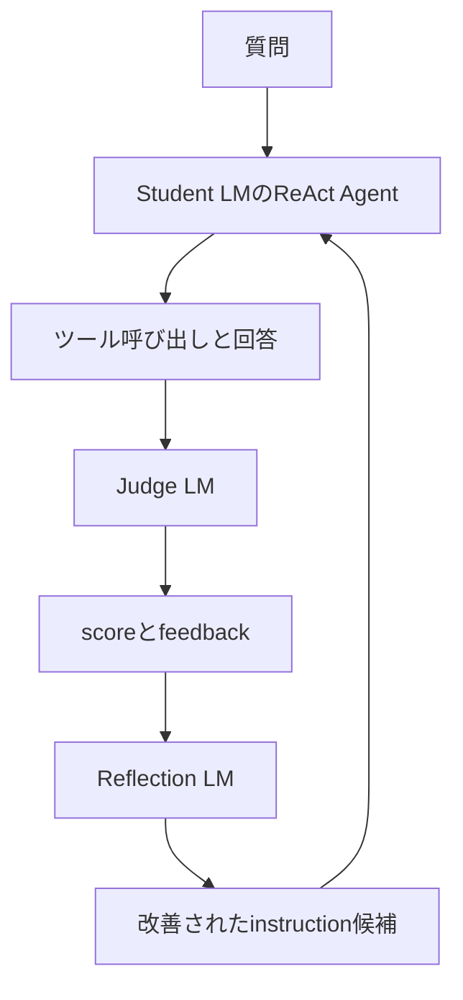

# DSPy GEPAツール利用最適化：コピペ実行ガイド

> メンターから渡された`calculate_expression`、`analyze_numbers`、`convert_units`の定義が終わった直後から使うガイドです。  
> JupyterLabで「セル1」から順番にコピーして実行してください。

## 0. このガイドの前提

先に、メンターから渡された次の処理を実行しておきます。

```text
1. import dspy
2. Azure OpenAIの設定
3. lm = dspy.LM(...)
4. dspy.configure(lm=lm)
5. call_mcp_tool(...)
6. calculate_expression(...)
7. analyze_numbers(...)
8. convert_units(...)
```

このガイドは、`convert_units`を定義したセルの次から始めます。

重要：公開GitHubには、AzureのAPIキー、endpoint、MCPのURL、MCPのAPIキーを載せないでください。このファイルでは、それらがすでに変数へ入っているものとして、変数名だけを使います。

---

# 実行用コード

## セル1：必要なライブラリと定義済み変数を確認する

```python
import importlib.metadata
import json
import time

import dspy
import pandas as pd


required_names = [
    "AZURE_OPENAI_API_KEY",
    "AZURE_OPENAI_ENDPOINT",
    "AZURE_OPENAI_API_VERSION",
    "calculate_expression",
    "analyze_numbers",
    "convert_units",
]


missing_names = [
    name
    for name in required_names
    if name not in globals()
]


if missing_names:
    raise NameError(
        "先にメンター配布コードを実行してください。"
        f" 未定義: {missing_names}"
    )


print("DSPy version:", importlib.metadata.version("dspy"))
print("3つのツールとAzure設定を確認しました。")
```

### このセルの意味

- 後で使う`json`、`time`、`pandas`を読み込みます。
- 3つのツールとAzure設定が定義されているか確認します。
- 未実行のセルがある場合は、GEPAまで進む前に止めます。

`pandas`がない場合は、別セルで次を実行してからやり直します。

```python
%pip install pandas
```

インストール後はKernelを再起動し、メンター配布コードから順番に再実行します。

---

## セル2：Agentの入出力を定義する

```python
class ToolQA(dspy.Signature):
    """
    ユーザーの質問に正確に回答してください。

    計算が必要な場合は、利用可能なツールから適切なものを選択してください。
    ツールを利用する場合は、正しい引数を渡してください。
    不要または重複したツール呼び出しは避けてください。
    ツールの実行結果を利用して、ユーザー要求を満たす最終回答を作成してください。
    """

    question: str = dspy.InputField(
        desc="ユーザーが入力した質問"
    )

    answer: str = dspy.OutputField(
        desc="ユーザー要求を満たす最終回答"
    )
```

### このセルの意味

`ToolQA`は計算関数ではなく、ReAct Agentへ与えるタスク仕様です。

| 部分 | 意味 |
|---|---|
| classのdocstring | Agentへの初期指示 |
| `question` | Agentへの入力 |
| `answer` | Agentの最終出力 |

GEPAは、このようなDSPy Program内の指示文を改善します。

---

## セル3：ReActのtrajectoryからツール履歴を取り出す

```python
def extract_tool_history(trajectory):
    """
    ReActのtrajectoryから、外部ツールの呼び出し履歴と実行結果を取り出す。

    finishはReActの終了合図であり、外部ツールではないため除外する。
    Judgeが読みやすいように、結果をJSON文字列へ変換して返す。
    """

    trajectory = trajectory or {}
    tool_calls = []
    tool_results = []

    for key, tool_name in trajectory.items():
        if not key.startswith("tool_name_"):
            continue

        step = key.removeprefix("tool_name_")
        tool_name = str(tool_name)

        if tool_name == "finish":
            continue

        tool_args = trajectory.get(
            f"tool_args_{step}",
            {},
        )

        observation = trajectory.get(
            f"observation_{step}"
        )

        tool_calls.append(
            {
                "step": step,
                "tool": tool_name,
                "arguments": tool_args,
            }
        )

        tool_results.append(
            {
                "step": step,
                "tool": tool_name,
                "result": observation,
            }
        )

    tool_calls_text = json.dumps(
        tool_calls,
        ensure_ascii=False,
        default=str,
    )

    tool_results_text = json.dumps(
        tool_results,
        ensure_ascii=False,
        default=str,
    )

    return tool_calls_text, tool_results_text
```

### このセルの意味

ReActのtrajectoryは、おおむね次の形です。

```text
thought_0
tool_name_0
tool_args_0
observation_0
thought_1
tool_name_1
...
```

この関数は、Judgeに必要な部分だけを次のようにまとめます。

```json
[
  {
    "step": "0",
    "tool": "analyze_numbers",
    "arguments": {
      "values": [10, 20, 30]
    }
  }
]
```

---

## セル4：ReActを`dspy.Module`で包む

```python
class MCPToolAgent(dspy.Module):
    """
    3つのMCPツールを利用するReAct Agent。

    ReActの最終回答に加えて、Judgeによる評価に必要な
    ツール呼び出し履歴とツール実行結果も返す。
    """

    def __init__(self):
        super().__init__()

        self.agent = dspy.ReAct(
            ToolQA,
            tools=[
                calculate_expression,
                analyze_numbers,
                convert_units,
            ],
            max_iters=5,
        )

    def forward(self, question: str):
        """
        質問をReActへ渡し、回答とツール利用履歴をPredictionとして返す。
        """

        result = self.agent(
            question=question
        )

        tool_calls, tool_results = extract_tool_history(
            result.trajectory
        )

        return dspy.Prediction(
            answer=result.answer,
            tool_calls=tool_calls,
            tool_results=tool_results,
            trajectory=result.trajectory,
        )


agent = MCPToolAgent()
```

### なぜ`dspy.Module`が必要か

生の`dspy.ReAct`は主に`answer`と`trajectory`を返します。しかし今回のJudgeは、次の3つを使います。

```text
prediction.answer
prediction.tool_calls
prediction.tool_results
```

そこでReActを`MCPToolAgent`で包み、評価に必要な出力を追加しています。

`forward()`は、このDSPy Moduleを呼び出したときに実行される本体です。

---

## セル5：Agentの動作を1問で確認する

```python
smoke_prediction = agent(
    question=(
        "10, 20, 30, 40, 50の平均と標準偏差を"
        "計算してください"
    )
)


print("answer:")
print(smoke_prediction.answer)

print("\ntool_calls:")
print(smoke_prediction.tool_calls)

print("\ntool_results:")
print(smoke_prediction.tool_results)

print("\ntrajectory:")
for key, value in smoke_prediction.trajectory.items():
    print(f"{key}: {value}")
```

### 確認すること

- `analyze_numbers`が呼ばれているか。
- 平均と標準偏差を求める引数になっているか。
- `tool_calls`が`[]`になっていないか。
- 最終回答がツール結果と一致しているか。

ここでエラーが出る場合、JudgeやGEPAには進みません。

---

## セル6：Judgeに渡すツール説明を作る

```python
AVAILABLE_TOOLS = """
1. calculate_expression
   用途：単一の数式を計算する。
   主な引数：expression、precision。
   例：25 * 16、128 * 1.08、2 ** 10。

2. analyze_numbers
   用途：数値配列の平均、中央値、標準偏差、分散などを計算する。
   主な引数：values、operations、second_values、outlier_method。
   例：1, 2, 3, 4, 5の平均と中央値。

3. convert_units
   用途：長さ、質量、温度、時間、データサイズなどの単位を変換する。
   主な引数：value、from_unit、to_unit、category、precision。
   例：10 kmをmへ変換する。
""".strip()


print(AVAILABLE_TOOLS)
```

### このセルの意味

Judgeは、Agentが選べたツールの一覧を知らなければ、選択の良し悪しを評価できません。

この説明にはツール名、用途、主な引数だけを書きます。MCP URLやAPIキーは入れません。

---

## セル7：trainset、valset、testsetを作る

```python
def make_example(question):
    """
    Agentへの質問と、Judgeが評価に使う情報を持つExampleを作る。
    """

    return dspy.Example(
        question=question,
        user_query=question,
        available_tools=AVAILABLE_TOOLS,
    ).with_inputs("question")


trainset = [
    # 数値計算
    make_example("25 * 16を計算してください"),
    make_example("100 / 4を計算してください"),
    make_example("2の10乗を求めてください"),

    # 統計
    make_example("1, 2, 3, 4, 5の平均を求めてください"),
    make_example("2, 4, 6, 8, 10の中央値を求めてください"),
    make_example(
        "10, 20, 30, 40, 50の平均と標準偏差を求めてください"
    ),

    # 単位変換
    make_example("1 kmは何mですか？"),
    make_example("5000 mは何kmですか？"),
    make_example("2 kgは何gですか？"),

    # ツールを使う必要がない質問
    make_example("平均値とは何か、計算せずに説明してください"),
]


valset = [
    make_example("37 + 58を計算してください"),
    make_example("3, 7, 9, 11, 20の平均を求めてください"),
    make_example("250 cmは何mですか？"),
    make_example("中央値とは何か、計算せずに説明してください"),
]


testset = [
    make_example("144 ** 0.5を計算してください"),
    make_example(
        "4, 8, 15, 16, 23, 42の中央値を求めてください"
    ),
    make_example("3.5 kgは何gですか？"),
    make_example(
        "単位変換が必要になる場面を1つ説明してください"
    ),
]


print("trainset:", len(trainset))
print("valset:", len(valset))
print("testset:", len(testset))
```

### 3分割の役割

| データ | 使い方 |
|---|---|
| `trainset` | GEPAが改善案を考える材料 |
| `valset` | GEPAが候補instructionを比較するデータ |
| `testset` | 方法を決めた後の最終評価 |

`tool_necessity_score`を評価するため、ツールを使う必要がない質問も含めています。

---

## セル8：LLM審査員のSignatureを定義する

```python
class ToolUseJudge(dspy.Signature):
    """
    AI Agentによるツール利用を厳格に評価してください。

    以下の観点を総合的に評価します。

    1. 選択したツールがユーザー要求に適しているか。
    2. 外部ツールを使用する必要があったか。
    3. ツールに渡した引数が適切か。
    4. 最終回答がユーザー要求を満たしているか。
    5. 不要または重複したツール呼び出しがないか。

    代替ツールでも同じ目的を安全かつ正確に達成できる場合は、
    必ずしも減点しないでください。

    各スコアは0.0から1.0で返してください。
    feedbackには、問題点とAgentの指示を改善するための
    具体的な助言を書いてください。
    """

    user_query: str = dspy.InputField(
        desc="ユーザーが入力した質問"
    )

    available_tools: str = dspy.InputField(
        desc="Agentが利用可能だったツールの名前、引数、説明"
    )

    tool_calls: str = dspy.InputField(
        desc="実際に呼び出したツール、引数、実行順序"
    )

    tool_results: str = dspy.InputField(
        desc="各ツールの実行結果"
    )

    final_answer: str = dspy.InputField(
        desc="Agentが生成した最終回答"
    )

    tool_selection_score: float = dspy.OutputField(
        desc="ツール選択の妥当性。0.0から1.0"
    )

    tool_necessity_score: float = dspy.OutputField(
        desc=(
            "ツール利用または非利用の妥当性。"
            "不要・重複呼び出しも考慮する。0.0から1.0"
        )
    )

    argument_score: float = dspy.OutputField(
        desc="ツール引数の妥当性。0.0から1.0"
    )

    task_success_score: float = dspy.OutputField(
        desc="ユーザー要求の達成度。0.0から1.0"
    )

    feedback: str = dspy.OutputField(
        desc=(
            "問題点と、Agentの指示を改善するための"
            "具体的な助言"
        )
    )
```

### 4つのスコア

| 出力 | 評価内容 |
|---|---|
| `tool_selection_score` | ツールの種類が適切か |
| `tool_necessity_score` | ツールが必要だったか、不要・重複呼び出しがないか |
| `argument_score` | 引数が適切か |
| `task_success_score` | 最終回答が要求を満たしたか |

---

## セル9：Judge LMを設定する

このセルを`ToolUseJudge`の定義後、`run_judge()`の定義前に置きます。

```python
# ============================================================
# Judge LMの設定場所
# ============================================================

# メンターから指定されたJudge用Azure deployment名を入れる。
# Azure上のdeployment名が本当に「gpt-5.4-mini」の場合は
# このまま使用できる。異なる場合は、この1行だけ変更する。
JUDGE_AZURE_OPENAI_DEPLOYMENT = "gpt-5.4-mini"


judge_lm = dspy.LM(
    f"azure/{JUDGE_AZURE_OPENAI_DEPLOYMENT}",
    api_key=AZURE_OPENAI_API_KEY,
    api_base=AZURE_OPENAI_ENDPOINT,
    api_version=AZURE_OPENAI_API_VERSION,
    temperature=0.0,
)


judge = dspy.ChainOfThought(
    ToolUseJudge
)


print(
    "Judge LMを設定しました:",
    JUDGE_AZURE_OPENAI_DEPLOYMENT,
)
```

### ここで重要なこと

`JUDGE_AZURE_OPENAI_DEPLOYMENT`に入れるのは、Azure Portalまたはメンターから指定された**deployment名**です。公開モデル名とdeployment名が異なる場合があります。

例えばAzure上のdeployment名が`judge-gpt54-mini`なら、次のようにします。

```python
JUDGE_AZURE_OPENAI_DEPLOYMENT = "judge-gpt54-mini"
```

APIキー、endpoint、API versionは、メンター配布部分ですでに定義された変数を再利用します。

`judge_lm`はAgentの回答生成には使いません。次の`dspy.context`により、採点中だけJudge LMへ切り替えます。

---

## セル10：Judgeを呼び出す関数を作る

```python
def run_judge(example, prediction):
    """
    1件のExampleとAgentのPredictionをJudge LMへ渡し、評価結果を返す。
    """

    with dspy.context(lm=judge_lm):
        judgment = judge(
            user_query=example.user_query,
            available_tools=example.available_tools,
            tool_calls=prediction.tool_calls,
            tool_results=prediction.tool_results,
            final_answer=prediction.answer,
        )

    return judgment
```

### データの流れ

```text
example.user_query       ─┐
example.available_tools  ─┤
prediction.tool_calls    ─┤→ Judge LM → 4スコア＋feedback
prediction.tool_results  ─┤
prediction.answer        ─┘
```

---

## セル11：GEPA用の評価関数を作る

```python
def clip01(value):
    """
    数値を0.0から1.0の範囲へ収める。
    """

    return max(
        0.0,
        min(1.0, float(value)),
    )


def tool_use_metric(
    example,
    prediction,
    trace=None,
    pred_name=None,
    pred_trace=None,
    program_trace=None,
):
    """
    Agentのツール利用をJudge LMで評価するGEPA用metric。

    4つの観点を重み付きで合成し、0.0から1.0のscoreを作る。
    GEPAが指示改善に利用できるよう、文章feedbackも返す。
    """

    judgment = run_judge(
        example,
        prediction,
    )

    tool_selection = clip01(
        judgment.tool_selection_score
    )

    tool_necessity = clip01(
        judgment.tool_necessity_score
    )

    argument = clip01(
        judgment.argument_score
    )

    task_success = clip01(
        judgment.task_success_score
    )

    score = (
        0.40 * tool_selection
        + 0.20 * tool_necessity
        + 0.15 * argument
        + 0.25 * task_success
    )

    return dspy.Prediction(
        score=clip01(score),
        feedback=judgment.feedback,
    )
```

### 重み

| 項目 | 重み |
|---|---:|
| ツール選択 | 0.40 |
| ツールの必要性 | 0.20 |
| 引数 | 0.15 |
| タスク達成 | 0.25 |
| 合計 | 1.00 |

GEPAでは数値`score`だけでなく、具体的な`feedback`が重要です。Reflection LMがfeedbackを読み、新しい指示を考えるためです。

---

## セル12：Judgeとmetricを1問で確認する

```python
judge_test_example = trainset[0]


judge_test_prediction = agent(
    question=judge_test_example.question
)


judge_test_result = run_judge(
    judge_test_example,
    judge_test_prediction,
)


print(
    "tool_selection_score:",
    judge_test_result.tool_selection_score,
)
print(
    "tool_necessity_score:",
    judge_test_result.tool_necessity_score,
)
print(
    "argument_score:",
    judge_test_result.argument_score,
)
print(
    "task_success_score:",
    judge_test_result.task_success_score,
)
print(
    "feedback:",
    judge_test_result.feedback,
)


judge_test_metric = tool_use_metric(
    judge_test_example,
    judge_test_prediction,
)


print("weighted score:", judge_test_metric.score)
print("metric feedback:", judge_test_metric.feedback)
```

### 確認すること

- 4つのスコアが表示されるか。
- 各スコアが0.0～1.0になっているか。
- weighted scoreが0.0～1.0になっているか。
- feedbackが具体的か。
- 明らかに正しいAgent実行に極端な低得点を付けていないか。

Judgeが正常に動くまで、GEPAは実行しません。

---

## セル13：Baseline評価用の数値metricを作る

```python
def score_only_metric(
    example,
    prediction,
    trace=None,
):
    """
    通常評価用に、tool_use_metricの数値scoreだけを返す。
    """

    result = tool_use_metric(
        example,
        prediction,
        trace=trace,
    )

    return float(result.score)
```

### なぜ別の関数を作るのか

GEPAでは、次の両方を返します。

```text
score
feedback
```

Baselineの集計では数値だけが必要なので、`score_only_metric`で`score`を取り出します。

---

## セル14：GEPA前のBaselineを測る

```python
baseline_evaluator = dspy.Evaluate(
    devset=valset,
    metric=score_only_metric,
    num_threads=1,
    display_progress=True,
    display_table=True,
)


baseline_result = baseline_evaluator(
    agent
)


print("Baseline score:", baseline_result.score)
```

### Baselineとは

Baselineは、GEPAで最適化する前のAgentの基準性能です。

```text
Baseline
= 初期ToolQA
+ ReAct
+ 3つのツール
+ GEPA最適化なし
```

後で同じ`valset`と同じJudgeを使って`optimized_agent`を評価し、改善量を測ります。

Judge LMも呼ぶため、最初は`num_threads=1`にしています。

---

## セル15：Reflection LMを設定する

このセルはBaseline評価の後、GEPAの設定前に置きます。

```python
# ============================================================
# Reflection LMの設定場所
# ============================================================

# Judgeと同じAzure deploymentを使う。
# 別のReflection用deploymentを指定された場合は、この1行を変更する。
REFLECTION_AZURE_OPENAI_DEPLOYMENT = (
    JUDGE_AZURE_OPENAI_DEPLOYMENT
)


reflection_lm = dspy.LM(
    f"azure/{REFLECTION_AZURE_OPENAI_DEPLOYMENT}",
    api_key=AZURE_OPENAI_API_KEY,
    api_base=AZURE_OPENAI_ENDPOINT,
    api_version=AZURE_OPENAI_API_VERSION,
    temperature=0.0,
)


print(
    "Reflection LMを設定しました:",
    REFLECTION_AZURE_OPENAI_DEPLOYMENT,
)
```

### Judge LMとの違い

| LM | 役割 |
|---|---|
| `judge_lm` | Agentの実行へscoreとfeedbackを付ける |
| `reflection_lm` | feedbackを読み、より良いinstructionを提案する |

同じdeploymentを使っても、コード上の役割は異なります。

---

## セル16：GEPAを設定する

```python
optimizer = dspy.GEPA(
    metric=tool_use_metric,
    auto="light",
    reflection_lm=reflection_lm,
    num_threads=4,
)


print("GEPA optimizerを作成しました。")
```

### 各引数

| 引数 | 意味 |
|---|---|
| `metric` | Judgeによるscoreとfeedback |
| `auto="light"` | 小さな探索予算で試す |
| `reflection_lm` | 改善instructionを考えるLM |
| `num_threads=4` | 最大4件を並列処理する |

画像の指定に合わせて`num_threads=4`にしています。レート制限や接続エラーが発生した場合は、一時的に`1`へ変更してメンターに相談します。

---

## セル17：GEPAでAgentを最適化する

```python
optimized_agent = optimizer.compile(
    student=agent,
    trainset=trainset,
    valset=valset,
)


print("GEPAによる最適化が完了しました。")
```

### 画像のコードとの違い

画像では次の最小形でした。

```python
optimized_agent = optimizer.compile(
    student=agent,
    trainset=trainset,
)
```

このガイドでは、未知の質問への一般化を確認しやすいように`valset=valset`も指定しています。

`valset`を省略すると、GEPAはtrainsetを候補選択にも使います。メンターから画像どおりにする指示がある場合は、`valset=valset`の行だけ削除します。

### GEPA内部の流れ

```text
1. 現在のAgentをtrainsetで実行
2. Judgeがscoreとfeedbackを返す
3. Reflection LMが新しいinstructionを提案
4. valsetで候補を比較
5. 予算が尽きるまで繰り返す
6. 最良の候補をoptimized_agentとして返す
```

Student LMのニューラルネットワークの重みを学習しているわけではありません。主に指示文などのテキスト要素を改善します。

---

## セル18：最適化後を同じ条件で評価する

```python
optimized_result = baseline_evaluator(
    optimized_agent
)


print("Baseline score:", baseline_result.score)
print("Optimized score:", optimized_result.score)
print(
    "Improvement:",
    optimized_result.score - baseline_result.score,
)
```

### 比較時に固定されているもの

- 同じStudent LM
- 同じJudge LM
- 同じ3つのツール
- 同じ`valset`
- 同じ評価関数と重み
- 同じ`max_iters`

主に変わっているのは、GEPAが改善したinstructionです。

---

## セル19：未使用testsetで最終比較する

```python
test_evaluator = dspy.Evaluate(
    devset=testset,
    metric=score_only_metric,
    num_threads=1,
    display_progress=True,
    display_table=True,
)


baseline_test_result = test_evaluator(
    agent
)


optimized_test_result = test_evaluator(
    optimized_agent
)


print(
    "Baseline test score:",
    baseline_test_result.score,
)
print(
    "Optimized test score:",
    optimized_test_result.score,
)
print(
    "Test improvement:",
    optimized_test_result.score
    - baseline_test_result.score,
)
```

testsetは、trainsetにもvalsetにも入っていない質問です。方法や設定を決めた後、最後に使います。

---

## セル20：4つのスコアを個別に記録する

```python
def evaluate_with_judge(program, dataset):
    """
    Agentをデータセット全体で実行し、Judgeの4スコアを表にまとめる。
    """

    rows = []

    for index, example in enumerate(dataset):
        start = time.perf_counter()

        try:
            prediction = program(
                question=example.question
            )

            agent_elapsed = time.perf_counter() - start

            judge_start = time.perf_counter()

            judgment = run_judge(
                example,
                prediction,
            )

            judge_elapsed = time.perf_counter() - judge_start

            tool_selection = clip01(
                judgment.tool_selection_score
            )
            tool_necessity = clip01(
                judgment.tool_necessity_score
            )
            argument = clip01(
                judgment.argument_score
            )
            task_success = clip01(
                judgment.task_success_score
            )

            weighted_score = (
                0.40 * tool_selection
                + 0.20 * tool_necessity
                + 0.15 * argument
                + 0.25 * task_success
            )

            tool_calls = json.loads(
                prediction.tool_calls
            )

            rows.append(
                {
                    "index": index,
                    "question": example.question,
                    "answer": prediction.answer,
                    "tool_calls": prediction.tool_calls,
                    "tool_selection": tool_selection,
                    "tool_necessity": tool_necessity,
                    "argument": argument,
                    "task_success": task_success,
                    "weighted_score": clip01(weighted_score),
                    "num_tool_calls": len(tool_calls),
                    "agent_latency_sec": agent_elapsed,
                    "judge_latency_sec": judge_elapsed,
                    "feedback": judgment.feedback,
                    "error": None,
                }
            )

        except Exception as error:
            rows.append(
                {
                    "index": index,
                    "question": example.question,
                    "answer": None,
                    "tool_calls": None,
                    "tool_selection": 0.0,
                    "tool_necessity": 0.0,
                    "argument": 0.0,
                    "task_success": 0.0,
                    "weighted_score": 0.0,
                    "num_tool_calls": 0,
                    "agent_latency_sec": None,
                    "judge_latency_sec": None,
                    "feedback": None,
                    "error": repr(error),
                }
            )

    return pd.DataFrame(rows)


def summarize_results(result_df):
    """
    問題ごとの評価表から、発表用の平均指標を計算する。
    """

    return {
        "tool_selection": result_df["tool_selection"].mean(),
        "tool_necessity": result_df["tool_necessity"].mean(),
        "argument": result_df["argument"].mean(),
        "task_success": result_df["task_success"].mean(),
        "weighted_score": result_df["weighted_score"].mean(),
        "avg_tool_calls": result_df["num_tool_calls"].mean(),
        "avg_agent_latency_sec": result_df[
            "agent_latency_sec"
        ].mean(),
        "avg_judge_latency_sec": result_df[
            "judge_latency_sec"
        ].mean(),
        "error_rate": result_df["error"].notna().mean(),
    }
```

### AgentとJudgeの時間を分ける理由

```text
agent_latency_sec
  → 実際の利用者が質問してから回答を得るまでの時間

judge_latency_sec
  → 評価実験でJudgeが採点するための追加時間
```

Judgeの時間は、本番利用時のAgent応答時間に含めません。

---

## セル21：詳細比較表を作る

```python
baseline_df = evaluate_with_judge(
    agent,
    testset,
)


optimized_df = evaluate_with_judge(
    optimized_agent,
    testset,
)


baseline_summary = summarize_results(
    baseline_df
)


optimized_summary = summarize_results(
    optimized_df
)


comparison_df = pd.DataFrame(
    [
        baseline_summary,
        optimized_summary,
    ],
    index=[
        "Baseline",
        "GEPA",
    ],
)


display(comparison_df)


display(
    baseline_df[
        [
            "question",
            "tool_calls",
            "weighted_score",
            "feedback",
            "error",
        ]
    ]
)


display(
    optimized_df[
        [
            "question",
            "tool_calls",
            "weighted_score",
            "feedback",
            "error",
        ]
    ]
)
```

最終発表では、総合点だけでなく次を示します。

| 指標 | 意味 |
|---|---|
| Tool Selection | 正しい種類のツールを選んだか |
| Tool Necessity | 必要なときだけツールを使ったか |
| Argument | 正しい引数を渡したか |
| Task Success | 最終回答が要求を満たしたか |
| Avg Tool Calls | 不要な呼び出しが増減したか |
| Agent Latency | 利用者の待ち時間が増減したか |

---

## セル22：最適化済みAgentを保存する

```python
optimized_agent.save(
    "optimized_mcp_tool_agent_gepa.json"
)


print("最適化済みAgentを保存しました。")
```

保存ファイルには、最適化されたinstructionや実習データ由来の内容が含まれる可能性があります。公開GitHubへ載せる前に、メンターへ確認してください。

---

# 何をしているのか詳しく理解する

## 1. Student、Judge、Reflectionの関係



### Student LM

メンター配布部分の`lm`です。実際に質問へ回答し、3つのツールを選択します。

### Judge LM

セル9の`judge_lm`です。Agentの実行を4観点で評価します。`dspy.context(lm=judge_lm)`の中だけで使われます。

### Reflection LM

セル15の`reflection_lm`です。Judgeのfeedbackを読み、次のinstruction候補を提案します。

---

## 2. Baseline評価とは

Baselineは、GEPAによる改善前の基準性能です。

```text
Baseline score = 最適化前Agentをvalsetで評価した値
Optimized score = GEPA後Agentを同じvalsetで評価した値
```

例えば、

```text
Baseline：62.0
GEPA後  ：78.0
```

なら、16ポイント改善です。最適化後の78だけを見ても、元から良かったのか、改善したのか分からないため、Baselineを先に測ります。

---

## 3. `tool_use_metric`が返すもの

```python
dspy.Prediction(
    score=0.82,
    feedback="統計問題ではanalyze_numbersを優先してください。",
)
```

### score

どの候補instructionが良いか比較するための数値です。

### feedback

なぜそのスコアになったのか、何を直すべきかをReflection LMへ伝える文章です。

GEPAでは、feedbackが抽象的だと改善しにくくなります。

```text
悪いfeedback：ツール利用が不適切です。

良いfeedback：平均と標準偏差を求める質問に対して
               calculate_expressionを選択しています。
               数値配列の統計処理ではanalyze_numbersを
               優先する指示を追加してください。
```

---

## 4. `trainset`、`valset`、`testset`

```text
trainset
  → GEPAが改善案を考える材料

valset
  → 改善案の中から良い候補を選ぶ

testset
  → 最後に未知問題への性能を確認する
```

testsetの結果を見ながら何度もinstructionや重みを変更すると、testsetにも過適合します。testsetは最終確認まで残します。

---

## 5. LLM Judgeの注意点

LLM Judgeは便利ですが、Judge自身も誤る可能性があります。

### GEPA前に確認すること

- 明らかに正しいツール利用へ高得点を付けるか。
- ツール不要質問で無駄に呼び出した場合、必要性スコアを下げるか。
- 誤った引数へargument scoreを下げるか。
- ツール結果と矛盾した回答へtask success scoreを下げるか。
- feedbackが具体的か。

### 実験時に固定すること

- Judge用deployment
- temperature
- `ToolUseJudge`の指示
- 4項目の重み
- valsetとtestset

途中でJudgeを変更したら、Baselineも測り直します。

---

# エラーが出たとき

## `NameError: calculate_expression is not defined`

メンター配布コードの3つのツール定義まで実行してから、セル1へ戻ります。

## Judge用deploymentが見つからない

セル9の次の値が、実際のAzure deployment名と一致しているか確認します。

```python
JUDGE_AZURE_OPENAI_DEPLOYMENT = "gpt-5.4-mini"
```

モデル名を推測せず、メンターへdeployment名を確認してください。

## `prediction.tool_calls`が存在しない

生のReActではなく、セル4のラッパーを使います。

```python
agent = MCPToolAgent()
```

## `example.user_query`が存在しない

セル7の`make_example()`を使ってデータセットを作り直します。

## `tool_calls`が常に`[]`

セル5でtrajectoryを表示します。

```python
print(smoke_prediction.trajectory)
```

`tool_name_0`、`tool_args_0`、`observation_0`があるか確認します。キー名が異なる場合は、セル3の`extract_tool_history()`を実際のキーに合わせます。

## GEPAが遅い、またはAPIエラーになる

セル16を一時的に次のようにします。

```python
optimizer = dspy.GEPA(
    metric=tool_use_metric,
    auto="light",
    reflection_lm=reflection_lm,
    num_threads=1,
)
```

これで動く場合、並列数またはAPIレート制限が原因の可能性があります。

## Judgeスコアがおかしい

セル12で、Agentの回答、tool calls、tool results、Judgeの4スコア、feedbackを1件ずつ確認します。Judgeがおかしい状態でGEPAを実行してはいけません。

---

# 実習中のチェックリスト

## GEPA実行前

- [ ] メンター配布コードがすべて実行済み。
- [ ] セル1の定義チェックに成功した。
- [ ] セル5で3つの出力を確認した。
- [ ] Judge用deployment名をメンターへ確認した。
- [ ] セル12でJudgeの採点を確認した。
- [ ] セル14でBaseline scoreを保存した。

## GEPA実行後

- [ ] BaselineとGEPA後を同じvalsetで比較した。
- [ ] 最後にtestsetでも比較した。
- [ ] 4つのスコアを個別に比較した。
- [ ] 不要なツール呼び出しが減ったか確認した。
- [ ] Agent応答時間をJudge時間と分けて測った。
- [ ] 代表的なtrajectoryとfeedbackを保存した。

---

# 発表用の結果表

| Method | Selection | Necessity | Argument | Success | Total | Calls | Agent Latency |
|---|---:|---:|---:|---:|---:|---:|---:|
| Baseline | 実測値 | 実測値 | 実測値 | 実測値 | 実測値 | 実測値 | 実測値 |
| GEPA | 実測値 | 実測値 | 実測値 | 実測値 | 実測値 | 実測値 | 実測値 |

発表では、次の順に説明します。

1. 3つのツールを利用するReAct Agentを構築した。
2. LLM Judgeでツール選択、必要性、引数、タスク達成を評価した。
3. scoreと文章feedbackをGEPAへ渡した。
4. BaselineとGEPA後を同じ条件で比較した。
5. どの評価項目が改善し、どの失敗が残ったか考察した。

---

# 公式資料

- [DSPy ReAct](https://dspy.ai/api/modules/ReAct/)
- [DSPy Module](https://dspy.ai/api/modules/Module/)
- [DSPy GEPA](https://dspy.ai/api/optimizers/GEPA/overview/)
- [GEPA Optimization Tutorial](https://dspy.ai/getting-started/gepa-optimization/)
- [DSPy Evaluate](https://dspy.ai/api/evaluation/Evaluate/)
- [DSPy Saving and Loading](https://dspy.ai/tutorials/saving/)

---

# 最短の実行順序

```text
メンター配布コード
  ↓
セル1～5：Agentを作り、動作確認
  ↓
セル6～8：データとJudgeの仕様を作る
  ↓
セル9：judge_lmを設定
  ↓
セル10～12：Judgeとmetricを確認
  ↓
セル13～14：Baseline評価
  ↓
セル15：reflection_lmを設定
  ↓
セル16～17：GEPAを実行
  ↓
セル18～21：最適化前後を比較
  ↓
セル22：最適化済みAgentを保存
```

特に、`judge_lm`はセル9です。`ToolUseJudge`を定義した後、`run_judge()`より前に実行してください。
