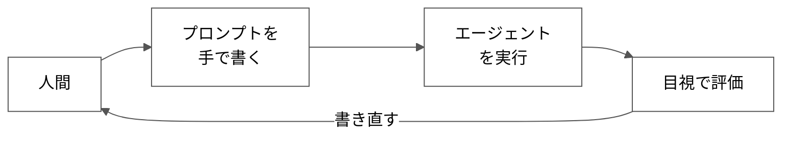
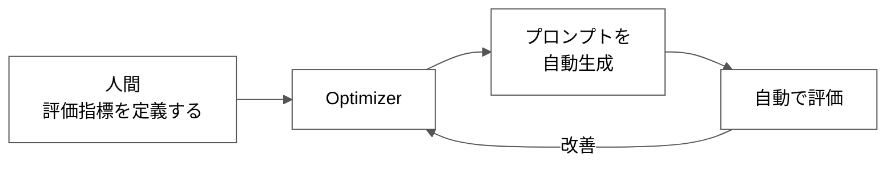
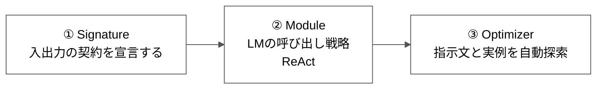
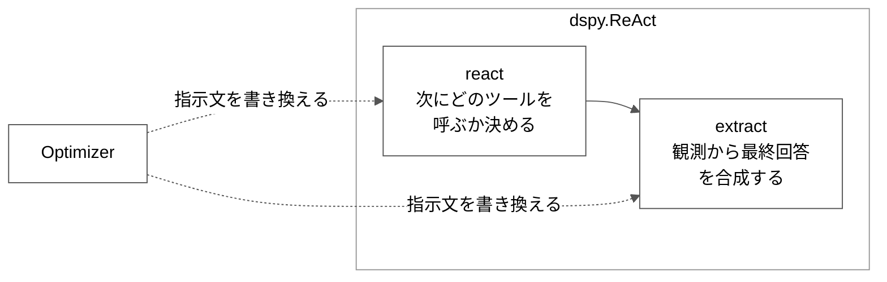
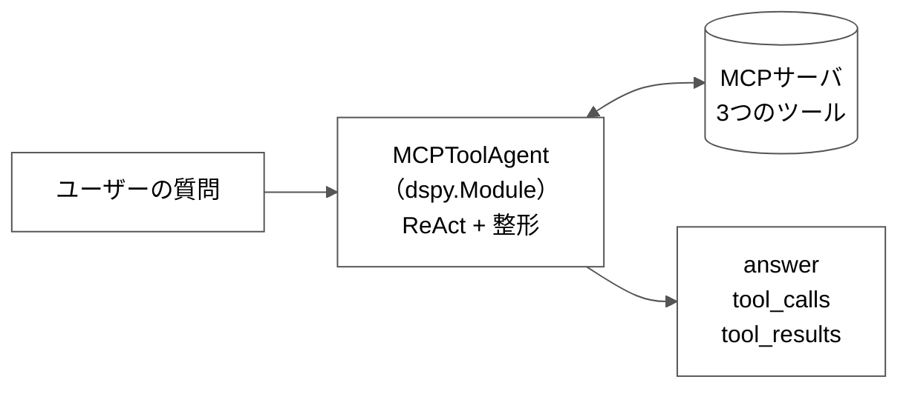
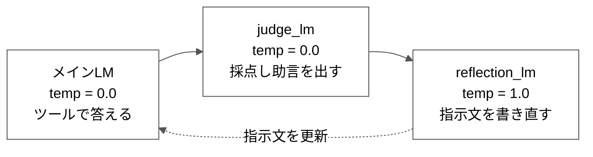
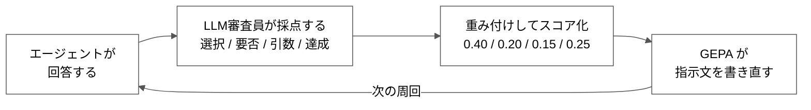

# 発表スライドの図（横向き）

すべて**左から右へ流れる横向き**に統一。
Mermaidの背景は**白**に設定済み。

各図は3つの形式で載せてある。

- **図（テキスト）**
  等幅フォントで見ると構造がわかる
- **Mermaid**
  GitHub上で実際の図として描画される
- **PowerPointでの作り方**

> スライドは横長なので、
> **フロー図は必ず横向きにする。**
> 縦に並べると下が余って
> 文字が小さくなる。

---

# 図1 — 従来 vs DSPy

**使うスライド: 4枚目「DSPyとは」**

伝えることは一点だけ。
**手作業のループが自動になる。**

## 図（テキスト）

```
【従来】プロンプトは人が書く

┌────────┐   ┌────────────────┐   ┌────────────────┐   ┌──────────────┐
│        │   │  プロンプトを  │   │  エージェント  │   │              │
│  人間  │──▶│    手で書く    │──▶│     を実行     │──▶│  目視で評価  │
│        │   │                │   │                │   │              │
└────────┘   └────────────────┘   └────────────────┘   └──────────────┘
     ▲                                                         │       
     └─────────────────────────────────────────────────────────┘       
                 すべて手作業（人間がループに入る）
```

```
【DSPy】プロンプトは自動生成される

┌──────────────┐   ┌─────────────┐   ┌────────────────┐   ┌──────────────┐
│     人間     │   │             │   │  プロンプトを  │   │              │
│  評価指標を  │──▶│  Optimizer  │──▶│    自動生成    │──▶│  自動で評価  │
│   定義する   │   │             │   │                │   │              │
└──────────────┘   └─────────────┘   └────────────────┘   └──────────────┘
        ▲                                                         │       
        └─────────────────────────────────────────────────────────┘       
                   ここが自動（人間はループに入らない）
```

## Mermaid





> **2つの図の違いに注目。**
> 従来は戻り矢印が**人間まで**戻る。
> DSPyは戻り矢印が
> **Optimizerで折り返す**。
> 人間はループの外にいる。
>
> ここが本発表で伝えたい差の本体。

## PowerPointでの作り方

1. スライドを**上下2段**に分ける
2. 上段に「従来」、下段に「DSPy」
3. 各段で角丸四角形を**横4つ**並べる
4. 右向き矢印でつなぐ
5. 一番右から一番左へ、
   **下を通る曲線矢印**で戻す
6. 戻り矢印の色と始終点
   - 従来 → **赤**、一番左（人間）まで戻す
   - DSPy → **青**、Optimizer で折り返す
7. 上段の背景を薄いグレー、
   下段を薄い青にする

**色と戻り矢印の長さの違いだけで
伝わる。**凝らなくてよい。

---

# 図2 — DSPyの3つの部品

**使うスライド: 5枚目「3つの部品」**

## 図（テキスト）

```
┌────────────────┐   ┌────────────────────┐   ┌──────────────────┐
│  ① Signature   │   │      ② Module      │   │   ③ Optimizer    │
│  入出力の契約  │──▶│  LMの呼び出し戦略  │──▶│  指示文と実例を  │
│   を宣言する   │   │       ReAct        │   │     自動探索     │
└────────────────┘   └────────────────────┘   └──────────────────┘
```

## Mermaid



## PowerPointでの作り方

1. 角丸四角形を**横3つ**並べる
2. 箱の中を2段にする
   - 上段: 番号と名前（**太字・大**）
   - 下段: 説明（小さめ・グレー）
3. 右向き矢印でつなぐ
4. **③ Optimizer だけ枠線を太く**する
   （ここがDSPyの本体だから）

---

# 図3 — ReActの内部構造

**使うスライド: 5枚目**

**前半で最も大事な図。**
テーマ名と実装がここでつながる。

## 図（テキスト）

```
┌────────────────────┐   ┌────────────────────┐
│       react        │   │      extract       │
│  次にどのツールを  │──▶│  観測から最終回答  │
│    呼ぶか決める    │   │     を合成する     │
└────────────────────┘   └────────────────────┘

この2つの箱＝dspy.ReAct の中身
Optimizer が書き換えるのはこの2つの指示文
= ツール利用最適化の実体
```

## Mermaid



## PowerPointでの作り方

1. 大きな四角形を1つ置き、
   左上に「dspy.ReAct」と書く
2. その**中に**四角形を**横2つ**並べる
   （react / extract）
3. 右向き矢印でつなぐ
4. 大きい四角形の**下**に
   「Optimizer」の箱を置く
5. Optimizerから**上向きの点線矢印を2本**、
   react と extract の両方に引く
6. 点線矢印を**赤**にし、
   ラベル「指示文を書き換える」を付ける
7. 図の下に赤字で1行

```
= これが「ツール利用最適化」の実体
```

> ここで一度止まって話す。
> 早口にならないこと。

---

# 図4 — システム構成

**使うスライド: 6枚目「実装したもの」**

## 図（テキスト）

```
┌──────────────┐   ┌─────────────────┐   ┌───────────────┐   ┌────────────────┐
│  ユーザーの  │   │  MCPToolAgent   │   │   MCPサーバ   │   │     answer     │
│     質問     │──▶│  (dspy.Module)  │──▶│  3つのツール  │──▶│   tool_calls   │
│              │   │  ReAct + 整形   │   │               │   │  tool_results  │
└──────────────┘   └─────────────────┘   └───────────────┘   └────────────────┘
```

## Mermaid



## PowerPointでの作り方

1. 左から右へ4つ並べる
2. MCPサーバだけ
   **円筒形（データベース記号）**にする
3. MCPToolAgent と MCPサーバの間は
   **両方向矢印**
4. MCPToolAgent の枠を**点線**にし、
   「今回追加した層」と注記する

> **点線＋注記が効く。**
> 「既存のReActに何を足したのか」が
> 一目で伝わる。

---

# 図5 — 3つのLMの役割分担

**使うスライド: 後半「最適化」**

## 図（テキスト）

```
┌──────────────────┐   ┌────────────────────┐   ┌────────────────────┐
│     メインLM     │   │      judge_lm      │   │   reflection_lm    │
│    temp = 0.0    │──▶│     temp = 0.0     │──▶│     temp = 1.0     │
│  ツールで答える  │   │  採点し助言を出す  │   │  指示文を書き直す  │
└──────────────────┘   └────────────────────┘   └────────────────────┘
          ▲                                                │          
          └────────────────────────────────────────────────┘          
                   指示文を更新してメインLMへ戻る
```

## Mermaid



## PowerPointでの作り方

1. 横に3つ並べる
2. 枠線の色を分ける
   - メインLM → 青
   - judge_lm → 緑
   - reflection_lm → オレンジ
3. temperature の値を**大きく**する
4. 右端から左端へ、
   下を通る**点線の戻り矢印**

> **話すポイント**
> 採点だけ 0.0 なのは
> 毎回同じ点であってほしいから。
> 書き直しだけ 1.0 なのは
> いろいろな案がほしいから。

---

# 図6 — 評価と最適化のループ

**使うスライド: 後半「評価の設計」**

## 図（テキスト）

```
┌──────────────────┐   ┌───────────────────────┐   ┌───────────────────┐   ┌────────────┐
│  エージェントが  │   │      LLM審査員が      │   │   重み付けして    │   │  GEPA が   │
│     回答する     │──▶│       採点する        │──▶│     スコア化      │──▶│  指示文を  │
│                  │   │  選択/要否/引数/達成  │   │  .40/.20/.15/.25  │   │  書き直す  │
└──────────────────┘   └───────────────────────┘   └───────────────────┘   └────────────┘
          ▲                                                                       │      
          └───────────────────────────────────────────────────────────────────────┘      
                                    この周回が自動で回る
```

## Mermaid



## PowerPointでの作り方

1. 横4つ並べる
2. 「LLM審査員」の箱だけ枠を**緑**に
3. 重みの数字を大きく見せ、
   **0.40（ツール選択）だけ赤**にする
4. 右端から左端へ、
   下を通る曲線の戻り矢印

> **話すポイント**
> ツール選択に最大の重みを置いた。
> テーマが「ツール利用最適化」だから、
> 回答の正しさよりツールの使い方を
> 重視した。

---

# Mermaidの背景を白にする書き方

図の1行目に必ずこれを入れる。

```
%%{init: {'theme':'base','themeVariables':{'primaryColor':'#ffffff','primaryTextColor':'#000000','primaryBorderColor':'#555555','lineColor':'#555555','secondaryColor':'#ffffff','tertiaryColor':'#ffffff','clusterBkg':'#ffffff','clusterBorder':'#999999','edgeLabelBackground':'#ffffff'}}}%%
```

これが無いと
**箱が薄い紫、枠の背景が薄い黄色**で
描画される。GitHubの既定色のため。

| 設定名 | 効果 |
|---|---|
| primaryColor | 箱の塗り |
| clusterBkg | 枠（subgraph）の塗り |
| primaryBorderColor | 箱の枠線 |
| lineColor | 矢印の色 |

**PowerPointで作る場合も
背景は白に統一する。**
プロジェクタでは薄い色は
ほとんど見えない。

---

# 図の使い分けまとめ

| 図 | スライド | 役割 |
|---|---|---|
| 図1 | 4枚目 | 手作業→自動の対比 |
| 図2 | 5枚目 | DSPyの部品 |
| 図3 | 5枚目 | **テーマとの接続** |
| 図4 | 6枚目 | 実装の全体像 |
| 図5 | 後半 | LMの役割分担 |
| 図6 | 後半 | 評価と最適化 |

**1スライドに図は1つまで。**

図2と図3を同じスライドに置く場合は、
図2を小さく上に、図3を大きく下に置き、
**視線が図3に行くようにする。**

---

# 作る時間がないとき

優先順位はこの順。

1. **図3**（ReActの内部）
   これだけは必ず作る
2. **図1**（従来 vs DSPy）
3. **図6**（評価と最適化）
4. 図4、図5、図2

図2は箇条書きで代用できる。
**図3は代用がきかない。**
