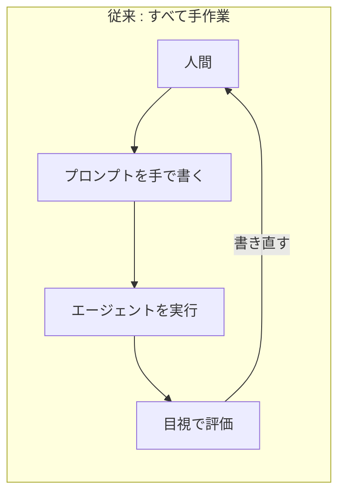
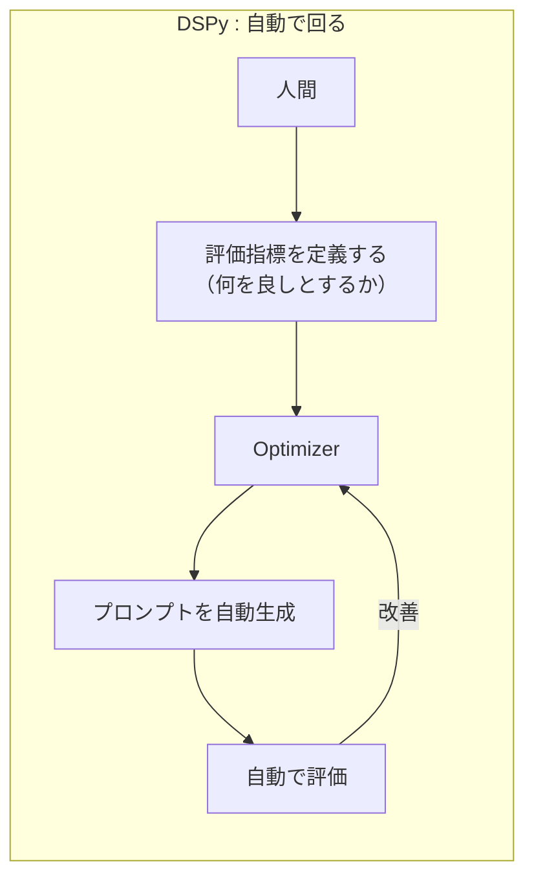
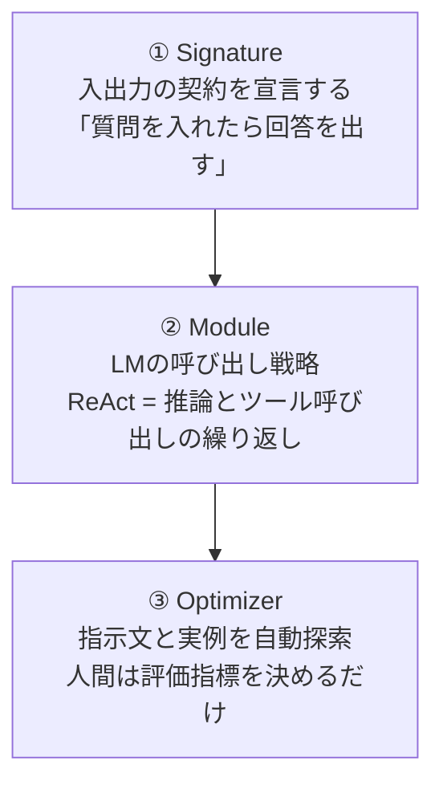
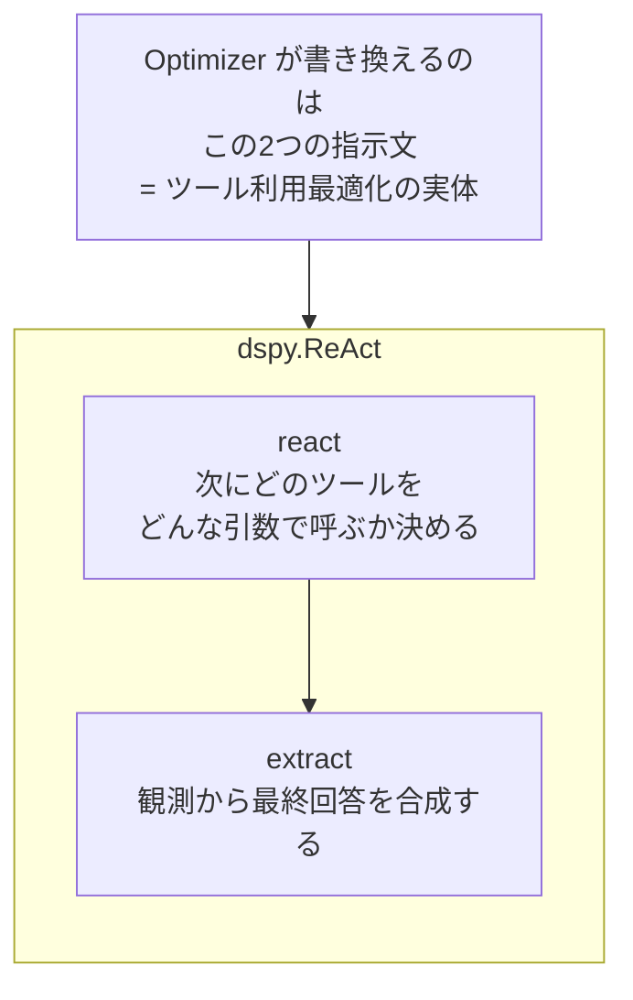
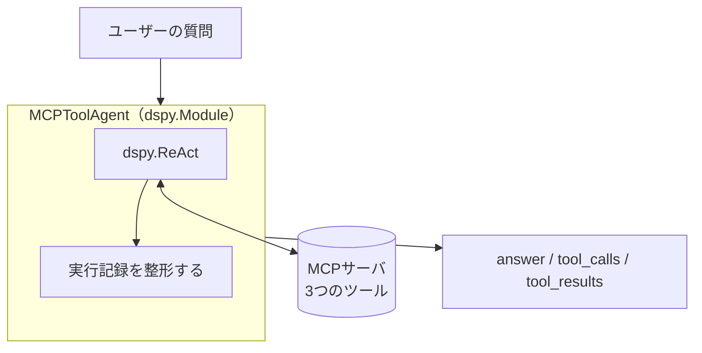
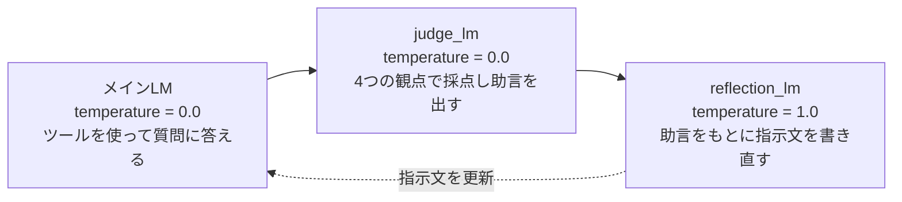
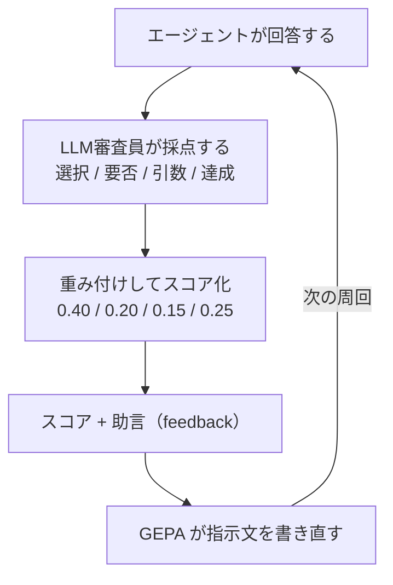

# 発表スライドの図

PowerPointで描くための図を
markdownで清書したもの。

各図は3つの形式で載せてある。

- **図（テキスト）**
  そのまま見て構造がわかる。
  等幅フォントで表示すること
- **Mermaid**
  GitHub上では実際の図として
  描画される。形の確認に使う
- **PowerPointでの作り方**
  図形・色・配置の手順

> テキスト版をPowerPointに直接
> 貼ることもできる。
> その場合はフォントを
> **MS ゴシック**などの等幅にし、
> 行間を狭くする。
> ただし清書するなら
> 図形で描いたほうが見栄えは良い。

---

# 図1 — 従来 vs DSPy

**使うスライド: 4枚目「DSPyとは」**

この図が前半で一番重要。
**手作業のループが自動になる**
という一点だけを伝える。

## 図（テキスト）

```
【従来】プロンプトは人が書く

   ┌────────────────────────────┐
┌─▶│            人間            │
│  └────────────────────────────┘
│                 │
│                 ▼
│  ┌────────────────────────────┐
│  │    プロンプトを手で書く    │
│  └────────────────────────────┘
│                 │
│                 ▼
│  ┌────────────────────────────┐
│  │     エージェントを実行     │
│  └────────────────────────────┘
│                 │
│                 ▼
│  ┌────────────────────────────┐
│  │         目視で評価         │
│  └────────────────────────────┘
│                 │
└─────────────────┘  すべて手作業
```

```
【DSPy】プロンプトは自動生成される

   ┌────────────────────────────┐
┌─▶│            人間            │
│  └────────────────────────────┘
│                 │
│                 ▼
│  ┌────────────────────────────┐
│  │     評価指標を定義する     │
│  │    （何を良しとするか）    │
│  └────────────────────────────┘
│                 │
│                 ▼
│  ┌────────────────────────────┐
│  │         Optimizer          │
│  └────────────────────────────┘
│                 │
│                 ▼
│  ┌────────────────────────────┐
│  │    プロンプトを自動生成    │
│  └────────────────────────────┘
│                 │
│                 ▼
│  ┌────────────────────────────┐
│  │         自動で評価         │
│  └────────────────────────────┘
│                 │
└─────────────────┘  ここが自動
```

## Mermaid





> Mermaidでは、DSPy側のループが
> **人間まで戻らない**ことに注目。
> 従来はループが人間を通るが、
> DSPyはOptimizerの中で閉じる。
> ここが伝えたい差。

## PowerPointでの作り方

1. スライドを左右2列に分ける
2. 左に「従来」、右に「DSPy」
3. 各列に角丸四角形を縦に並べる
4. 「線矢印」で下向きにつなぐ
5. 一番下から一番上へ戻る矢印を
   **曲線矢印**で引く
6. **戻り矢印の色**
   - 従来 → **赤**、ラベル「手作業」
   - DSPy → **青**、ラベル「自動」
7. 左列全体を薄いグレーの背景、
   右列を薄い青の背景にすると
   対比が一目でわかる

**色を分けるだけで伝わる。**
凝らなくてよい。

---

# 図2 — DSPyの3つの部品

**使うスライド: 5枚目「3つの部品」**

## 図（テキスト）

```
┌──────────────────────────────────────────────┐
│                 ① Signature                  │
│            入出力の契約を宣言する            │
│         「質問を入れたら回答を出す」         │
└──────────────────────────────────────────────┘
                        │
                        ▼
┌──────────────────────────────────────────────┐
│                   ② Module                   │
│               LMの呼び出し戦略               │
│    ReAct = 推論とツール呼び出しの繰り返し    │
└──────────────────────────────────────────────┘
                        │
                        ▼
┌──────────────────────────────────────────────┐
│                 ③ Optimizer                  │
│            指示文と実例を自動探索            │
│          人間は評価指標を決めるだけ          │
└──────────────────────────────────────────────┘
```

## Mermaid



## PowerPointでの作り方

1. 角丸四角形を3つ縦に並べる
2. 各箱の中を2段にする
   - 上段: 番号と名前（**太字・大**）
   - 下段: 説明（小さめ・グレー）
3. 下向き矢印でつなぐ
4. **③ Optimizer だけ枠線を太く**、
   塗りを濃い色にする
   （ここがDSPyの本体だから）

---

# 図3 — ReActの内部構造

**使うスライド: 5枚目（図2の右か下）**

**前半で最も大事な図。**
テーマ名「ツール利用最適化」と
実装が、この図でつながる。

## 図（テキスト）

```
┌──────────────────────────────────────────┐
│                dspy.ReAct                │
│                                          │
│    ┌──────────────────────────────────┐  │
│    │              react               │  │
│    │         次にどのツールを         │  │
│    │     どんな引数で呼ぶか決める     │  │
│    └──────────────────────────────────┘  │
│                    │                     │
│                    ▼                     │
│    ┌──────────────────────────────────┐  │
│    │             extract              │  │
│    │    観測から最終回答を合成する    │  │
│    └──────────────────────────────────┘  │
└──────────────────────────────────────────┘
                     ▲                      
                     │                      
┌──────────────────────────────────────────┐
│        Optimizer が書き換えるのは        │
│             この2つの指示文              │
│         = ツール利用最適化の実体         │
└──────────────────────────────────────────┘
```

## Mermaid



## PowerPointでの作り方

1. 大きめの四角形を1つ置き、
   上に「dspy.ReAct」と書く
2. その**中に**小さい四角形を2つ、
   縦に並べる（react / extract）
3. 2つを下向き矢印でつなぐ
4. 大きい四角形の**下**に
   別の四角形を置き、
   上向き矢印で大きい箱を指す
5. **下の箱を赤枠・赤文字**にする
6. 「= ツール利用最適化の実体」を
   **太字**にする

> ここで一度止まって話す。
> 早口にならないこと。

---

# 図4 — システム構成

**使うスライド: 6枚目「実装したもの」**

## 図（テキスト）

```
┌────────────────────────────────────┐
│           ユーザーの質問           │
└────────────────────────────────────┘
                  │
                  ▼
┌────────────────────────────────────┐
│     MCPToolAgent (dspy.Module)     │
│                                    │
│   ┌────────────────────────────┐   │
│   │         dspy.ReAct         │   │
│   │   ⇄ MCPサーバ (3ツール)    │   │
│   └────────────────────────────┘   │
│                 │                  │
│                 ▼                  │
│   ┌────────────────────────────┐   │
│   │     実行記録を整形する     │   │
│   └────────────────────────────┘   │
└────────────────────────────────────┘
                  │
                  ▼
┌────────────────────────────────────┐
│        answer / tool_calls         │
│            tool_results            │
└────────────────────────────────────┘
```

## Mermaid



## PowerPointでの作り方

1. 上から下へ3段に置く
   - 質問 → Module → 出力
2. 真ん中のModuleは**大きい枠**にし、
   中に「dspy.ReAct」と
   「実行記録を整形する」を入れる
3. **右側**に円筒形（データベース記号）で
   「MCPサーバ」を置く
4. ReActとMCPサーバを
   **両方向矢印**でつなぐ
5. Moduleの枠を**点線**にして
   「今回追加した層」と注記する

> **点線＋注記が効く。**
> 「既存のReActに何を足したのか」が
> 一目で伝わる。

---

# 図5 — 3つのLMの役割分担

**使うスライド: 後半「最適化」**

前半では使わないが、
後半で必ず必要になるので
ここに入れておく。

## 図（テキスト）

```
┌────────────────────────────────────────┐
│      メインLM  temperature = 0.0       │
│       ツールを使って質問に答える       │
└────────────────────────────────────────┘

┌────────────────────────────────────────┐
│      judge_lm  temperature = 0.0       │
│      4つの観点で採点し助言を出す       │
└────────────────────────────────────────┘

┌────────────────────────────────────────┐
│    reflection_lm  temperature = 1.0    │
│      助言をもとに指示文を書き直す      │
└────────────────────────────────────────┘
```

## Mermaid



## PowerPointでの作り方

1. 横に3つ並べる
2. 色を分ける
   - メインLM → 青
   - judge_lm → 緑
   - reflection_lm → オレンジ
3. temperature の値を
   **大きく目立たせる**
4. 一番右から一番左へ
   点線の戻り矢印

> **話すポイント**
> 採点だけ 0.0 なのは
> 毎回同じ点であってほしいから。
> 書き直しだけ 1.0 なのは
> いろいろな案がほしいから。

---

# 図6 — 評価と最適化のループ

**使うスライド: 後半「評価の設計」**

## 図（テキスト）

```
   ┌────────────────────────────────────┐
┌─▶│       エージェントが回答する       │
│  └────────────────────────────────────┘
│                     │
│                     ▼
│  ┌────────────────────────────────────┐
│  │        LLM審査員が採点する         │
│  │     選択 / 要否 / 引数 / 達成      │
│  └────────────────────────────────────┘
│                     │
│                     ▼
│  ┌────────────────────────────────────┐
│  │        重み付けしてスコア化        │
│  │     0.40 / 0.20 / 0.15 / 0.25      │
│  └────────────────────────────────────┘
│                     │
│                     ▼
│  ┌────────────────────────────────────┐
│  │      スコア + 助言(feedback)       │
│  └────────────────────────────────────┘
│                     │
│                     ▼
│  ┌────────────────────────────────────┐
│  │      GEPA が指示文を書き直す       │
│  └────────────────────────────────────┘
│                     │
└─────────────────────┘  この周回が自動
```

## Mermaid



## PowerPointでの作り方

1. 5つの箱を縦に並べる
2. 左側に大きな**曲線の戻り矢印**を引く
3. 「LLM審査員」の箱だけ
   色を変える（緑など）
4. 重みの数字
   **0.40 / 0.20 / 0.15 / 0.25** を
   大きく見せる
5. 0.40（ツール選択）だけ
   **赤で強調**

> **話すポイント**
> ツール選択に最大の重みを置いた。
> テーマが「ツール利用最適化」
> だから、回答の正しさより
> ツールの使い方を重視した。

---

# 図の使い分けまとめ

| 図 | スライド | 役割 |
|---|---|---|
| 図1 | 4枚目 | 手作業→自動の対比 |
| 図2 | 5枚目 | DSPyの部品 |
| 図3 | 5枚目 | **テーマとの接続** |
| 図4 | 6枚目 | 実装の全体像 |
| 図5 | 後半 | LMの役割分担 |
| 図6 | 後半 | 評価と最適化 |

**1スライドに図は1つまで。**
2つ以上載せると、
聞き手はどちらを見ればよいか
分からなくなる。

図2と図3を同じスライドに置く場合は、
図2を小さく左に、
図3を大きく右に置いて、
**視線が図3に行くようにする。**

---

# 図を作る時間がないとき

優先順位はこの順。

1. **図3**（ReActの内部）
   これだけは必ず作る
2. **図1**（従来 vs DSPy）
3. **図6**（評価と最適化）
4. 図4、図5、図2

図2は箇条書きで代用できる。
図3は代用がきかない。
