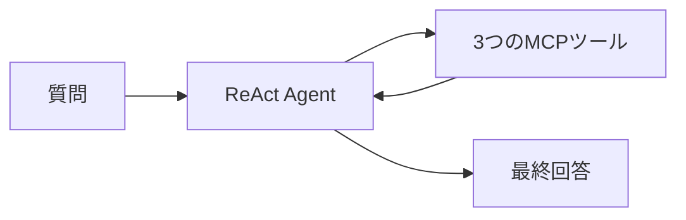

# 10分発表スライド下書き

## 発表タイトル

**DSPyによるAIエージェントのツール利用最適化**

想定聴衆：メンター、研究開発部門の社員、他の実習参加者  
発表時間：10分  
推奨枚数：9枚  

この下書きでは、スライドに実際に載せる文章と、発表時に話す内容を分けています。

- 「スライドに載せる内容」：PowerPointへ記載する短い文章
- 「図表案」：スライド上の配置や図
- 「発表者ノート」：口頭で説明する内容

---

# Slide 1　タイトル

## スライドに載せる内容

### DSPyによるAIエージェントのツール利用最適化

ReAct Agentのツール選択をGEPAで改善する

氏名：〇〇〇〇  
実習先：株式会社東芝  
日付：2026年9月〇日

## 図表案

タイトルだけを大きく表示します。背景には図を入れすぎず、下部に氏名と日付を置きます。

## 発表者ノート（約30秒）

本実習では、AIエージェントが質問に応じて適切なツールを選択する仕組みを作り、そのツール利用をDSPyのGEPAで最適化しました。本日は、実装した仕組み、評価方法、最適化前後で確認できた変化について発表します。

---

# Slide 2　ツールを持つだけでは十分ではない

## スライドに載せる内容

### AIエージェントの性能はツールの使い方で変わる

- 適切なツールを選べるか
- 正しい引数を渡せるか
- 複数ツールを適切な順番で使えるか
- 不要な呼び出しを避けられるか

**課題：ツール利用の改善を人手で行うと、試行錯誤が必要になる**

## 図表案

中央に次の3要素を横並びで置きます。

```text
質問 → ツール選択 → 最終回答
```

「ツール選択」の下に、選択・引数・順序の3語を小さく配置します。

## 発表者ノート（約55秒）

LLMへツールを与えても、必ず適切に利用できるとは限りません。ツール名の選択だけでなく、引数、実行順序、途中結果の受け渡しも最終的な回答品質に影響します。通常はプロンプトを人が修正しながら改善しますが、今回はこの過程をDSPyで自動化することを目指しました。

---

# Slide 3　3つのMCPツールをReAct Agentに与えた

## スライドに載せる内容

### 質問に応じて3つのツールを使い分ける

| ツール | 用途 |
|---|---|
| `calculate_expression` | 数式の計算 |
| `analyze_numbers` | 数値配列の統計分析 |
| `convert_units` | 単位変換 |

**Student LM：GPT-4o**

## 図表案



実際のPowerPointでは、Agentを中央に置き、左に質問、右にツールと最終回答を配置します。

## 発表者ノート（約1分）

Agentには、数式計算、統計分析、単位変換の3つのMCPツールを与えました。DSPyのReActを使い、Agentが質問を読み、必要なツールと引数を決め、結果を確認してから回答します。Student LMにはGPT-4oを使用しました。

ReActのtrajectoryには、途中の判断、ツール名、引数、ツール結果が記録されます。この履歴を後の評価に利用しました。

---

# Slide 4　Judgeの評価を使ってGEPAが指示を改善する

## スライドに載せる内容

### scoreとfeedbackを使った最適化サイクル

```text
Agentを実行
   ↓
Judgeが採点・feedback生成
   ↓
Reflection LMが改善案を作成
   ↓
新しいプロンプトを再評価
```

Judge LM・Reflection LM：`gpt-5.4-mini`

## 評価項目

| 評価項目 | 重み |
|---|---:|
| ツール選択 | 40% |
| ツールの必要性 | 20% |
| 引数・実行順序 | 15% |
| タスク達成度 | 25% |

## 図表案

左側に最適化サイクル、右側に評価項目の表を配置します。

## 発表者ノート（約1分15秒）

Agentの実行履歴と最終回答をJudge LMへ渡し、4項目で採点しました。Judgeは数値のscoreに加えて、日本語で改善点をfeedbackとして返します。

GEPAは、低得点だった実行履歴とfeedbackをReflection LMに渡します。Reflection LMが新しい指示を提案し、その候補を再評価します。モデルの重みを学習するのではなく、Agentへ与えるプロンプトを改善する仕組みです。

---

# Slide 5　簡単な問題から複数ツール問題へ段階的に評価した

## スライドに載せる内容

### 問題の複雑さを段階的に上げた

| 段階 | 問題例 | 想定する処理 |
|---|---|---|
| 1ツール | `10 kmは何mか` | 単位変換 |
| 2ツール | `2 kmをmに直し、350 mを足す` | 変換→計算 |
| 複合問題 | 単位を統一し、統計量を求め、追加計算 | 変換→統計→計算 |

GEPAの探索上限：`max_metric_calls=80`から開始

## 図表案

表の左から右へ、問題の複雑さが増すことを矢印で示します。

```text
1ツール → 2ツール → 複数の中間結果に依存する問題
```

## 発表者ノート（約1分）

最初は、1問につき1つのツールを使う問題で評価しました。しかし、これらはGPT-4oにとって簡単で、最適化前からほぼ適切に処理できました。

そこで、単位変換の結果を次の計算へ渡す2ツール問題を追加しました。さらに、今後の追加検証として、変換、統計分析、追加計算を順番に行う複合問題も用意しました。

GEPAの探索回数は、まず`max_metric_calls=80`とします。30回では、問題全体を一度評価した後に残る探索回数が少ないためです。80回で不足した場合のみ120回を試します。

---

# Slide 6　1ツール問題では改善余地がほとんどなかった

## スライドに載せる内容

### 最適化前からスコアが高い「天井効果」が発生

| 実験 | Baseline | GEPA後 | 変化 |
|---|---:|---:|---:|
| 1ツール問題 | 98.67 | 98.33 | −0.34 |
| 2ツール問題を追加 | 98.71 | 99.71 | **＋1.00** |

**単純な問題だけでは、最適化効果を確認しにくい**

## 図表案

このスライドでは棒グラフではなく、数値を読み取りやすい表を使います。1ポイントの差を強調するために縦軸を途中から切った棒グラフを使うと、差を過大に見せる可能性があります。

`＋1.00`だけをアクセントカラーで強調します。

## 発表者ノート（約1分10秒）

1ツール問題ではBaselineが98.67、GEPA後が98.33で、改善は確認できませんでした。これはAgentが最適化前から適切なツールを使えており、改善余地がほとんどなかったためだと考えられます。

一方、2ツール問題を追加すると、Baselineの98.71からGEPA後の99.71へ、1.0ポイント改善しました。全体の差は小さいものの、特定の問題ではツールの使い方に明確な変化がありました。

---

# Slide 7　GEPA後に必要な単位変換が追加された

## スライドに載せる内容

### 代表例：混在した単位を含む平均値問題

**質問**  
1.2 km、800 m、1500 mの平均をmで求める

| 最適化前 | GEPA後 |
|---|---|
| `calculate_expression` | `convert_units` |
|  | ↓ |
|  | `calculate_expression` |

**変化：混在した単位を処理するための変換ステップが追加された**

## 図表案

左右比較にします。

```text
最適化前                      GEPA後
calculate_expression          convert_units
                              ↓
                              calculate_expression
```

`convert_units`をアクセントカラーで囲み、追加された処理だと分かるようにします。

## 発表者ノート（約1分20秒）

代表例は、1.2 km、800 m、1500 mの平均をmで求める問題です。最適化前は`calculate_expression`だけを使用しました。GEPA後は、最初に`convert_units`を使用し、その後に`calculate_expression`を使用しました。

したがって、GEPA後には、混在する単位を明示的に統一する処理が追加されました。ただし、統計専用の`analyze_numbers`を使ったわけではないため、「完全に理想的なツール系列になった」とはせず、「必要な単位変換処理が追加された」と解釈します。

---

# Slide 8　より複雑な依存関係で追加検証する

## スライドに載せる内容

### 中間結果を次のツールへ渡す能力を評価する

**追加問題例**

> 1.2 km、800 m、1.5 kmをすべてmに統一し、平均値と中央値を求め、両者の差を計算する。

```text
convert_units（1.2 km）
        ↓
convert_units（1.5 km）
        ↓
analyze_numbers（平均・中央値）
        ↓
calculate_expression（差）
```

## 評価する指標

- Judgeの平均score
- 必要ツール使用率
- 正しい順序で完了した問題の割合

## 図表案

左側に4段階の処理、右側に3つの評価指標を置きます。

追加実験を完了した場合は、下の表へ実測値を入れます。

| 問題タイプ | Baseline | GEPA後 | 改善幅 |
|---|---:|---:|---:|
| 1ツール | ［実測値］ | ［実測値］ | ［実測値］ |
| 2ツール | ［実測値］ | ［実測値］ | ［実測値］ |
| 複合問題 | ［実測値］ | ［実測値］ | ［実測値］ |

## 発表者ノート（約1分15秒）

2ツールと3ツールという呼び出し回数だけでは、難易度の差が出ない可能性があります。そこで、複数の中間結果へ依存する問題を追加します。

例えば、複数の値を個別に単位変換し、その結果を統計ツールへ渡し、さらに統計結果を計算ツールへ渡します。最終回答だけでなく、必要なツールを使用した割合と、正しい順序で完了した割合も評価します。

追加実験が発表までに間に合わない場合は、このスライドを「今後の課題」として説明します。実測できた場合は、問題タイプ別の表と集合棒グラフに置き換えます。

---

# Slide 9　GEPAによる小さな改善と次の評価軸を確認できた

## スライドに載せる内容

### まとめ

1. 3つのMCPツールを使うReAct Agentを構築した
2. Judgeのscoreとfeedbackを使ってGEPAで最適化した
3. 1ツール問題では天井効果により変化が見られなかった
4. 2ツール問題では、必要な単位変換が追加され、スコアが1.0ポイント改善した
5. 複雑な問題では、ツールの有無だけでなく実行順序も評価する必要がある

**ツール利用最適化では、問題設計と評価指標が重要である**

## 図表案

中央に結論を大きく置き、その上に成果、下に今後の課題を配置します。

```text
成果：GEPAによるツール利用の変化を確認

結論：問題設計と評価指標が最適化結果を左右する

次：未知問題での再評価と実行順序の定量化
```

## 発表者ノート（約55秒）

本実習では、3つのMCPツールを使うReAct Agentを構築し、Judgeのscoreとfeedbackを利用してGEPAでプロンプトを最適化しました。

単純な問題では天井効果がありましたが、複数ツール問題では必要な単位変換が追加され、スコアも1.0ポイント改善しました。また、最適化の効果を明確にするには、単に問題数を増やすだけでなく、中間結果に依存する問題と、実行順序を評価する指標が必要だと分かりました。

以上で発表を終わります。

---

# 時間配分

| スライド | 内容 | 時間 |
|---:|---|---:|
| 1 | タイトル | 0:30 |
| 2 | 背景と課題 | 0:55 |
| 3 | Agentと3ツール | 1:00 |
| 4 | JudgeとGEPA | 1:15 |
| 5 | 実験設計 | 1:00 |
| 6 | スコア結果 | 1:10 |
| 7 | 代表事例 | 1:20 |
| 8 | 追加検証 | 1:15 |
| 9 | まとめ | 0:55 |
|  | **合計** | **9:20** |

残り約40秒は、スライド切り替えや説明の間に使います。

---

# 発表用グラフの選び方

## 現在の結果だけを示す場合

現在はスコア差が約1ポイントのため、棒グラフよりも次の組み合わせが伝わりやすくなります。

1. BaselineとGEPA後の数値表
2. 代表問題のツール履歴の左右比較

縦軸を98から100に切った棒グラフは、差を過大に見せる可能性があるため避けます。

## 複雑問題の結果が得られた場合

問題タイプ別の集合棒グラフを使用します。

- 横軸：1ツール、2ツール、複合問題
- 縦軸：平均score
- 系列：Baseline、GEPA後

同時に、正しいツール順序で完了した割合も別の表で示します。

---

# 発表前に差し替える箇所

- Slide 1の氏名と日付
- Slide 8の追加実験結果
- 問題タイプ別のBaselineとGEPA後の実測値
- 必要ツール使用率
- 正しい順序で完了した問題の割合
- 社内情報やAPIキーが画像に映り込んでいないか

追加実験を行わない場合でも、Slide 8は「追加検証・今後の課題」として使用できます。
